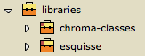
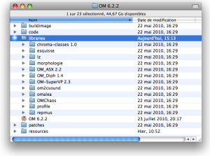
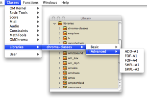
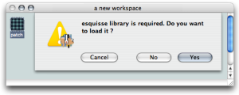
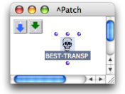
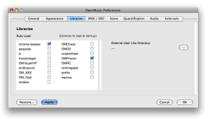
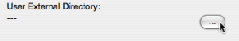
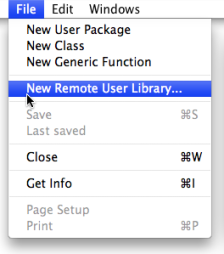
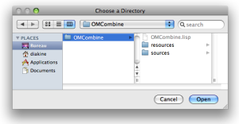
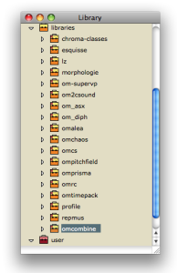

Navigation : [Previous](Packages "page précédente\(Packages\)") |
[Next](Tutorials "Next\(Tutorials\)")

# Extra Libraries

In addition to the standard OM functionalities, extra tools (classes,
functions, etc.) can be loaded in OM in the form of external libraries.

The OM extra librarires are represented in the ** Libraries ** package in the
Library window.

|

  
  
---|---  
  
To load a library :

  * double click on the lower part of a package
  * `Ctrl` / right click on a package and choose `Load Library`.

**** Loaded libraries show a green label : ,
unloaded libraries, a red label : .

The content of a library is displayed like the one of the other [
[Packages](Packages) ](Packages).

Items of the Library Window

  * [Packages](Packages)

Do not confuse the  Libraries package with the
 User package, which is dedicated to libraries
specifically programmed by the user.

## Location of the Libraries

OM Libraries

The `OM` folder includes a `Libraries` sub-directory that contains a number of
libraries created by IRCAM research team or collaborators and distributed with
teh OM application.

|

[zoom](../res/libfold_scr_1.png "Zoom \(nouvelle fenêtre\)")  
  
---|---  
  
Remote Libraries

Extra libraries can also be added by the user and loaded in OM (see section
below).

A number of them, written by the OM users or developers, can be downloaded on
the [OpenMusic
page](http://recherche.ircam.fr/equipes/repmus/OpenMusic/externals
"http://recherche.ircam.fr/equipes/repmus/OpenMusic/externals \(nouvelle
fenêtre\)").

## Using Libraries

Using Tools from a Loaded Library

Once a library is loaded, classes and functions can be dropped to a patch
editor

  * from the function and classes panes of the `Library` window
  * from the `Librairies` menu items on the `Functions` or `Classes` menus.

|

[zoom](../res/addfromlib_scr_1.png "Zoom \(nouvelle fenêtre\)")  
  
---|---  
  
See also

  * [Adding Boxes Into a Patch](AddingBoxes)

Prerequisite Libraries

If a patch contains functions or classes pertaining to a user library, the
user will be asked if the library must be loaded or not when opening the
patch.

|

  
  
---|---  
  
Choose `Yes`. Otherwise, all components attached to this patch will appear as
"[dead boxes](DeadBox)".

|

  
  
---|---  
  
The library can still be loaded afterwards. In this case, relaod the patch as
well using the menu `File / Last Saved` in order to find the original patch
boxes again.

Libraries Autoload

User libraries, including remote and external libraries, can be loaded
automatically at startup.

  1. Open the `Libraries` preferences,

  2. select the libraries you want to load at start up in the **" Auto Load"** pane,

  3. choose `Apply` and `OK`. 

|

[zoom](../res/libprefs_scr_1.png "Zoom \(nouvelle fenêtre\)")  
  
---|---  
  
## Adding External Libraries

The External Libraries Folders

Additional directories can be added and specified to store extra libraries,
via the `Libraries` preferences.

  1. Select the `OM 6.X.X / Preferences` menu.

  2. Select the `Libraries` preference tab, 

  3. Click on `...` to select a directory.

  4. Select or create a folder, then `Apply` or `OK`. 

|

  
  
---|---  
  
The external libraries present in these directories will be displayed in the
** libraries ** package  .

Use `File / Refresh Libraries Package` in order to update the contents of the
** libraries ** package contents.

Remote Libraries

Extra libraries can also be imported from any location to the Libraries
package. These libraries are considered as  **" remote"** libraries.

|

To import a remote library to the Library window,

  1. select the Library window

  2. choose `File / New Remote User Library`

  
  
---|---  
  
Select the folder of the library you want to import and choose `Open`.

|

  
  
---|---  
  
**Remote libraries** appear in the Libraries package as well, just like any
other extra libraries.

|

  
  
---|---  
  
External or Remote User Libraries Location

If you change the location of a library directory after it's been added in the
`Library` window, OM won't be able to load the library.

References :

Contents :

  * [OpenMusic Documentation](OM-Documentation)
  * [OM User Manual](OM-User-Manual)
    * [Introduction](00-Contents)
    * [System Configuration and Installation](Installation)
    * [Going Through an OM Session](Goingthrough)
    * [The OM Environment](Environment)
      * [Environment Windows](MainWindows)
      * [Preferences](Preferences)
      * [Workspace](Workspace)
      * [Library](Library)
        * [Packages](Packages)
        * Extra Libraries
      * [Tutorials](Tutorials)
      * [Resources](resources)
    * [Visual Programming I](BasicVisualProgramming)
    * [Visual Programming II](AdvancedVisualProgramming)
    * [Basic Tools](BasicObjects)
    * [Score Objects](ScoreObjects)
    * [Maquettes](Maquettes)
    * [Sheet](Sheet)
    * [MIDI](MIDI)
    * [Audio](Audio)
    * [SDIF](SDIF)
    * [Reactive mode](Reactive)
    * [Lisp Programming](Lisp)
    * [Errors and Problems](errors)
  * [OpenMusic QuickStart](QuickStart-Chapters)

Navigation : [Previous](Packages "page précédente\(Packages\)") |
[Next](Tutorials "Next\(Tutorials\)")

