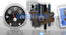
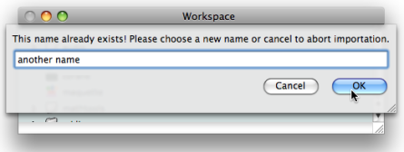
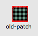
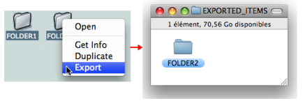

Navigation : [Previous](WS-Presentation "page
précédente\(Presentation Options\)") | [Next](Library "page
suivante\(Library\)")

# Import / Export

This section shows how to bring material to or from a workspace during a
session via the ** "import" and "export" commands** . These commands also
allow to share material between workspaces, as a sole workspace can be open
per session.

Implicit copies of files and folders are generated and can be modified
independently from the master item. Genuine items aren't affected by
modifications of an imported file.

## Import

With the "Import" command

The user can import a file or a folder from any location in the computer to
the  **open window of the workspace** , or to that of an  **open sub folder**
.

To import a file or folder :

  * drag and drop the item in the workspace
  * `Ctrl` / right click in the workspace and choose `Import File - Folder`.

|

Importing a file to the Midi folder of the OMWorkspace using the contextual
menu.  
  
---|---  
  
Additional Import Procedures

|

  * Drag and drop the item on the OM icon of the dock.
  * Double click on the item.

  
  
---|---  
  
In the import dialogue window, choose `Yes` to import the item, which will be
copied in the current workspace.

OM systematically asks if the user wants to import the item concerned.

Existing Item / Name

If an item of the targeted directory has the same name as the item you want to
import, you will be offered to rename it.

Earlier Files Compatibility

When loading an old workspace, or importing old patches or maquettes, OM may
check their contents and report possible errors. Illegible files will not be
imported to the workspace.

|

Earlier readable files (generally from OM 4 or earlier versions) show a red
background until they are updated by OM at opening.

Consider keeping originals of the files, since the updated ones will not be
legible anymore by former versions.  
  
---|---  
  
## Export

Export Procedure

The only way to export or copy OM files and folders directly from the
workspace to the finder is to use the contextual menu. ** They cannot be
dragged and dropped **.

Select the workspace, a file or folder :

  1. `Ctrl` / right click on an item and choose `Export` in the contextual menu.

  2. Choose a name, an extension and select a destination folder in the dialogue window.

Exporting a folder from the OMWorkspace to another workspace.The relevant
extension is always offered by the lower pop up menu of the dialogue window.
It is added to the file name automatically.[Zoom](../res/export_scr_1.png
"Zoom \(nouvelle fenêtre\)")

All files belonging to a workspace can be exported :

  * .omp files : patches
  * .omm files : maquettes.

Exporting One Item at a Time

Only one folder or file can be exported at a time. OM won't display any
message If you select several items, but will export the item that was clicked
on to open the contextual menu.

Workspace Folder Modifications

Modifications of the Workspace folder must be done via the OM application. If
the `Elements` sub folder is modified directly while OM is running, the
application cannot notice ongoing modifications, and OM can crash. The
`Import` and `Export` commands must be privileged.

References :

Contents :

  * [OpenMusic Documentation](OM-Documentation)
  * [OM User Manual](OM-User-Manual)
    * [Introduction](00-Contents)
    * [System Configuration and Installation](Installation)
    * [Going Through an OM Session](Goingthrough)
    * [The OM Environment](Environment)
      * [Environment Windows](MainWindows)
      * [Preferences](Preferences)
      * [Workspace](Workspace)
        * [The Workspace Window](WS-Window)
        * [Presentation Options](WS-Presentation)
        * Import / Export
      * [Library](Library)
      * [Tutorials](Tutorials)
      * [Resources](resources)
    * [Visual Programming I](BasicVisualProgramming)
    * [Visual Programming II](AdvancedVisualProgramming)
    * [Basic Tools](BasicObjects)
    * [Score Objects](ScoreObjects)
    * [Maquettes](Maquettes)
    * [Sheet](Sheet)
    * [MIDI](MIDI)
    * [Audio](Audio)
    * [SDIF](SDIF)
    * [Reactive mode](Reactive)
    * [Lisp Programming](Lisp)
    * [Errors and Problems](errors)
  * [OpenMusic QuickStart](QuickStart-Chapters)

Navigation : [Previous](WS-Presentation "page
précédente\(Presentation Options\)") | [Next](Library "page
suivante\(Library\)")

