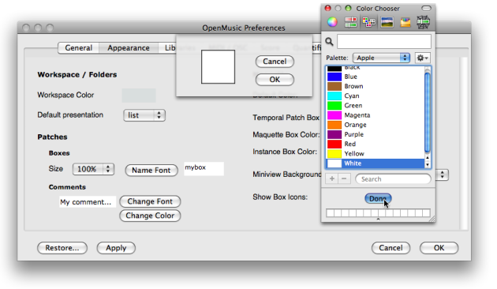
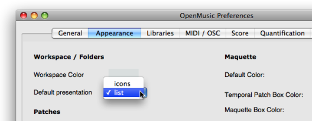
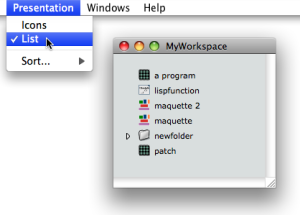
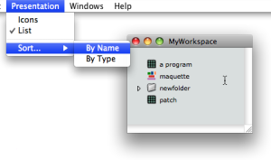
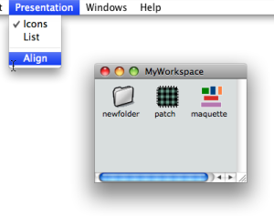
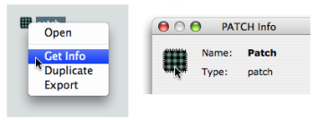
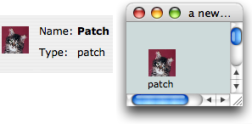
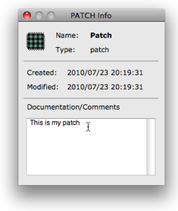

Navigation : [Previous](WS-Window "page précédente\(The Workspace
Window\)") | [Next](WS-ImportExport "Next\(Import /
Export\)")

# Presentation Options

## Workspace Preferences

The default workspace colour and presentation mode can be specified via the OM
preferences. To access the workspace preferences, go to `OM 6.X.X /
Preferences`, select the `Appearance` tab and go to the **Workspace /
Folders** section.

Background Colour

To modify the workspace background colour :

  1. choose `Change Color`

  2. click on the coloured frame, select a colour via the colour chooser and choose `Done`

  3.     * to validate your choice, click on `Apply` and / or `OK`. 

    * to restore the workspace default appearance, click on `Restore`. 

[Zoom](../res/workspacecolour_scr_1.png "Zoom \(nouvelle fenêtre\)")

Items Presentation Mode

The items of the workspace window can be displayed either on  **Icon** or
**List** mode, the Icon mode being the default presentation mode.

To change the default presentation mode, select a presentation mode in the
**Workspace / Folders** section.

## Items Presentation

Presentation Menu

The presentation mode of items can also modified at a session via the
`Presentation` menu.

Presentation modes are accessed via the main menu, or the contextual menu with
a `Ctrl` / right click.

To choose a presentation mode, select `Presentation / Icons - List` .

|

  
  
---|---  
  
Putting Items in Oder

To sort components by name or type, select the `List` mode and the
corresponding menu item in the `Sort` menu.

|

  
  
---|---  
  

|

In Icons mode, the workspace can be tidied with the `Align` menu item.

To align components automatically, select `Presentation / Align` .  
  
---|---  
  
## Items properties

Properties of patches and maquettes can be accessed and modified in the
workspace via their `Info` window.

To open the `Info` window :

  * `Ctrl` / right click on the item and choose `Get Info` .
  * Press `Cmd` \+ `i` .

The `Info` window can also display information or comments about the name,
type, date of creation and modification of a selected item within the
workspace.

Changing the icon

To modify the icon of an item, click on the upper left corner icon of the
`Info` window to open the Picture Chooser, then select an icon or in the
**OM** **Resources** or **User Resources** frame.

|

  
  
---|---  
  
For Detailed Information about Resources Management :

  * [Resources](resources)

Note

In case of problem in localizing or reading a picture or icon, the
 default icon or the
 image is attributed to the corresponding items.

Editing the Documentation

|

To edit the documentation, just type the information in the
Documentation/Comments prompt.

This documentation is then visible as a tooltip when hovering the mouse over
the item whith `Cmd` pressed.  
  
---|---  
  
References :

Plan :

  * [OpenMusic Documentation](OM-Documentation)
  * [OM User Manual](OM-User-Manual)
    * [Introduction](00-Sommaire)
    * [System Configuration and Installation](Installation)
    * [Going Through an OM Session](Goingthrough)
    * [The OM Environment](Environment)
      * [Environment Windows](MainWindows)
      * [Preferences](Preferences)
      * [Workspace](Workspace)
        * [The Workspace Window](WS-Window)
        * Presentation Options
        * [Import / Export](WS-ImportExport)
      * [Library](Library)
      * [Tutorials](Tutorials)
      * [Resources](resources)
    * [Visual Programming I](BasicVisualProgramming)
    * [Visual Programming II](AdvancedVisualProgramming)
    * [Basic Tools](BasicObjects)
    * [Score Objects](ScoreObjects)
    * [Maquettes](Maquettes)
    * [Sheet](Sheet)
    * [MIDI](MIDI)
    * [Audio](Audio)
    * [SDIF](SDIF)
    * [Lisp Programming](Lisp)
    * [Errors and Problems](errors)
  * [OpenMusic QuickStart](QuickStart-Chapters)

Navigation : [Previous](WS-Window "page précédente\(The Workspace
Window\)") | [Next](WS-ImportExport "Next\(Import /
Export\)")

