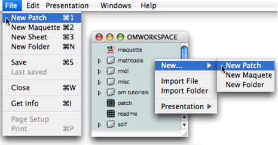

Navigation : [Previous](Workspace "page précédente\(Workspace\)")
| [Next](WS-Presentation "Next\(Presentation
Options\)")

# The Workspace Window

Visual programming in OM generally starts browsing the workspace window, in or
der to create and/or select programming items.

## Adding and Deleting Components in the Workspace Window

Adding Components

Different type of program representations can be used in OM :

  * patches[1]  (standard visual programs)
  * maquettes[2]  ("temporal" visual programs)
  * lisp functions (textual programs) 

They can be added in the workspace as well as in the storage folders of the
workspace.

To add an item in the workspace or in an open folder, use the `File` or
contextual menu - `Ctrl` / right click :

  * `New Patch - Maquette - Lisp Function - Folder`

You can also use the following shortcuts :

  * Patch : `Cmd` +1
  * Maquette : Cmd +2
  * Folder : Cmd + n

Get Into Visual Programming

  * [Introduction to Patch Programming](ProgrammingIntro)

Maquettes

  * [Maquettes](Maquettes)

Using Lisp Functions

  * [Lisp Programming](Lisp)

Reminder

The workspace window displays the items stored in the `Elements` sub folder of
the [ `Workspace` ](Workspace\(s\)) folder.

Clearing or Deleting Items

To delete an item, select it and choose :

  * clear : `Edit / Clear`
  * cut : `Edit / Cut` or `Cmd` \+ `x`

Clearing an item deletes it forever. It may be safer to choose the `Cut`
command, which possibly allows to paste the item afterward.

## Basic Procedures

Most operations on files and folders can be executed with the standard
contextual menus and shortcuts.

Opening Folders and Programs

  * Double click on an item, or `Ctrl` / right click and choose `open`.
  * In ** List mode **, on may also click on the adjacent triangle of a folder -  - to open it.

Moving Items from a Folder to Another

To move an items to another folder :

  * drag and drop the item.

  * cut and paste the item in an open folder : 

    * choose `Edit / Cut / Paste` ,
    * press `Cmd` \+ `x` / `Cmd` \+ `v`.

Copying Components

  * Select `Edit / Copy / Paste` or press `Cmd` +`c`  / `Cmd`\+ `v` .
  * On **Mac** : `Alt` drag and drop the item. On **Windows** :  `Cmd` drag and drop the item.

Duplicating Components

To duplicate an item :

  * select `Edit / Duplicate / Paste`
  * press `Cmd` \+ `d`.

Renaming Files and Folders

Double click on the name or press `Enter` to edit it
 .

Click in the window or press `Enter` again to validate.

Saving Files, Folders and Workspaces

To save an item and its content,

  * select `File/ Save`
  * press `Cmd` \+ `s`. 

When saving a workspace, the dialogue window that opens allows to apply this
choice to the whole content of the folder or workspace at once, or to selected
items within the workspace.

No "Save As" Option

The "Save as" option is not available for any of the components of a workspace
or a workspace itself.

References :

  1. Patch

A programming unit where objects and functions - boxes - are interconnected to
build a musical algorithm, that is, a sequence of instructions. A patch can
also be embedded as a box within another patch.

  2. Maquette

A hybrid of visual program and sequencer, a programming unit provided with a
time dimension, where musical material is organized in a time oriented
structure.

Contents :

  * [OpenMusic Documentation](OM-Documentation)
  * [OM User Manual](OM-User-Manual)
    * [Introduction](00-Contents)
    * [System Configuration and Installation](Installation)
    * [Going Through an OM Session](Goingthrough)
    * [The OM Environment](Environment)
      * [Environment Windows](MainWindows)
      * [Preferences](Preferences)
      * [Workspace](Workspace)
        * The Workspace Window
        * [Presentation Options](WS-Presentation)
        * [Import / Export](WS-ImportExport)
      * [Library](Library)
      * [Tutorials](Tutorials)
      * [Resources](resources)
    * [Visual Programming I](BasicVisualProgramming)
    * [Visual Programming II](AdvancedVisualProgramming)
    * [Basic Tools](BasicObjects)
    * [Score Objects](ScoreObjects)
    * [Maquettes](Maquettes)
    * [Sheet](Sheet)
    * [MIDI](MIDI)
    * [Audio](Audio)
    * [SDIF](SDIF)
    * [Lisp Programming](Lisp)
    * [Errors and Problems](errors)
  * [OpenMusic QuickStart](QuickStart-Chapters)

Navigation : [Previous](Workspace "page précédente\(Workspace\)")
| [Next](WS-Presentation "Next\(Presentation
Options\)")

