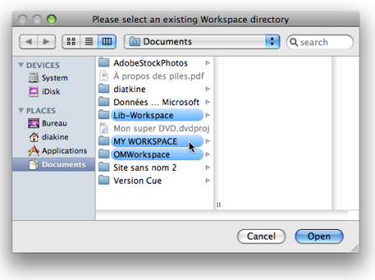
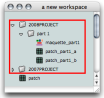
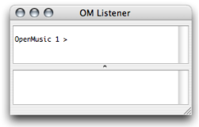

Navigation : [Previous](Launching%20OM "page précédente\(Launching
OM\)") | [Next](QuittingSaving "Next\(Quitting OM and
Saving\)")

# Workspace(s) Management

A workspace has two functions :

  * It is a virtual desktop in which programs and other associated files are created and organized. 
  * It is also a "real" folder, where most programming material is created and stored.

The Workspace therefore both refers to a window in the OM environment, and to
a folder located on the user's hard drive. The number of workspaces, their
name and location is at the user's discretion : several workspaces can coexist
on the same machine, but ** only one workspace can be open at a session **.

This chapter provides information about the content of the workspace window
and folder, and directions to manage one or several workspaces.

## Organizing Workspaces

  * Several workspaces can be kept on the same machine. Each of them represent a specific project and can possibly have a personalized environment : ** in the event of the crash or unexpected disappearing of a workspace, a user will "only" loose one project, and not a whole composer's life. **

  * Several projects can be kept in a single workspace, in several folders and sub folders, which can be convenient if they share a lot of common material. It is recommended in this case to gather all the components of a project in a dedicated sub folder. 

|

A workspace containing programs and storage folders.  
  
---|---  
  
## Workspace Window and Listener

Opening a Workspace

If you open or create a workspace at the beginning of an OM session, you will
be asked to select a directory in your hard disk. It is advised to choose the
user's home directory  , or one of its sub
directories.

The Right Folder

Mind selecting the `Workspace` folder itself and not one of its sub
directories when opening a workspace. If you select a sub directory, OM will
generate a new workspace out of it, which will disorganize your folders.

The Listener

|

Once OM has been launched, the window of the selected workspace appears
automatically with another window : the ** OM Listener **.

The Listener is a Lisp communication interface. With the workspace, it is a
major element of the OM environment, so that both windows open automatically
at the start of a session.  
  
---|---  
  
About the Listener

  * [Windows of the OM Environment](MainWindows)

## Workspace Folder

Contents

The elements folder and the corresponding workspace
window.[Zoom](../res/elementsfold_scr_1.png "Zoom \(nouvelle fenêtre\)")

The `Workspace` folder can contain a number of  **sub folders** . These sub
folders enclose the persistent documents[1] that are available for an OM
session.

The elements displayed in the workspace window are actually stored in the
`Elements` sub directory of the `Workspace` folder.

The Workspace Sub Folders

  * ` Elements` : programs, that is patches[2] (.omp files) and maquette[3] (.omm files), folders to store programs.
  * `In and Out Files` : additional files, such as audio, MIDI, SDIF and text files written or to be read by OM. 
  * `Globals` : global variables[4], that is, specific instances[5] that have been created in OM in order to be used subsequently in projects. 
  * `Resources` : material for the OM graphic interface, such as images and icons. 
  * `User` : programming tools created in OM by the user : classes[6] (.omc), functions[7] or methods[8] (both .ome). 
  * **Additional files** : preferences.lisp and wsparams.lisp contain the workspace's preferences and parameters. 

Full Information about the Workspace

  * [Workspace](Workspace)

Modifying the Workspace Folder during an OM Session

Modifying these folders can be extremely tricky and should never be done while
OM is running.

Importing and Exporting Files at a Session

  * [Import / Export](WS-ImportExport)

References :

  1. Persistent object/document, Persistence

A persistent object corresponds to a "real" file that is kept somewhere in the
hard drive of the computer. Examples of persistent objects in OM are patches,
maquettes, or global variables. The corresponding documents are kept in the
Workspace folder. Conversely, a "non-persistent" object lays within a program
but cannot be manipulated as an independent file.

  2. Patch

A programming unit where objects and functions - boxes - are interconnected to
build a musical algorithm, that is, a sequence of instructions. A patch can
also be embedded as a box within another patch.

  3. Maquette

A hybrid of visual program and sequencer, a programming unit provided with a
time dimension, where musical material is organized in a time oriented
structure.

  4. Global variable

An instance of OM object that has been saved in order to be used in other
programs. Global variables are visible from the `Library` window and stored as
.omi files in the `Globals` folder of the workspace.

  5. Instance

An actual object created at runtime, out of a given class. In OM, more
specifically, an object created when evaluating a factory box. An instance can
be saved as a global variable.

⤷ `SHIFT` click on an outlet - especially the first outlet representing the
self, the whole object - of a factory box to materialize an instance.

  6. Class

A category of objects sharing common properties - characteristics and
behaviour. A class specifies the internal structure and behaviour of an
object. In OM, it is represented in a patch by a factory box that can produce
an instance of a class.

See also : Object, Instance

  7. Function

A  portion of code within a larger program, which performs a specific task.
Operates upon 0 or more parameters and returns a value.

  8. Method

An elementary function or part of a generic function defining rules for its
behaviour depending on a type of argument. Defining a generic function amounts
to defining at least one method.

For instance, the OM+ function is made of four methods : 1. number + list / 2.
list + number / 3. number + number / 4. list + list

Contents :

  * [OpenMusic Documentation](OM-Documentation)
  * [OM User Manual](OM-User-Manual)
    * [Introduction](00-Contents)
    * [System Configuration and Installation](Installation)
    * [Going Through an OM Session](Goingthrough)
      * [Launching OM](Launching%20OM)
      * Workspace(s) Management
      * [Quitting OM and Saving](QuittingSaving)
    * [The OM Environment](Environment)
    * [Visual Programming I](BasicVisualProgramming)
    * [Visual Programming II](AdvancedVisualProgramming)
    * [Basic Tools](BasicObjects)
    * [Score Objects](ScoreObjects)
    * [Maquettes](Maquettes)
    * [Sheet](Sheet)
    * [MIDI](MIDI)
    * [Audio](Audio)
    * [SDIF](SDIF)
    * [Lisp Programming](Lisp)
    * [Reactive mode](Reactive)
    * [Errors and Problems](errors)
  * [OpenMusic QuickStart](QuickStart-Chapters)

Navigation : [Previous](Launching%20OM "page précédente\(Launching
OM\)") | [Next](QuittingSaving "Next\(Quitting OM and
Saving\)")

