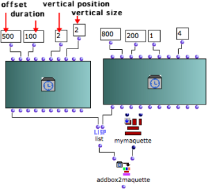
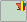
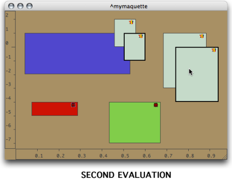
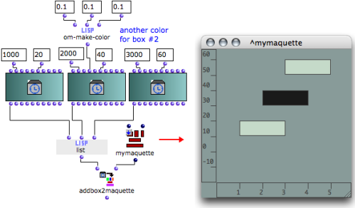
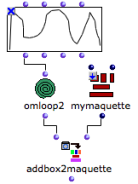
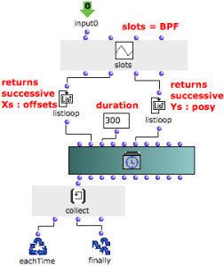
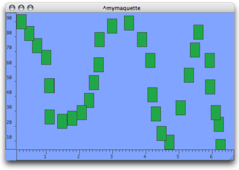

Navigation : [Previous](addprocedure "page précédente\(Adding
TemporalBoxes\)") | [Next](REF3 "Next\(Accessing
Boxes\)")

ci a ete desactive. Certaines fonctionnalites de ce guide sont restreintes.

# Adding TemporalBoxes : Examples

## Adding a List of TemporalBoxes in a Maquette

Program

|

  * List returns a list of TemporalBoxes that are added in the maquette. 
  * The Temporalbox instances have temporal and graphic parameters. 
  * The "self" outputs of the instances are connected to list. 
  * The resulting list is returned to addbox2maquette. 

When addbox2maquette is evaluated, both TemporalBoxes are added in the
maquette.  
  
---|---  
  
Maquette and Evaluations

The corresponding temporal objects are represented by gray boxes
 , which show a small OM icon if the `show box
icon` option is selected in the maquette preferences.

The maquette, after the first evaluation of addbox2maquette.

This maquette already contained three temporal objects. Addbox2maquette has
been evaluated twice, without modifying the TemporalBoxes parameters : objects
are superimposed. Everytime the function is evaluated, the TemporalBoxes are
added in the maquette. No TemporalBox is deleted from the maquette.

After the second evaluation of the function.

## Specifying Colour

The colour of a TemporalBox is specified with R-G-B values and the om-make-
color function.

Systematizing Colour According to Posy and Offset

  * [TemporalBoxes Interaction : Examples (1)](REF5)

## Specifying TemporalBoxes Number and Position with a PBF

Program

|

This patch allows to place  **several** TemporalBoxes in a maquette. It has a
BPF, an OMLoop box, and the addbox2maquette function.

  * The BPF is a series of points whose graphic position is transposed in the maquette. A series of point in the curve is selected. The x-points and y-points are converted into temporal and graphical data.
  * The OMLoop iterates the operation. 

  
  
---|---  
  
OMLoop

|

The "self" of the BPF is returned to the input of the OMLoop : the x and
y-points of each point are enumerated via the slots of a BPF and two
listloops.

  * Xs are returned to the "offset" input of the TemporalBox instance. 
  * Ys are returned to the "posy" input.
  * A duration has also been assigned to the temporalbox instance.

  1. At each step of the loop, collect stores the information returned by the temporalbox instance. 

  2. Finally returns the whole of the results addbox2maquette at the end of the iteration. 

  
  
---|---  
  
Resulting Maquette

The BPF is expressed by the position of the TemporalBoxes.

References :

Contents :

  * [OpenMusic Documentation](OM-Documentation)
  * [OM User Manual](OM-User-Manual)
    * [Introduction](00-Contents)
    * [System Configuration and Installation](Installation)
    * [Going Through an OM Session](Goingthrough)
    * [The OM Environment](Environment)
    * [Visual Programming I](BasicVisualProgramming)
    * [Visual Programming II](AdvancedVisualProgramming)
    * [Basic Tools](BasicObjects)
    * [Score Objects](ScoreObjects)
    * [Maquettes](Maquettes)
      * [Creating a Maquette](Maquette)
      * [TemporalBoxes](TemporalBoxes)
      * [The Maquette Editor](Editor)
      * [Maquette Programming](Programming%20Maquette)
      * [Maquettes in Patches](Maquettes%20in%20Patches)
        * [Build Mode](Build)
        * [Functional Mode](Maquettes%20in%20Patches1)
        * [Reference Mode](Maquettes%20in%20Patches2)
          * [Adding TemporalBoxes](addprocedure)
          * Examples
          * [Accessing Boxes](REF3)
          * [Removing Boxes](REF4)
          * [Interaction (1)](REF5)
          * [Interation (2)](Intercation2)
    * [Sheet](Sheet)
    * [MIDI](MIDI)
    * [Audio](Audio)
    * [SDIF](SDIF)
    * [Lisp Programming](Lisp)
    * [Reactive mode](Reactive)
    * [Errors and Problems](errors)
  * [OpenMusic QuickStart](QuickStart-Chapters)

Navigation : [Previous](addprocedure "page précédente\(Adding
TemporalBoxes\)") | [Next](REF3 "Next\(Accessing
Boxes\)")

