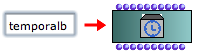
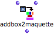
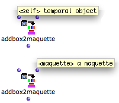
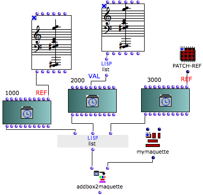
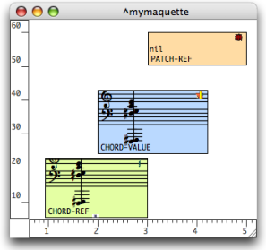
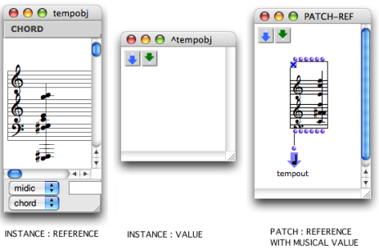
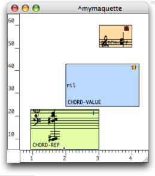

Navigation : [Previous](Maquettes%20in%20Patches2 "page
précédente\(Reference Mode\)") | [Next](addexamples "page
suivante\(Examples\)")

ci a ete desactive. Certaines fonctionnalites de ce guide sont restreintes.

# Reference Mode : Adding TemporalBoxes in a Maquette

Before a TemporalBox is added in a maquette on "reference" mode, this box must
be created in a patch as a TemporalBox instance. Several functions can then be
used for adding, accessing, deleting a TemporalBox from a maquette.

## Creating a Temporalbox Instance in a Patch

To add a ** Temporalbox instance** in a patch, `Cmd` click and type
"temporalbox", or select `Classes / OMKernel / Maquette / TEMPORALBOX`.

TemporalBox instances must then be assigned required values, such as a
position, a value, a duration, and so on.

|

  
  
---|---  
  
## Addbox2maquette Function

Functionalities

|

The ** addbox2maquette function** allows to add one or more TemporalBoxes in a
maquette from a patch.  
  
---|---  
  
The addbox2maquette function as two inputs and one input :

  * "self" : a TemporalBox instance on "reference" mode. 
  * "maquette" : a maquette on "reference" mode.
  * Its input returns the reference of a TemporalBox

|

  
  
---|---  
  
To add the addbox2maquette function :

  * `Cmd` click and type "addbox2maquette"
  * select `Functions, OMKernel, Maquette / Addbox2maquette`. 

Procedure

To add a TemporalBox with the addbox2maquette function :

  1. connect the "self" output of a TemporalBox instance to the "self" input of the function 

  2. connect the "self" output of the maquette box to the "maquette" input of the function

  3. evaluate the function. 

The parameters assigned to the TemporalBox instance are expressed by the
graphic position of the TemporalBox.

The TemporalBox is assigned a temporal and a vertical position.

Other Parameters

Of course, many other parameters and more or less sophisticated interactions
between those parameters - for instance, position / colour / pitch - can be at
stake in the maquette's program.

Programming with Parametric Interaction

  * [TemporalBoxes Interaction : Examples (1)](REF5)

## Reference and Value Inputs of the TemporalBox

A TemporalBox instance is an actual program, which can :

  * **calculate and yield** an object via its internal program,
  * **be given a value** via the "value" input,
  * **refer to an object** via its "reference" input. 

Adding Objects with the "Value" and "Reference" Inputs of a Temporalbox
Instance

This patch adds three objects in a maquette :

  1. a chord, via a "reference" input

  2. another chord, via a "value" input

  3. a patch with a chord for musical value,via a "reference" input. 

|

Addbox2maquette has been evaluated, but the TemporalBoxes have not been
evaluated yet.

  * The first box shows a chord, its  **reference** . 
  * The second box shows an  **empty patch, because it has no reference** , but its musical value is that of a chord.
  * The third box has a patch for  **reference** . It doesn't have a musical value yet.

  
  
---|---  
  
The TemporalBoxes content shows a chord instance, an empty patch and a patch
producing a musical value.

The TemporalBoxes have been evaluated. Their content has not changed.

  * The first box  **still shows** a chord, because its reference hasn't changed.
  * The second box  **now shows** **no value** , because its empty patch cannot yield anything. 
  * The third box  **now shows** a chord, because its internal patch has been evaluated. 

|

  
  
---|---  
  
"Value" vs. "Reference" Input

  * The object connected to the "value" input becomes the value of this box. This result is updated at each evaluation of  **the box's program** in the maquette. 

    * If this program is empty, then the TemporalBox  **won't yield anything** . 
    * If not, it yields whatever is connected to the program's  **Tempout** , no matter what is connected to its "value" input.
  * The object connected to the "reference" input becomes a  **permanent reference** for the TemporalBox in the maquette. 

    * This object can be a  **patch** or  **maquette** on "reference" mode, or an  **instance** .
    * If no object is assigned to this "reference" input, the TemporalBox will be an empty patch.

References :

Contents :

  * [OpenMusic Documentation](OM-Documentation)
  * [OM User Manual](OM-User-Manual)
    * [Introduction](00-Contents)
    * [System Configuration and Installation](Installation)
    * [Going Through an OM Session](Goingthrough)
    * [The OM Environment](Environment)
    * [Visual Programming I](BasicVisualProgramming)
    * [Visual Programming II](AdvancedVisualProgramming)
    * [Basic Tools](BasicObjects)
    * [Score Objects](ScoreObjects)
    * [Maquettes](Maquettes)
      * [Creating a Maquette](Maquette)
      * [TemporalBoxes](TemporalBoxes)
      * [The Maquette Editor](Editor)
      * [Maquette Programming](Programming%20Maquette)
      * [Maquettes in Patches](Maquettes%20in%20Patches)
        * [Build Mode](Build)
        * [Functional Mode](Maquettes%20in%20Patches1)
        * [Reference Mode](Maquettes%20in%20Patches2)
          * Adding TemporalBoxes
          * [Examples](addexamples)
          * [Accessing Boxes](REF3)
          * [Removing Boxes](REF4)
          * [Interaction (1)](REF5)
          * [Interation (2)](Intercation2)
    * [Sheet](Sheet)
    * [MIDI](MIDI)
    * [Audio](Audio)
    * [SDIF](SDIF)
    * [Lisp Programming](Lisp)
    * [Reactive mode](Reactive)
    * [Errors and Problems](errors)
  * [OpenMusic QuickStart](QuickStart-Chapters)

Navigation : [Previous](Maquettes%20in%20Patches2 "page
précédente\(Reference Mode\)") | [Next](addexamples "page
suivante\(Examples\)")

