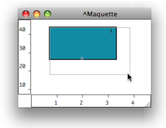
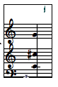
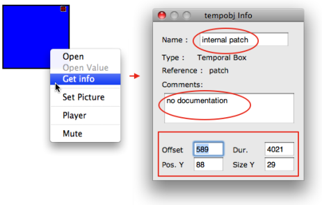
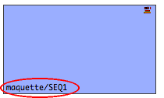

Navigation : [Previous](AddingTempbox "page précédente\(Adding
TemporalBoxes\)") | [Next](Appearance "page
suivante\(Temporalboxes Appearance\)")

# Elementary Manipulations

## Basic Commands

Selection

Boxes are selected using standard mouse selection. A selected box generally
shows a bold border.

  * To enable multiple selection, keep `SHIFT` pressed while clicking on boxes.

  * To select all the boxes of a window : 

    * choose `Edit / Select All`
    * press `Cmd`\+ `a` .

Resize

|

  * To resize a box, hover the mouse over the lower-right corner of the box, then drag it with the cursor
  * To reinitialize the size of a box, press `i`.

  
  
---|---  
  

|

Note that the content displayed in the miniview rarely fits the size of the
box.  
  
---|---  
  
Move

To move and item :

  * drag and drop it with the mouse
  * use the `->` keys - add  `SHIFT` to move items faster.

Align

To align all selected boxes automatically, press `SHIFT`\+ `a` .

Copy

To copy an item from a maquette editor to another one, or to another location
in the maquette :

  * press `Alt` \+ and drag the item
  * use the `Edit` menu commands and shortcuts - Copy, Paste, Duplicate....

Deleting Selected Boxes

To delete one or several selected boxes :

  * press `Backspace`.
  * use the `Edit / Clear` or `Cut` menu.
  * use the `Cmd`\+ `x` shortcut.

Undo

To cancel an action :

  * select `Edit / Undo`
  * press `Cmd`\+ `z`.

## Editing and Displaying Information

Size, Position, Name, Comments : the Get Info Window

The `Info` window displays information about the name, position in the
maquette, size of the TemporalBox, as well as possible comments.

  * To open the window, `Ctrl` / right click on the box and choose `Get Info` .

  * To edit the name, position and size of a TemporalBox, or add a comment : 

    1. click and type information in the relevant frame

    2. validate

Displaying Names

To display the name of a box, select it and press `n`

|

  
  
---|---  
  
Reminder

To display the TemporalBox reference icon, select the `Show Box Icons` option
of the `Maquette Preferences` tab.

References :

Plan :

  * [OpenMusic Documentation](OM-Documentation)
  * [OM 6.6 User Manual](OM-User-Manual)
    * [Introduction](00-Sommaire)
    * [System Configuration and Installation](Installation)
    * [Going Through an OM Session](Goingthrough)
    * [The OM Environment](Environment)
    * [Visual Programming I](BasicVisualProgramming)
    * [Visual Programming II](AdvancedVisualProgramming)
    * [Basic Tools](BasicObjects)
    * [Score Objects](ScoreObjects)
    * [Maquettes](Maquettes)
      * [Creating a Maquette](Maquette)
      * [TemporalBoxes](TemporalBoxes)
        * [Adding TemporalBoxes](AddingTempbox)
        * Elementary Manipulations
        * [Temporalboxes Appearance](Appearance)
        * [TemporalBoxes Value](TempValues)
      * [The Maquette Editor](Editor)
      * [Maquette Programming](Programming%20Maquette)
      * [Maquettes in Patches](Maquettes%20in%20Patches)
    * [Sheet](Sheet)
    * [MIDI](MIDI)
    * [Audio](Audio)
    * [SDIF](SDIF)
    * [Lisp Programming](Lisp)
    * [Errors and Problems](errors)
  * [OpenMusic QuickStart](QuickStart-Chapters)

Navigation : [Previous](AddingTempbox "page précédente\(Adding
TemporalBoxes\)") | [Next](Appearance "page
suivante\(Temporalboxes Appearance\)")

