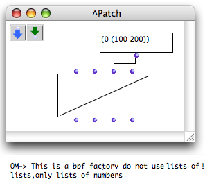
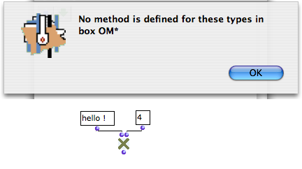
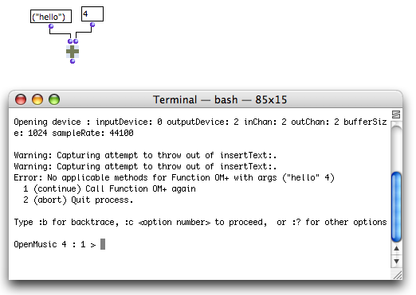

Navigation : [Previous](Reactive "page précédente\(Reactive visual programs in OM\)") | [Next](QuickStart-Chapters "page
suivante\(OpenMusic QuickStart\)")

# Errors and Problems

## Warnings

Listener Messages

|

Minor programming errors are usually displayed in the Listener window as well
as plain messages. This allows OM to keep on running smoothly and the user to
understand the origins of the error.

Such error messages can occur when evaluating a box, for instance.  
  
---|---  
  
Handle Error Messages Option

More "serious" errors can interrupt the evaluation of a patch. If the `handle
error messages` option was selected in the `Preferences` pane, an error window
opens.

If not, the error will propagate and a **Terminal** window will open.

## The Lisp Terminal

In the case of more important, unpredicted errors, or if the `handle error
messages` option wasn't selected, a system Terminal opens and reprorts the
error.

Terminal Window Commands

This terminal window is an underlying Lisp debugger, which can be exited, or
used for understanding and possibly solve the cause of an error.

Here are a few useful commands to enter in this terminal :

  * To get back to the ** preceding step ** of the error : enter ":top" and validate
  * To display the **simple backtrace** of an error : enter ":b" and validate.
  * To display the  **detailed backtrace** of an error : enter ":bb" and validate.

The function call stack in question can be copied and submitted in a bug
report to the IRCAM development or support teams.

  * To use one of the  **options offered** by the Terminal, type ":c" with the option's reference, e.g. : ":c 1", ":c 2", etc. and validate.
  * To display  **other possible commands** , enter ":help" and validate.

An error in the Mac OS system Terminal

## Abort Command

If a program execution is stuck or lasts too long, go to the OM Listener and
type `Cmd` \+ `SHIFT` \+ `a` to abort.

References :

Contents :

  * [OpenMusic Documentation](OM-Documentation)
  * [OM User Manual](OM-User-Manual)
    * [Introduction](00-Contents)
    * [System Configuration and Installation](Installation)
    * [Going Through an OM Session](Goingthrough)
    * [The OM Environment](Environment)
    * [Visual Programming I](BasicVisualProgramming)
    * [Visual Programming II](AdvancedVisualProgramming)
    * [Basic Tools](BasicObjects)
    * [Score Objects](ScoreObjects)
    * [Maquettes](Maquettes)
    * [Sheet](Sheet)
    * [MIDI](MIDI)
    * [Audio](Audio)
    * [SDIF](SDIF)
    * [Lisp Programming](Lisp)
    * [Reactive mode](Reactive)
    * Errors and Problems
  * [OpenMusic QuickStart](QuickStart-Chapters)

Navigation : [Previous](Reactive "page précédente\(Reactive visual programs in OM\)") | [Next](QuickStart-Chapters "page
suivante\(OpenMusic QuickStart\)")

