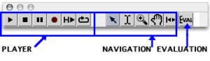
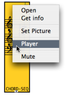

Navigation : [Previous](Grid%20and%20Rulers "page
précédente\(Rulers and Grid\)") | [Next](Markers "page
suivante\(Markers / Anchors\)")

# The Palette

## Palette

|

The maquette provides a palette with navigation controlers, a player, and an
evaluation command.  
  
---|---  
  
Navigation

|

**Zoom :**

|

click and drag the mouse over a zone of the maquette to zoom on it.  
  
---|---|---  
  

|

**Hand :**

|

click and slip to reach a zone of the maquette without changing its scale.  
  

|

**Reset :**

|

select this tool to fit the content of the maquette to the window editor.  
  

|

**Segment :**

|

click and drag the mouse over a temporal segment to select it.  
  

|

**Pointer :**

|

allows the selection of boxes.  
  
Player

|

**Play :**

|

applies to the whole maquette.  
  
---|---|---  
  

|

**Stop**

|  
  

|

**Pause**

|  
  

|

**Play selection :**

|

applies to a selected temporal segment, or selected boxes.  
  

|

**Loop :**

|

a switch on/off to associate with  or
 to play an item, temporal chunk or a whole
maquette repeatedly.  
  
The `Space` key can be used as a "play / stop" command.

Evaluation

Evaluation  : this command evaluates the whole
content of the maquette.

Evaluation of Maquettes and Temporaboxes

  * [Evaluation of the Maquette](MaquetteEvaluation)

Player Options

Each object can be played with one or several players.

To assign a player to an object :

  1. `Ctrl` / right click on a box 

  2. choose `Player` . 

To apply the same module to all the TemporalBoxes of a maquette, follow the
same procedure from the maquette editor.

|

  
  
---|---  
  
Detailed Presentation of Players

  * [Playback and Players](1-Play)

References :

Contents :

  * [OpenMusic Documentation](OM-Documentation)
  * [OM User Manual](OM-User-Manual)
    * [Introduction](00-Contents)
    * [System Configuration and Installation](Installation)
    * [Going Through an OM Session](Goingthrough)
    * [The OM Environment](Environment)
    * [Visual Programming I](BasicVisualProgramming)
    * [Visual Programming II](AdvancedVisualProgramming)
    * [Basic Tools](BasicObjects)
    * [Score Objects](ScoreObjects)
    * [Maquettes](Maquettes)
      * [Creating a Maquette](Maquette)
      * [TemporalBoxes](TemporalBoxes)
      * [The Maquette Editor](Editor)
        * [Editor Appearance](EditorAppearance)
        * [Rulers and Grid](Grid%20and%20Rulers)
        * The Palette
        * [Markers / Anchors](Markers)
      * [Maquette Programming](Programming%20Maquette)
      * [Maquettes in Patches](Maquettes%20in%20Patches)
    * [Sheet](Sheet)
    * [MIDI](MIDI)
    * [Audio](Audio)
    * [SDIF](SDIF)
    * [Lisp Programming](Lisp)
    * [Errors and Problems](errors)
  * [OpenMusic QuickStart](QuickStart-Chapters)

Navigation : [Previous](Grid%20and%20Rulers "page
précédente\(Rulers and Grid\)") | [Next](Markers "page
suivante\(Markers / Anchors\)")

