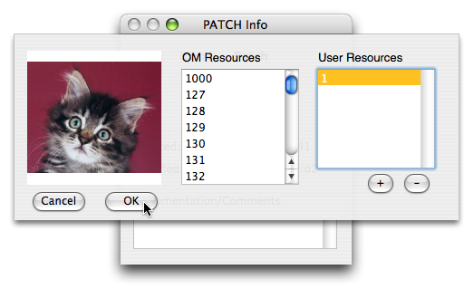
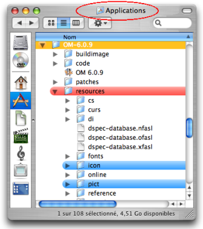
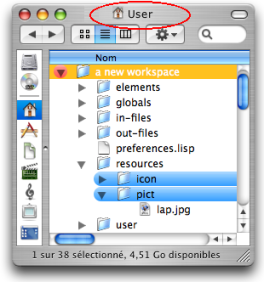
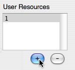
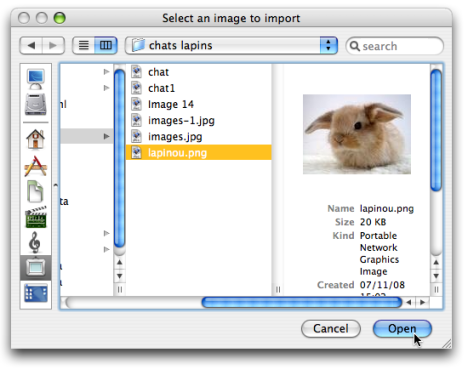

Navigation : [Previous](Tutorials "page précédente\(Tutorials\)")
| [Next](BasicVisualProgramming "Next\(Visual
Programming I\)")

# Resources

Resources are images or icons dedicated to the visual interface of OM. The
user may have to choose images or icons for various reasons : inserting an
image in a patch, giving an identity to a temporal object[1] in a maquette,
choosing an icon for a patch, a class or a function...

## Generalities

The user may be asked to select pictures or icons in several cases. In this
case, a **Resource Selection** dialog will appear and help selecting the
corresponding file from OM or user resources (see section below).

Format, Size and Name

Several formats can be handled by the OM interface :

  * **TIF** files (.tif, .tiff), 
  * **JPEG** files (.jpg, .jpeg), 
  * **GIF** files (.gif), 
  * **BMP** files (.bmp) 
  * **PNG** files (.png). 

Pictures and icons can have background transparency alpha layer.

Icons shouldn't exceed 64 pixels and be given a numeric reference such as
"127.tiff".

Images can have any name and dimensions.

Uses

Pictures or icons can be assigned as background pictures in patches and
maquettes. They can also be assigned to the patches and maquettes or other
user-defined items in the Workspace and Library windows.

Changing the Icon of an Item

  * [Presentation Options](WS-Presentation)

Background Pictures in Patches and Maquettes

  * [Picture Box](PictureBox)
  * [Maquette Editor Appearance](EditorAppearance)

## Resources Directories

OM Resources

Pictures and icons of the **OM Resources** are located in the `Applications /
OM 6.X.X / resources / icon - pict` sub folders.

User Resources

|

Pictures and icons added as **User Resources** belong to the workspace `
resources / icon - pict` sub folders.  
  
---|---  
  
## Resource Selection Dialog

Choosing resources

Depending on the case, the resource selection dialog will display the icons or
pictures available in the OM resources and/or in the user resources.

Adding a Resource

You can add an icon or an image to the **User Resources**.

  1. Click on `+` .

  2. A dialogue window opens.

|

  
  
---|---  
  
Select a resource :

  1. Browse your hard drive to select a file.

  2. Choose `Open` and `OK` in the dialogue window. 

Choose `Cancel` to cancel your choice.

The selected file will be automatically copied and stored in the `Workspace /
Resources /`sub-folder.

Deleting a Resource

To delete a picture or icon from the **User Resources** , choose `-`.

The corresponding file will be automatically deleted from the `Workspace /
Resources /`sub-folder.

References :

  1. Temporal object

In a maquette, any object provided with an explicit or computable duration,
such as an audio file, a chord object or a patch.

See also : Maquette.

Contents :

  * [OpenMusic Documentation](OM-Documentation)
  * [OM User Manual](OM-User-Manual)
    * [Introduction](00-Contents)
    * [System Configuration and Installation](Installation)
    * [Going Through an OM Session](Goingthrough)
    * [The OM Environment](Environment)
      * [Environment Windows](MainWindows)
      * [Preferences](Preferences)
      * [Workspace](Workspace)
      * [Library](Library)
      * [Tutorials](Tutorials)
      * Resources
    * [Visual Programming I](BasicVisualProgramming)
    * [Visual Programming II](AdvancedVisualProgramming)
    * [Basic Tools](BasicObjects)
    * [Score Objects](ScoreObjects)
    * [Maquettes](Maquettes)
    * [Sheet](Sheet)
    * [MIDI](MIDI)
    * [Audio](Audio)
    * [SDIF](SDIF)
    * [Lisp Programming](Lisp)
    * [Errors and Problems](errors)
  * [OpenMusic QuickStart](QuickStart-Chapters)

Navigation : [Previous](Tutorials "page précédente\(Tutorials\)")
| [Next](BasicVisualProgramming "Next\(Visual
Programming I\)")

