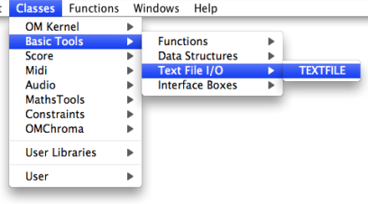

Navigation : [Previous](ArrayTools "page précédente\(Class-Array
Tools\)") | [Next](TextFileEdition "Next\(TextFile
Edition\)")

# TextFile

|

The ** TextFile ** box represents a text buffer in a visual program. It can be

  * internal to a patch - by default
  * attached to an **external file** of the computer.

  
---|---  
  
Textfile boxes are accessed via the `Classes / Basic Tools / Text / TEXTFILE`
menu.

References :

Contents :

  * [OpenMusic Documentation](OM-Documentation)
  * [OM User Manual](OM-User-Manual)
    * [Introduction](00-Contents)
    * [System Configuration and Installation](Installation)
    * [Going Through an OM Session](Goingthrough)
    * [The OM Environment](Environment)
    * [Visual Programming I](BasicVisualProgramming)
    * [Visual Programming II](AdvancedVisualProgramming)
    * [Basic Tools](BasicObjects)
      * [Curves and Functions](CurvesAndFunctions)
      * [Array](ClassArray)
      * TextFile
        * [TextFile Edition](TextFileEdition)
        * [Outer Environment](TextFileEnvironment)
      * [Picture](Picture)
    * [Score Objects](ScoreObjects)
    * [Maquettes](Maquettes)
    * [Sheet](Sheet)
    * [MIDI](MIDI)
    * [Audio](Audio)
    * [SDIF](SDIF)
    * [Lisp Programming](Lisp)
    * [Reactive mode](Reactive)
    * [Errors and Problems](errors)
  * [OpenMusic QuickStart](QuickStart-Chapters)

Navigation : [Previous](ArrayTools "page précédente\(Class-Array
Tools\)") | [Next](TextFileEdition "Next\(TextFile
Edition\)")

