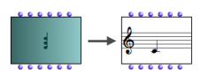
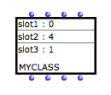
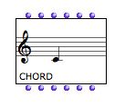
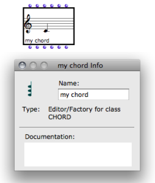

Navigation générale : 

  - [Guide](OM-Documentation.md)
  - [Plan](OM-Documentation_1.md)
  - [Glossaire](OM-Documentation_2.md)

OpenMusic
DocumentationHiérarchie
de section : [OM 6.6 User
Manual](OM-User-Manual.md) \>
[Visual Programming
I](BasicVisualProgramming.md) \>
[Boxes](Boxes.md) \>
[Objects – Factory
Boxes](FactoryBoxes.md) \>
Visualization

Navigation : [page
précédente](FactoryBoxes.md "page précédente(Objects – Factory Boxes)")
| [page
suivante](2-Instanciation.md "page suivante(Instantiating Objects)")

# Visualization

## Visualizing Objects : the Miniview

<table>
<colgroup>
<col style="width: 50%" />
<col style="width: 50%" />
</colgroup>
<tbody>
<tr class="odd">
<td>

The current value of a factory box – its last computed value, or its default value if the box has just been added – is displayed instead of the initial icon.

To show or hide a miniview, press <code class="keyboard_tl">m</code> .

</td>
<td>

A "chord" box in normal and "miniview" modes.

</td>
</tr>
</tbody>
</table>

Adjustments

To move the content of a miniview up or down : press `Alt`+ `↑` or `↓` .

Default Miniview

<table>
<colgroup>
<col style="width: 50%" />
<col style="width: 50%" />
</colgroup>
<tbody>
<tr class="odd">
<td>

The object refers to a simple class with three slots : slot1, slot2 and slot3.

</td>
<td>

Some classes don't have a specific miniview. A default miniview then shows the different slot – input – names and current values.

</td>
</tr>
</tbody>
</table>

About Slots

  - [Instantiating Objects](2-Instanciation.md)

## Displaying and Editing the Name of a Factory Box

<table>
<colgroup>
<col style="width: 50%" />
<col style="width: 50%" />
</colgroup>
<tbody>
<tr class="odd">
<td>

</td>
<td>

In theory, the name of a factory box isn't displayed with its icon.

To displayed or hide the name of a box, press  <code class="keyboard_tl">n</code>.

A default name appears in the lower left corner of the box icon. This name is that of the corresponding class of the box.

</td>
</tr>
</tbody>
</table>

<table>
<colgroup>
<col style="width: 50%" />
<col style="width: 50%" />
</colgroup>
<tbody>
<tr class="odd">
<td>

To edit this name :

<ol>
<li>
open the <code class="label_tl">Info</code> window

<ul>
<li>select <code class="menuPath_tl">File / Get Info</code> </li>
<li>press <code class="keyboard_tl">Cmd</code> +<code class="keyboard_tl"> i</code></li>
</ul></li>
<li>
edit the name in the <strong>"Name"</strong> frame.
</li>
</ol>

</td>
<td>

</td>
</tr>
</tbody>
</table>

Références : 

Plan :

  - [OpenMusic Documentation](OM-Documentation.md)
  - [OM 6.6 User Manual](OM-User-Manual.md)
      - [Introduction](00-Sommaire.md)
      - [System Configuration and
        Installation](Installation.md)
      - [Going Through an OM Session](Goingthrough.md)
      - [The OM Environment](Environment.md)
      - [Visual Programming I](BasicVisualProgramming.md)
          - [Patch Introduction](ProgrammingIntro.md)
          - [Adding Boxes Into a Patch](AddingBoxes.md)
          - [Elementary Manipulations](ElementaryManips.md)
          - [Boxes](Boxes.md)
              - [Boxes Features](GraphicFeatures.md)
              - [Data Boxes](DataBox.md)
              - [Function Boxes](FunctionBoxes.md)
              - [Objects – Factory Boxes](FactoryBoxes.md)
                  - Visualization
                  - [Instantiating
                    Objects](2-Instanciation.md)
                  - [Playback and Players](1-Play.md)
                  - [Editors](3-Editors.md)
                  - [Import/Export](4-ImportExport.md)
              - [Abstraction Boxes](AbsBoxesIntro.md)
              - [Other Boxes](OtherBoxes.md)
          - [Box Inputs](BoxInputs.md)
          - [Connections](Connections.md)
          - [Evaluation](Evaluation.md)
          - [Documentation and Info](DocAndInfo.md)
          - [Comments](Comments.md)
          - [Pictures](Pictures.md)
          - [Saving / Reloading a Patch](SavingPatch.md)
          - [Dead Boxes](DeadBox.md)
      - [Visual Programming
        II](AdvancedVisualProgramming.md)
      - [Basic Tools](BasicObjects.md)
      - [Score Objects](ScoreObjects.md)
      - [Maquettes](Maquettes.md)
      - [Sheet](Sheet.md)
      - [MIDI](MIDI.md)
      - [Audio](Audio.md)
      - [SDIF](SDIF.md)
      - [Lisp Programming](Lisp.md)
      - [Errors and Problems](errors.md)
  - [OpenMusic QuickStart](QuickStart-Chapters.md)

Navigation : [page
précédente](FactoryBoxes.md "page précédente(Objects – Factory Boxes)")
| [page
suivante](2-Instanciation.md "page suivante(Instantiating Objects)")

[A propos...](OM-Documentation_3.md)(c) Ircam - Centre
Pompidou

