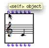
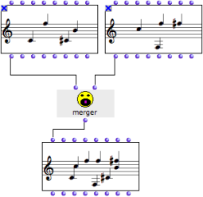
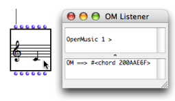
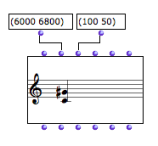
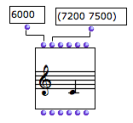
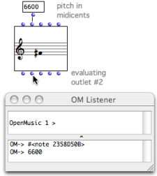

Navigation générale : 

  - [Guide](OM-Documentation.md)
  - [Plan](OM-Documentation_1.md)
  - [Glossaire](OM-Documentation_2.md)

OpenMusic
DocumentationHiérarchie
de section : [OM 6.6 User
Manual](OM-User-Manual.md) \>
[Visual Programming
I](BasicVisualProgramming.md) \>
[Boxes](Boxes.md) \>
[Objects – Factory
Boxes](FactoryBoxes.md) \>
Instantiating
Objects

Navigation : [page
précédente](1-Visualization.md "page précédente(Visualization)")
| [page
suivante](1-Play.md "page suivante(Playback and Players)")

# Instantiating Objects

Instantiation

An instance is an exemplar of a class of objects. Instantiation is the
process of creating an instance of a class using a factory box.

Factory Slots

A factory box has a number of slots, represented by inputs and outputs.
Once values are assigned to the slots or parameters of a factory box, it
can be evaluated to produce an
instance[\[1\]](#kFootBsktc1804),
an exemplar of a class.

  - The first input and output always correspond to the object
    that is created by the box. It is called the "self" of the
    box.
  - Each of the other inputs and outputs stands for an attribute,
    or parameter of the object – a
    slot[\[2\]](#kFootBsktc2074)
    of the corresponding
    class[\[3\]](#kFootBsktc1871).

Note that the value of a factory box can also be defined via its editor.

## First Input / Output : "Self"

<table>
<colgroup>
<col style="width: 50%" />
<col style="width: 50%" />
</colgroup>
<tbody>
<tr class="odd">
<td>

</td>
<td>

The first input / output of a factory box is usually called "self". It stands for the object itself.

A "self" input can be connected to :

<ul>
<li> the "self" output of an <strong>object belonging to the same class</strong> , </li>
<li>a <strong>simple value</strong> , or the <strong>output of an object</strong> , provided it can produce such an object.</li>
</ul>

Reciprocally, the evaluation of a "self" output, or its connection to another box returns the computed object itself.

</td>
</tr>
</tbody>
</table>

Automatic Object Conversions

When compatibility allows it, OM automatic converts objects of a
diferent type and creates an instance of the relevant class.

A chord can be created from a note, but a note cannot be created from a
chord.

Manipulating Objects via the "Self" Input

The merger function builds a chord-sequence, or
chord-seq[\[4\]](#kFootBsktc2079)
, out of two other chord-sequences given as
arguments[\[5\]](#kFootBsktc2051).

<table>
<colgroup>
<col style="width: 50%" />
<col style="width: 50%" />
</colgroup>
<tbody>
<tr class="odd">
<td>

</td>
<td>

<ul>
<li>Top : the "self" outputs of the chord-seqs are connected to the inputs of merger. </li>
<li>Middle : the output of merger is connected to the "self" input of a third chord-seq.</li>
<li>Bottom : the third chord-seq represents the resulting chord sequence once evaluated.</li>
</ul>

</td>
</tr>
</tbody>
</table>

The two initial chord-seqs are locked to preserve their value.
Conversely, the box that is to be evaluated isn't locked, to take the
result of the upstream computation into account.

Protecting a Box

  - [Lock Mode](LockMode.md)

Evaluation

<table>
<colgroup>
<col style="width: 50%" />
<col style="width: 50%" />
</colgroup>
<tbody>
<tr class="odd">
<td>

To evaluate a box, select it and press <code class="keyboard_tl">v</code> .

Its value is computed, and the result of the "self" output, that is, the internal representation of the resulting instance<a href="#kFootBsktc1804">[1]</a> is displayed in the Listener.

</td>
<td>

</td>
</tr>
</tbody>
</table>

About Evaluation

  - [Evaluation](Evaluation.md)

Tip : Reinitializing a Box

To reset a box to its default state, press `SHIFT` + `i` .

## Other Inputs / Outputs : Object Parameters

Parameters (Slots)

The other inputs and outputs represent the various parameters (also
called class
slots[\[2\]](#kFootBsktc2074)),
used for defining an instance.

Inputs and outputs respectively address the same parameters – and follow
the same ordering.

A note box has five inlets and outlets, a "self", and four other inlets,
which correspond to the usual musical features or parameters of a note :
midicents – pitch –, velocity – dynamics –, duration, midi channel.

To get information about the qualities of a slot, keep pressing `Cmd`
while overing the mouse over an input or output.

Setting Input Values

<table>
<colgroup>
<col style="width: 50%" />
<col style="width: 50%" />
</colgroup>
<tbody>
<tr class="odd">
<td>

Building a chord with two of its parameters : a list of pitches (6000 6800) for C4 and G#4, and a list of note velocities – dynamics – (100 50).

</td>
<td>

Input values must be specified to define an object. Several parameters can be set or connected at a time. If no value is specified, the default value of the input is applied.

</td>
</tr>
</tbody>
</table>

Setting Box Inputs Values, Using a Box's Editor

  - [Box Inputs](BoxInputs.md)
  - [Editors](3-Editors.md)

Conflict : Setting the "Self" Input and Other Attributes

<table>
<colgroup>
<col style="width: 50%" />
<col style="width: 50%" />
</colgroup>
<tbody>
<tr class="odd">
<td>

An object can be created directly from the "self" input value, and from the other input parameters. By convention, "self" has priority over the other inputs, whose values are ignored.

</td>
<td>

Different values have been assigned to the "self" and "pitch" inputs. The value of the "self" input is applied for the instantiation.

</td>
</tr>
</tbody>
</table>

Getting Output Values

The different outlets of an object can be used for reading the values of
its attributes. Outputs can be connected as parameters to other factory
or function box inputs.

To evaluate the value of an output, `Cmd` click on it. The whole box is
evaluated and a specific instance of the class is created.

<table>
<colgroup>
<col style="width: 50%" />
<col style="width: 50%" />
</colgroup>
<tbody>
<tr class="odd">
<td>

The second input represents the pitch value of a note box.

<ul>
<li>If the factory box, or if its "self" outlet is evaluated, the reference of the instance appears in the Listener. </li>
<li>If the second output is evaluated, a similar value to that of the second inlet is returned in the Listener, and inform us about the pitch of the note. </li>
</ul>

</td>
<td>

</td>
</tr>
</tbody>
</table>

Références : 

1.  
    
    

    
    

    
    Instance
    
    

    
    

    
    

    
    

    
    An actual object created at runtime, out of a given class. In OM,
    more specifically, an object created when evaluating a factory box.
    An instance can be saved as a global variable.
    
    ⤷ `SHIFT` click on an outlet – especially the first outlet
    representing the self, the whole object – of a factory box to
    materialize an instance.
    
    

    
    

    
    

    
    

2.  
    
    

    
    

    
    Slot
    
    

    
    

    
    

    
    

    
    In object oriented programming, a slot represents and attribute of a
    class. For instance, the class "note" in OM has 4 slots : pitch,
    duration, velocity, and MIDI channel.
    
    

    
    

    
    

    
    

3.  
    
    

    
    

    
    Class
    
    

    
    

    
    

    
    

    
    A category of objects sharing common properties – characteristics
    and behaviour. A class specifies the internal structure and
    behaviour of an object. In OM, it is represented in a patch by a
    factory box that can produce an instance of a class.
    
    See also : Object, Instance
    
    

    
    

    
    

    
    

4.  
    
    

    
    

    
    Chord-Seq
    
    

    
    

    
    

    
    

    
    OM name of a chord sequence. By extension, a note sequence, since a
    single note can be considered a chord.
    
    

    
    

    
    

    
    

5.  
    
    

    
    

    
    Argument
    
    

    
    

    
    

    
    

    
    An argument represents a parameter upon which a function operates.
    For instance, the (om+ x y) function has two arguments : x and y.
    
    

    
    

    
    

    
    

Plan :

  - [OpenMusic Documentation](OM-Documentation.md)
  - [OM 6.6 User Manual](OM-User-Manual.md)
      - [Introduction](00-Sommaire.md)
      - [System Configuration and
        Installation](Installation.md)
      - [Going Through an OM Session](Goingthrough.md)
      - [The OM Environment](Environment.md)
      - [Visual Programming I](BasicVisualProgramming.md)
          - [Patch Introduction](ProgrammingIntro.md)
          - [Adding Boxes Into a Patch](AddingBoxes.md)
          - [Elementary Manipulations](ElementaryManips.md)
          - [Boxes](Boxes.md)
              - [Boxes Features](GraphicFeatures.md)
              - [Data Boxes](DataBox.md)
              - [Function Boxes](FunctionBoxes.md)
              - [Objects – Factory Boxes](FactoryBoxes.md)
                  - [Visualization](1-Visualization.md)
                  - Instantiating
                    Objects
                  - [Playback and Players](1-Play.md)
                  - [Editors](3-Editors.md)
                  - [Import/Export](4-ImportExport.md)
              - [Abstraction Boxes](AbsBoxesIntro.md)
              - [Other Boxes](OtherBoxes.md)
          - [Box Inputs](BoxInputs.md)
          - [Connections](Connections.md)
          - [Evaluation](Evaluation.md)
          - [Documentation and Info](DocAndInfo.md)
          - [Comments](Comments.md)
          - [Pictures](Pictures.md)
          - [Saving / Reloading a Patch](SavingPatch.md)
          - [Dead Boxes](DeadBox.md)
      - [Visual Programming
        II](AdvancedVisualProgramming.md)
      - [Basic Tools](BasicObjects.md)
      - [Score Objects](ScoreObjects.md)
      - [Maquettes](Maquettes.md)
      - [Sheet](Sheet.md)
      - [MIDI](MIDI.md)
      - [Audio](Audio.md)
      - [SDIF](SDIF.md)
      - [Lisp Programming](Lisp.md)
      - [Errors and Problems](errors.md)
  - [OpenMusic QuickStart](QuickStart-Chapters.md)

Navigation : [page
précédente](1-Visualization.md "page précédente(Visualization)")
| [page
suivante](1-Play.md "page suivante(Playback and Players)")

[A propos...](OM-Documentation_3.md)(c) Ircam - Centre
Pompidou

