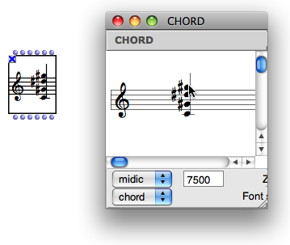

Navigation générale : 

  - [Guide](OM-Documentation.md)
  - [Plan](OM-Documentation_1.md)
  - [Glossaire](OM-Documentation_2.md)

OpenMusic
DocumentationHiérarchie
de section : [OM 6.6 User
Manual](OM-User-Manual.md) \>
[Visual Programming
I](BasicVisualProgramming.md) \>
[Boxes](Boxes.md) \>
[Objects – Factory
Boxes](FactoryBoxes.md) \>
Editors

Navigation : [page
précédente](1-Play.md "page précédente(Playback and Players)")
| [page
suivante](4-ImportExport.md "page suivante(Import/Export)")

# Editors

Factory boxes have an **internal editor** . As a complement to the
algorithmic creation of objects, it is a means to build, or modify them
manually once objects have been initialized. Some elementary classes
have a default editor, but most objects used in OM have specifically
dedicated editors, such as score editors, sound file editors, BPF
editors, etc. All editors open with a double click on a factory box.

## Basic Editors

Default Instance Editor

<table>
<colgroup>
<col style="width: 50%" />
<col style="width: 50%" />
</colgroup>
<tbody>
<tr class="odd">
<td>

When a class has only a default – basic – editor, it opens with a double click.

This editor has a number of slots<a href="#kFootBsktc2074">[1]</a>, which represent the object's parameters. Each slot is represented by a grey box and can be edited directly.

To edit the value of a component :

<ol>
<li>
double click on the numeric frame
</li>
<li>
enter a new value and validate.
</li>
</ol>

</td>
<td>

The default editor of an OSC-event.

</td>
</tr>
</tbody>
</table>

If the value of a slot is iself an instance of a class (e.g. a note,
etc.), the internal editor of this class opens at double-clicking it in
the parent editor.

Lists (e.g., "bundle" in the previous example) also open in a specific
internal list editor.

List Editor

List in OM editors have a specific editor where each item is presented
in a separate cell (and can in turn be edited).

A **list editor** displays components values, indexes and navigation
arrows.

<table>
<colgroup>
<col style="width: 50%" />
<col style="width: 50%" />
</colgroup>
<tbody>
<tr class="odd">
<td>

A List editor

</td>
<td>

<ul>
<li>
Items are displayed next to a bidimensional index in the list, that is, the editor allows to represent lists of list on a single plane.
</li>
<li>
The navigation arrows at the top allow to shift the display position in the list (the editor window shows up to 10 elements only).
</li>
</ul>

</td>
</tr>
</tbody>
</table>

Note

It is not possible to modify the number of elements in a List using the
list editor.

## Specific Editors

Some factory boxes have a specific editor, which also opens with a
double click.

Example of OM object editors

  - [BPFs and BPCs Editors](BPFEditors.md)
  - [Score Editors](ScoreEditors.md)

To open the default editor of such factory box, press `Cmd` and double
click on the box.

The default and specific score editors of the "note" class

Note that both editors can't be open at the same time. Close the editor
manually so as to open the other editor.

## Preserving Manual Modifications

Once modifications have been done in an editor, the corresponding box is
**locked automatically** . Indeed, a new evaluation of an unlocked box
would compute a new object and replace the current value, hence
canceling all previous modifications. Of course, the box can still be
unlocked if necessary.

To lock or unlock a box, select it and press `b`.

Références : 

1.  
    
    

    
    

    
    Slot
    
    

    
    

    
    

    
    

    
    In object oriented programming, a slot represents and attribute of a
    class. For instance, the class "note" in OM has 4 slots : pitch,
    duration, velocity, and MIDI channel.
    
    

    
    

    
    

    
    

Plan :

  - [OpenMusic Documentation](OM-Documentation.md)
  - [OM 6.6 User Manual](OM-User-Manual.md)
      - [Introduction](00-Sommaire.md)
      - [System Configuration and
        Installation](Installation.md)
      - [Going Through an OM Session](Goingthrough.md)
      - [The OM Environment](Environment.md)
      - [Visual Programming I](BasicVisualProgramming.md)
          - [Patch Introduction](ProgrammingIntro.md)
          - [Adding Boxes Into a Patch](AddingBoxes.md)
          - [Elementary Manipulations](ElementaryManips.md)
          - [Boxes](Boxes.md)
              - [Boxes Features](GraphicFeatures.md)
              - [Data Boxes](DataBox.md)
              - [Function Boxes](FunctionBoxes.md)
              - [Objects – Factory Boxes](FactoryBoxes.md)
                  - [Visualization](1-Visualization.md)
                  - [Instantiating
                    Objects](2-Instanciation.md)
                  - [Playback and Players](1-Play.md)
                  - Editors
                  - [Import/Export](4-ImportExport.md)
              - [Abstraction Boxes](AbsBoxesIntro.md)
              - [Other Boxes](OtherBoxes.md)
          - [Box Inputs](BoxInputs.md)
          - [Connections](Connections.md)
          - [Evaluation](Evaluation.md)
          - [Documentation and Info](DocAndInfo.md)
          - [Comments](Comments.md)
          - [Pictures](Pictures.md)
          - [Saving / Reloading a Patch](SavingPatch.md)
          - [Dead Boxes](DeadBox.md)
      - [Visual Programming
        II](AdvancedVisualProgramming.md)
      - [Basic Tools](BasicObjects.md)
      - [Score Objects](ScoreObjects.md)
      - [Maquettes](Maquettes.md)
      - [Sheet](Sheet.md)
      - [MIDI](MIDI.md)
      - [Audio](Audio.md)
      - [SDIF](SDIF.md)
      - [Lisp Programming](Lisp.md)
      - [Errors and Problems](errors.md)
  - [OpenMusic QuickStart](QuickStart-Chapters.md)

Navigation : [page
précédente](1-Play.md "page précédente(Playback and Players)")
| [page
suivante](4-ImportExport.md "page suivante(Import/Export)")

[A propos...](OM-Documentation_3.md)(c) Ircam - Centre
Pompidou

