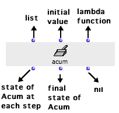
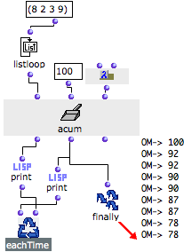

Navigation générale : 

  - [Guide](OM-Documentation.md)
  - [Plan](OM-Documentation_1.md)
  - [Glossaire](OM-Documentation_2.md)

OpenMusic
DocumentationHiérarchie
de section : [OM 6.6 User
Manual](OM-User-Manual.md) \>
[Visual Programming
II](AdvancedVisualProgramming.md) \>
[Iterations: OMLoop](OMLoop.md)
\>
[Accumulators](LoopAccumulators.md)
\> Acum

Navigation : [page
précédente](Count.md "page précédente(Count)")
| [page
suivante](LoopExample.md "page suivante(Example : A Random Series)")

# Acum : Defining Accumulation Procedures

**
Acum** is a generic module used for defining storage or accumulation
procedure.

## Inputs and Outputs

<table>
<colgroup>
<col style="width: 50%" />
<col style="width: 50%" />
</colgroup>
<tbody>
<tr class="odd">
<td>

</td>
<td>

Contrary to the other accumulators, accum has three default inputs and one optional input :

<ul>
<li>"acum" : collects the successive elements of a list returned by an iterator</li>
<li>"init" : <strong>initial value</strong> of the accumulator</li>
<li>"fun" : an <strong>accumulation function</strong> to apply to each collected element.</li>
<li>first output : </li>
</ul>
<ol>
<li>
collects the input value and applies the accumulation function
</li>
<li>
returns the current state of the accumulator.
</li>
</ol>
<ul>
<li> second output : returns the finale value of acum. </li>
<li> third output : resets the accumulator to the value specified by "init".</li>
</ul>

</td>
</tr>
</tbody>
</table>

More information about Lambda Functions :

  - [Lambda Mode](LambdaMode.md)

"Init" : Defining Acum's Behaviour

" **Init** " actually defines the accumulator's behaviour.

It must take a function or box on[ lambda](LambdaMode.md)
mode, with two inputs :

1.  one for the element to collect,

2.  one for the initial value.

## Example : Subtracting a List of Numbers

We want to subtract numbers successively – for instance (100-8-2-3-9).
For this, we need an initial value, x, a list of numbers, the om-
function on "lambda" mode, and acum.

<table>
<colgroup>
<col style="width: 50%" />
<col style="width: 50%" />
</colgroup>
<tbody>
<tr class="odd">
<td>

The initial value of acum is 100. Om- is set on "lambda" mode it is connected to the third output of acum. It is applied recursively to the elements of the list and to the initial value. We get (100 - a - b - c - d).

<ol>
<li>
Listloop returns the successive elements of the list to acum.
</li>
<li>
At each step of the iteration, the first print box prints the <strong>successive current values</strong> of acum : 100 ; 100-8 = 92 ; 92-2 = 90 ; ...
</li>
<li>
At each step of the iteration, the second print box prints the result of the subtraction, which is then stored as <strong>the new current value</strong> of accum.
</li>
<li>
When the iteration is over, Finally returns the final state of acum.
</li>
</ol>

</td>
<td>

</td>
</tr>
</tbody>
</table>

Références : 

Plan :

  - [OpenMusic Documentation](OM-Documentation.md)
  - [OM 6.6 User Manual](OM-User-Manual.md)
      - [Introduction](00-Sommaire.md)
      - [System Configuration and
        Installation](Installation.md)
      - [Going Through an OM Session](Goingthrough.md)
      - [The OM Environment](Environment.md)
      - [Visual Programming I](BasicVisualProgramming.md)
      - [Visual Programming
        II](AdvancedVisualProgramming.md)
          - [Abstraction](Abstraction.md)
          - [Evaluation Modes](EvalModes.md)
          - [Higher-Order Functions](HighOrder.md)
          - [Control Structures](Control.md)
          - [Iterations: OMLoop](OMLoop.md)
              - [Iteration](LoopIntro.md)
              - [General Features](LoopGeneral.md)
              - [Evaluators](LoopEvaluators.md)
              - [Iterators](LoopIterators.md)
              - [Accumulators](LoopAccumulators.md)
                  - [Collect](Collect.md)
                  - [Sum](Sum.md)
                  - [Min / Max](MinMax.md)
                  - [Count](Count.md)
                  - Acum
              - [Example : A Random Series](LoopExample.md)
          - [Instances](Instances.md)
          - [Interface Boxes](InterfaceBoxes.md)
          - [Files](Files.md)
      - [Basic Tools](BasicObjects.md)
      - [Score Objects](ScoreObjects.md)
      - [Maquettes](Maquettes.md)
      - [Sheet](Sheet.md)
      - [MIDI](MIDI.md)
      - [Audio](Audio.md)
      - [SDIF](SDIF.md)
      - [Lisp Programming](Lisp.md)
      - [Errors and Problems](errors.md)
  - [OpenMusic QuickStart](QuickStart-Chapters.md)

Navigation : [page
précédente](Count.md "page précédente(Count)")
| [page
suivante](LoopExample.md "page suivante(Example : A Random Series)")

[A propos...](OM-Documentation_3.md)(c) Ircam - Centre
Pompidou

