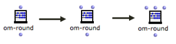
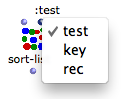

Navigation générale : 

  - [Guide](OM-Documentation.md)
  - [Plan](OM-Documentation_1.md)
  - [Glossaire](OM-Documentation_2.md)

OpenMusic
DocumentationHiérarchie
de section : [OM 6.6 User
Manual](OM-User-Manual.md) \>
[Visual Programming
I](BasicVisualProgramming.md) \>
[Box Inputs](BoxInputs.md) \>
Additional
Inputs

Navigation : [page
précédente](StandardInputs.md "page précédente(Standard Inputs)")
| [page
suivante](Connections.md "page suivante(Connections)")

# Additional Inputs : Optional, Keyword and Rest Arguments

For practical issues, function boxes don't always show all possible
inlets. Additional arguments can be added to Lisp and OM functions. They
can be either **optional**, **keyword** , or " **rest** " arguments.

  - **Optional arguments** can be added successively in a predefined
    order, which cannot be modified.

  - **Keyword arguments** can be added and named ad libitum by the user
    with a keyword.
    
    Hence, keyword arguments are especially convenient if a function has
    numerous additional arguments : the user can choose one or more
    specific items among a whole range of arguments. This also means
    that keyword arguments are more or less independent from each other.

  - **Rest arguments** represent an unlimited numbers of successive
    parameters.

Contrary to standard arguments, functions **always work** if optional
arguments or keyword arguments are not specified, usually because
suitable default values are applied.

Getting Information About Arguments

The additional arguments type – **optional** or **keyword** arguments –
is indicated at the beginning of the documentation.

  - Optional arguments are signaled by the" **\&optional**
    "prefix.

<!-- end list -->

  - Keyword arguments are identified by the **\&key**
    prefix.
  - Rest arguments are identified by the **\&rest** prefix.

Accessing Documentation

  - [Documentation and Info](DocAndInfo.md)

## Optional Arguments

<table>
<colgroup>
<col style="width: 50%" />
<col style="width: 50%" />
</colgroup>
<tbody>
<tr class="odd">
<td>

Optional arguments are not visible by default

<ul>
<li>To add optional arguments, select the box and press <code class="keyboard_tl">Alt</code> + <code class="keyboard_tl">→</code>.</li>
<li>To delete them, press <code class="keyboard_tl">Alt</code> + <code class="keyboard_tl">←</code> (or <code class="keyboard_tl">&lt;</code>). </li>
</ul>

</td>
<td>

The OM-ROUND function has one input by default and and two optional inputs.

</td>
</tr>
</tbody>
</table>

Adding All Optional Inputs : \>

Press `>` to add all possible optional inputs at once.

Using Optional Inputs : OM-ROUND

<table>
<colgroup>
<col style="width: 50%" />
<col style="width: 50%" />
</colgroup>
<tbody>
<tr class="odd">
<td>

</td>
<td>

OM-ROUND rounds a number (or a list of number) to the closest integer value(s).

It has also two Optional arguments :

<ul>
<li> decimals allows to round to the closest decimal value (by default, 0 decimals = integer)</li>
<li> divisor allows to specify a divisor to apply before rounding (by default, 1). </li>
</ul>

</td>
</tr>
</tbody>
</table>

<table>
<colgroup>
<col style="width: 50%" />
<col style="width: 50%" />
</colgroup>
<tbody>
<tr class="odd">
<td>

The standard use of OM-ROUND does not require using the optional inputs (A).

In (B) we use the first optional ( decimals ) to round the input number whith a higher precision.

</td>
<td>

</td>
</tr>
</tbody>
</table>

## Keyword Arguments

<table>
<colgroup>
<col style="width: 50%" />
<col style="width: 50%" />
</colgroup>
<tbody>
<tr class="odd">
<td>

Keyword arguments are not visible by default.

To add keyword arguments, select the box and press <code class="keyboard_tl">k</code>.

To remove them, press <code class="keyboard_tl">SHIFT</code> + <code class="keyboard_tl">k</code> to remove it.

</td>
<td>

The SORT-LIST function has one initial argument and three keyword arguments

</td>
</tr>
</tbody>
</table>

Note that keyword arguments are represented by **dark blue inlets** .

Setting Keyword Arguments

Contrary to optional arguments, keyword arguments are not in a fixed,
predefined order and can therefore be used independently from one
another.

You must therefore set **both the name of the keyword input and its
value**.

<table>
<colgroup>
<col style="width: 50%" />
<col style="width: 50%" />
</colgroup>
<tbody>
<tr class="odd">
<td>

The default name of a new keyword is the first unused argument in the keywords list. This name is visible by hovering the mouse over the box inlet.

Note that keyword names are always preceded by " <strong><code class="label_tl">:</code></strong> "

To change the argument :

<ol>
<li>
click on the inlet
</li>
<li>
select a name in the pop up menu
</li>
</ol>

</td>
<td>

</td>
</tr>
</tbody>
</table>

<table>
<colgroup>
<col style="width: 50%" />
<col style="width: 50%" />
</colgroup>
<tbody>
<tr class="odd">
<td>

The value of a keyword argument is set like the value of a standard argument by connecting a box to the keyword input.

Like standard or optional inputs, keyword inputs can have default values. To show this value, <code class="keyboard_tl">Shift</code> click on the input.

</td>
<td>

</td>
</tr>
</tbody>
</table>

<table>
<colgroup>
<col style="width: 50%" />
<col style="width: 50%" />
</colgroup>
<tbody>
<tr class="odd">
<td>

When an input menu is attached to a keyword input, it is also accessed with <code class="keyboard_tl">Shift</code> click on the input.

</td>
<td>

</td>
</tr>
</tbody>
</table>

Setting Box Inputs, Input Menus, etc.

  - [Standard Inputs](StandardInputs.md)

Using Keyword Inputs : SORT-LIST

<table>
<colgroup>
<col style="width: 50%" />
<col style="width: 50%" />
</colgroup>
<tbody>
<tr class="odd">
<td>

</td>
<td>

SORT-LIST sorts items in a list. It has three keyword arguments

<ul>
<li>test : a test used to compare items to sort them (by default, &lt;, so the function sorts number in growing order)</li>
<li>key : an accessor applyed to the items before to compare them to each other (Do not confuse with the &amp;key prefix of keyword arguments!</li>
<li>rec : which allows to apply the sort procedure recursively in the list.</li>
</ul>

</td>
</tr>
</tbody>
</table>

Using Functions as Arguments (test, key...)

  - [Lambda Mode](LambdaMode.md)

<table>
<colgroup>
<col style="width: 50%" />
<col style="width: 50%" />
</colgroup>
<tbody>
<tr class="odd">
<td>

The default behaviour of the function sorts the numbers in ascending order (A).

If we add the  :test keyword input and change the test function, we can change this default behaviour. Here, the test function is changed for &gt;, which outputs numbers in decreasing order (B).

</td>
<td>

</td>
</tr>
</tbody>
</table>

<table>
<colgroup>
<col style="width: 50%" />
<col style="width: 50%" />
</colgroup>
<tbody>
<tr class="odd">
<td>

The  :key argument is a potential connection used for applying a function to the elements of the input list, before they are compared with each other.

Here, (C) we sort a more complex list by comparing the second element of each item.

</td>
<td>

</td>
</tr>
</tbody>
</table>

It would also be possible to change both the test and key values by
adding another keyword input to the box.

In general, any combination of the different keyword inputs is allowed.

## Rest Arguments

<table>
<colgroup>
<col style="width: 50%" />
<col style="width: 50%" />
</colgroup>
<tbody>
<tr class="odd">
<td>

Rest arguments are not visible by default, and are generally at the end of the arguments list of a function. They work like optional arguments but are not named nor of a specific number.

<ul>
<li>To add rest arguments, select the box and press <code class="keyboard_tl">Alt</code> + <code class="keyboard_tl">→</code> or <code class="keyboard_tl">&gt;</code> .</li>
<li>To delete them, press <code class="keyboard_tl">Alt</code> + <code class="keyboard_tl">←</code> or <code class="keyboard_tl">&lt;</code>. </li>
</ul>

</td>
<td>

The X-APPEND function has two initial arguments and a undertermined number of 'rest' arguments.

</td>
</tr>
</tbody>
</table>

Références : 

Plan :

  - [OpenMusic Documentation](OM-Documentation.md)
  - [OM 6.6 User Manual](OM-User-Manual.md)
      - [Introduction](00-Sommaire.md)
      - [System Configuration and
        Installation](Installation.md)
      - [Going Through an OM Session](Goingthrough.md)
      - [The OM Environment](Environment.md)
      - [Visual Programming I](BasicVisualProgramming.md)
          - [Patch Introduction](ProgrammingIntro.md)
          - [Adding Boxes Into a Patch](AddingBoxes.md)
          - [Elementary Manipulations](ElementaryManips.md)
          - [Boxes](Boxes.md)
          - [Box Inputs](BoxInputs.md)
              - [Standard Inputs](StandardInputs.md)
              - Additional
                Inputs
          - [Connections](Connections.md)
          - [Evaluation](Evaluation.md)
          - [Documentation and Info](DocAndInfo.md)
          - [Comments](Comments.md)
          - [Pictures](Pictures.md)
          - [Saving / Reloading a Patch](SavingPatch.md)
          - [Dead Boxes](DeadBox.md)
      - [Visual Programming
        II](AdvancedVisualProgramming.md)
      - [Basic Tools](BasicObjects.md)
      - [Score Objects](ScoreObjects.md)
      - [Maquettes](Maquettes.md)
      - [Sheet](Sheet.md)
      - [MIDI](MIDI.md)
      - [Audio](Audio.md)
      - [SDIF](SDIF.md)
      - [Lisp Programming](Lisp.md)
      - [Errors and Problems](errors.md)
  - [OpenMusic QuickStart](QuickStart-Chapters.md)

Navigation : [page
précédente](StandardInputs.md "page précédente(Standard Inputs)")
| [page
suivante](Connections.md "page suivante(Connections)")

[A propos...](OM-Documentation_3.md)(c) Ircam - Centre
Pompidou

