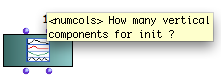
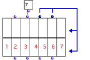

Navigation générale : 

  - [Guide](OM-Documentation.md)
  - [Plan](OM-Documentation_1.md)
  - [Glossaire](OM-Documentation_2.md)

OpenMusic
DocumentationHiérarchie
de section : [OM 6.6 User
Manual](OM-User-Manual.md) \>
[Basic Tools](BasicObjects.md)
\> [Array](ClassArray.md) \>
Class-Array
Object

Navigation : [page
précédente](ClassArray.md "page précédente(Array)")
| [page
suivante](ArrayEditor.md "page suivante(Class-Array Editor)")

# Class-Array Object

[Sommaire ](#)

1.  [Properties](#sdN1b)
2.  [Rows and Columns](#sdNec)
3.  [Instantiation](#sdN222)
4.  [Creating Arrays with Objects](#sdN36d)

The class-array box is accessed via the `Classes / Basic Tools / Array`
menu.

## Properties

Columns and Lines

The  **class-array** box has a number of **columns** , called "
**components** " and a variable number of **rows** or **lines** , called
" **fields** ".

Default Inputs and Outputs

<table>
<colgroup>
<col style="width: 50%" />
<col style="width: 50%" />
</colgroup>
<tbody>
<tr class="odd">
<td>

</td>
<td>

The class-array box has two default inputs and outputs

<ul>
<li>"self" : an object or a list of objects </li>
<li>"numcols" : a number of components or columns.</li>
</ul>

</td>
</tr>
</tbody>
</table>

Keyword Inputs

<table>
<colgroup>
<col style="width: 50%" />
<col style="width: 50%" />
</colgroup>
<tbody>
<tr class="odd">
<td>

The class-array can be added a number of <a href="AdditionalInputs.md"> keyword arguments </a> , which represent <strong><a href="AdditionalInputs.md"> </a></strong> the <strong>fields</strong> of the matrix.

Each keyword input has a corresponding output.

</td>
<td>

</td>
</tr>
</tbody>
</table>

## Rows and Columns

Use and Definition

<table>
<colgroup>
<col style="width: 50%" />
<col style="width: 50%" />
</colgroup>
<tbody>
<tr class="odd">
<td>

An empty class-array with 2 fields – rows – and 7 components – columns.

</td>
<td>

Each <strong>column</strong> represents a <strong>component</strong> .

Each <strong>line</strong> <strong>or row</strong> in the matrix display represents a <strong>field</strong> , which corresponds to one of the <strong>keyword inputs </strong> of the box.

<ul>
<li>Each line contains field values. Values are entered in the corresponding keyword input. </li>
<li>Field values are assigned successively to each component of the matrix. This means each cell has a specific value.</li>
</ul>
<ul>
<li>
Fields can be added by the user with the <code class="keyboard_tl">k</code> keys, just like <strong>keyword arguments</strong> in OM function boxes.

To delete a field, press <code class="keyboard_tl">SHIFT</code> + <code class="keyboard_tl">k</code> .
</li>
<li>
Fields can be defined as <strong>slots</strong> of the class-array subclasses.

They can then be hidden or shown with the <code class="keyboard_tl">&gt;</code> or <code class="keyboard_tl">&lt;</code> keys.
</li>
</ul>

</td>
</tr>
</tbody>
</table>

Slots / Subclasses

The class-array is designed to be used as a superclass for array classes
with default fields.

Subclasses[\[1\]](#kFootBsktc2905)
can be created either with Lisp code, or visually in OMExamples of
class-array subclasses are the classes from the [OMChroma
system]() for the control of sound synthesis.

Creating Subclasses

  - [Object Oriented Programming](OOP.md)

Keyword Inputs Name and Value

By default, keyword inputs – additional fields – are called ":k1",
":k2", etc...

To modify these names :

1\. click on the input

2\. enter a name starting with ":"

The value of keyword inputs must come from a connected box.

Keyword Inputs

  - [Additional Inputs : Optional, Keyword and Rest
    Arguments](AdditionalInputs.md)

## Instantiation

The class-array has an original and powerful instantiation system that
interprets the input data connected to its different filed inputs
automatically. If needed, input data is converted to generate and fill
all the components values internally, depending on the given number of
columns.

Applying a List of Values

If necessary, values are repeated.

1.  The list fits the number of components. The items contained in each
    list are assigned to the successive components.

2.  If the number of items is superior to the number of components, the
    list is repeated.

Applying a Single Value

<table>
<colgroup>
<col style="width: 50%" />
<col style="width: 50%" />
</colgroup>
<tbody>
<tr class="odd">
<td>

A single value is repeated for every component of the array.

</td>
<td>

The constant value is repeated for all the components.

</td>
</tr>
</tbody>
</table>

Resampling BPFs

<table>
<colgroup>
<col style="width: 50%" />
<col style="width: 50%" />
</colgroup>
<tbody>
<tr class="odd">
<td>

Eight values are sampled periodically in the curve.

</td>
<td>

A BPF can be resampled according to the number of components of the class-array . Hence, each <strong>component</strong> can be assigned a <strong>value</strong> , no matter how many points the BPF has.

This class-array contains eight components, or columns.

<ul>
<li>The BPF is the second field of the class-array .</li>
<li> Eight points are sampled in the BPF and assigned to the second line of the class-array .</li>
</ul>

Note that using the "x-points" or "y-points" instead of the "self" output of the BPF amounts to feeding the array with a list of value.

</td>
</tr>
</tbody>
</table>

Applying Functions

<table>
<colgroup>
<col style="width: 50%" />
<col style="width: 50%" />
</colgroup>
<tbody>
<tr class="odd">
<td>

If a function or a box on <a href="LambdaMode.md"> "lambda" mode </a> is connected to a field of the array, it is applied to the components of the field at the evaluation.

Here, arrays # 1 and 3 are instantiated with two functions :

<ol>
<li>
the sinus function is evaluated for n = 1 to 30, that is, for each component's index.
</li>
<li>
The om-random box in "lambda" mode defines a function that returns a random number between 0 and n, where n = the component's index.
</li>
</ol>

</td>
<td>

Instantiating arrays with the sinus and om-random functions.

</td>
</tr>
</tbody>
</table>

## Creating Arrays with Objects

Objects Lists

Objects, such as notes , chords , or any object in OM, can also be used
for filling the matrix fields. These objects must be connected as a list
to the class-array inputs.

This procedure also allows, for instance, to create **arrays of
arrays**, as in example 2 above.

Advanced Issue : Row Types

In class-array subclasses , the **type** of a subclass field may change
the way input data is interpreted.

Références : 

1.  
    
    

    
    

    
    Subclass
    
    

    
    

    
    

    
    

    
    A subclass is derived from a preexisting class, by inheritance. In
    object-oriented programming, objects are defined by classes. New
    objects can be created from existing objects. As objects are defined
    by classes, classes can inherit other classes. Sub-classes inherit
    attributes and behavior of the pre-existing classes, or
    super-classes. Code is compartmentalized and reused by creating
    collections of attributes and behaviors called objects which can be
    based on previously created objects.
    
    

    
    

    
    

    
    

Plan :

  - [OpenMusic Documentation](OM-Documentation.md)
  - [OM 6.6 User Manual](OM-User-Manual.md)
      - [Introduction](00-Sommaire.md)
      - [System Configuration and
        Installation](Installation.md)
      - [Going Through an OM Session](Goingthrough.md)
      - [The OM Environment](Environment.md)
      - [Visual Programming I](BasicVisualProgramming.md)
      - [Visual Programming
        II](AdvancedVisualProgramming.md)
      - [Basic Tools](BasicObjects.md)
          - [Curves and Functions](CurvesAndFunctions.md)
          - [Array](ClassArray.md)
              - Class-Array
                Object
              - [Class-Array Editor](ArrayEditor.md)
              - [Class-Array Tools](ArrayTools.md)
          - [TextFile](textfile.md)
          - [Picture](Picture.md)
      - [Score Objects](ScoreObjects.md)
      - [Maquettes](Maquettes.md)
      - [Sheet](Sheet.md)
      - [MIDI](MIDI.md)
      - [Audio](Audio.md)
      - [SDIF](SDIF.md)
      - [Lisp Programming](Lisp.md)
      - [Errors and Problems](errors.md)
  - [OpenMusic QuickStart](QuickStart-Chapters.md)

Navigation : [page
précédente](ClassArray.md "page précédente(Array)")
| [page
suivante](ArrayEditor.md "page suivante(Class-Array Editor)")

[A propos...](OM-Documentation_3.md)(c) Ircam - Centre
Pompidou

