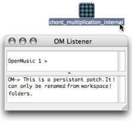

Navigation générale : 

  - [Guide](OM-Documentation.md)
  - [Plan](OM-Documentation_1.md)
  - [Glossaire](OM-Documentation_2.md)

OpenMusic
DocumentationHiérarchie
de section : [OM 6.6 User
Manual](OM-User-Manual.md) \>
[Visual Programming
II](AdvancedVisualProgramming.md) \>
[Abstraction](Abstraction.md)
\> [Abstraction
Boxes](AbsBoxes.md) \>
Standard
Abstraction

Navigation : [page
précédente](AbsBoxes.md "page précédente(Abstraction Boxes)")
| [page
suivante](RedAbstraction.md "page suivante(Internal Abstractions)")

# Standard Abstraction

This section deals with the integration of an existing patch

in another patch.

## Adding a Patch From the Workspace to Another Patch

Procedure

To be used as an abstraction, a patch can be dragged from the
**workspace window** to another **patch editor** .

The abstraction **refers** to the patch located in the workspace.

Consequently :

  - the abstraction and the patch in the workspace have the same name
    and icon,

  - the representation of the patch remains visible in the workspace :
    it hasn't been moved to the patch editor,

  - both items will be affected by subsequent operations performed in
    the abstraction.

No matter where the patch is open from, the editor displayed is the
same.

Preserving the Master of a Patch

  - [Saving / Reloading a Patch](SavingPatch.md)

Using Duplicates

Several patch boxes with the same reference can coexist in a patch
editor. Hence, the same function can be used at several steps of a
program. When an abstraction is duplicated, another box, which refers to
the same master patch, is created. Subsequent modifications to the
reference patch will therefore affect both items.

One representation of patch1 has been added inputs. The other
representation has been added outputs. Both items have been equally and
simultaneously modified.

## Managing Abstractions in the Workspace

Renaming an Abstraction

<table>
<colgroup>
<col style="width: 50%" />
<col style="width: 50%" />
</colgroup>
<tbody>
<tr class="odd">
<td>

</td>
<td>

A blue patch can only be renamed in the workspace.

</td>
</tr>
</tbody>
</table>

Deleting a Patch from the Workspace

<table>
<colgroup>
<col style="width: 50%" />
<col style="width: 50%" />
</colgroup>
<tbody>
<tr class="odd">
<td>

<strong>In a workspace</strong>, nothing shows that a blue patch is used as an abstraction : this must be taken into account when organizing it.

A warning pops up if one attempts to delete a patch used as an abstraction in another patch. If it is deleted its reference in the other patch editor will be replaced by a <a href="SavingPatch.md">dead box</a> .

</td>
<td>

</td>
</tr>
</tbody>
</table>

Références : 

Plan :

  - [OpenMusic Documentation](OM-Documentation.md)
  - [OM 6.6 User Manual](OM-User-Manual.md)
      - [Introduction](00-Sommaire.md)
      - [System Configuration and
        Installation](Installation.md)
      - [Going Through an OM Session](Goingthrough.md)
      - [The OM Environment](Environment.md)
      - [Visual Programming I](BasicVisualProgramming.md)
      - [Visual Programming
        II](AdvancedVisualProgramming.md)
          - [Abstraction](Abstraction.md)
              - [Abstraction Boxes](AbsBoxes.md)
                  - Standard
                    Abstraction
                  - [Internal
                    Abstractions](RedAbstraction.md)
                  - [Conversions](AbsConversion.md)
              - [Application](AbsApplication.md)
              - [Recursive Patches](Recursion.md)
          - [Evaluation Modes](EvalModes.md)
          - [Higher-Order Functions](HighOrder.md)
          - [Control Structures](Control.md)
          - [Iterations: OMLoop](OMLoop.md)
          - [Instances](Instances.md)
          - [Interface Boxes](InterfaceBoxes.md)
          - [Files](Files.md)
      - [Basic Tools](BasicObjects.md)
      - [Score Objects](ScoreObjects.md)
      - [Maquettes](Maquettes.md)
      - [Sheet](Sheet.md)
      - [MIDI](MIDI.md)
      - [Audio](Audio.md)
      - [SDIF](SDIF.md)
      - [Lisp Programming](Lisp.md)
      - [Errors and Problems](errors.md)
  - [OpenMusic QuickStart](QuickStart-Chapters.md)

Navigation : [page
précédente](AbsBoxes.md "page précédente(Abstraction Boxes)")
| [page
suivante](RedAbstraction.md "page suivante(Internal Abstractions)")

[A propos...](OM-Documentation_3.md)(c) Ircam - Centre
Pompidou

