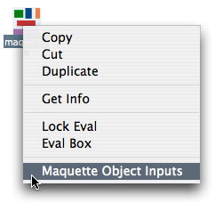
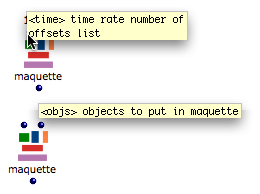
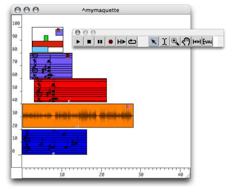

Navigation générale : 

  - [Guide](OM-Documentation.md)
  - [Plan](OM-Documentation_1.md)
  - [Glossaire](OM-Documentation_2.md)

OpenMusic
DocumentationHiérarchie
de section : [OM 6.6 User
Manual](OM-User-Manual.md) \>
[Maquettes](Maquettes.md) \>
[Maquettes in
Patches](Maquettes%20in%20Patches.md) \>
Build Mode

Navigation : [page
précédente](Maquettes%20in%20Patches.md "page précédente(Maquettes in Patches)")
| [page
suivante](Maquettes%20in%20Patches1.md "page suivante(Functional Mode)")

# Build Mode

## Build Mode

Use

|                                                                                       |                                                                                                                                 |
| ------------------------------------------------------------------------------------- | ------------------------------------------------------------------------------------------------------------------------------- |
|  | The "build" mode is the default mode of the maquette when it is dropped in a patch. It then shows dark blue inputs and outputs. |

Procedure

<table>
<colgroup>
<col style="width: 50%" />
<col style="width: 50%" />
</colgroup>
<tbody>
<tr class="odd">
<td>

To set a maquette back on build mode :

<ol>
<li>
<code class="keyboard_tl">Ctrl</code> / right click on the maquette box
</li>
<li>
select <code class="menuPath_tl">Maquette Object Inputs</code>.
</li>
</ol>

</td>
<td>

</td>
</tr>
</tbody>
</table>

Inputs and Outputs

<table>
<colgroup>
<col style="width: 50%" />
<col style="width: 50%" />
</colgroup>
<tbody>
<tr class="odd">
<td>

</td>
<td>

The two default inputs of the maquette box always take :

<ul>
<li>an onsets list</li>
<li>an objects list.</li>
</ul>

The "build" mode was oringinally the only way to add one or more TemporalBoxes in a maquette. It is a convenient way to add a succession of objects in a maquette. Other parameters, such as the vertical position of boxes, cannot be specified.

</td>
</tr>
</tbody>
</table>

<table>
<colgroup>
<col style="width: 50%" />
<col style="width: 50%" />
</colgroup>
<tbody>
<tr class="odd">
<td>

The default output of the maquette box returns the value built by the maquette :

<ul>
<li>a maquetteobj type of object, which gathers all the values produced by the objects contains, </li>
<li>something else, if the maquette is related to a synthesis patch. </li>
</ul>

</td>
<td>

</td>
</tr>
</tbody>
</table>

Inputs Lists

Objects and onsets of each lists match each other. Maquettes accept the
following types of objects : **musical objects** , **patches** and
**maquettes** on **"reference" mode** .

Standard Inputs and Outputs

Possible standard inputs –

and outputs –

– are hidden outside the maquette.

## Example : Adding a List of Items in a Maquette

We want to add a series of items in a maquette located in a patch.

Each input of list is connected to an object. List returns a list of
objects references, such as :

OM ==\> (\# \# \# \# \#).

  - The second input of the maquette takes this list of items.
    
  - The first input of the maquette takes a list of offsets, which
    determine the temporal position of the corresponding items.

The items appear in the maquette after the evaluation.

Note that the maquette must be evaluated from the outside to display the
items in the right order.

The maquette, once evaluated.

Evaluation and Content

Once the maquette is built, its content can either

  - remain the same, if no object is connected to it,

  - be replaced by new objects, if objects are connected to it.

Références : 

Plan :

  - [OpenMusic Documentation](OM-Documentation.md)
  - [OM 6.6 User Manual](OM-User-Manual.md)
      - [Introduction](00-Sommaire.md)
      - [System Configuration and
        Installation](Installation.md)
      - [Going Through an OM Session](Goingthrough.md)
      - [The OM Environment](Environment.md)
      - [Visual Programming I](BasicVisualProgramming.md)
      - [Visual Programming
        II](AdvancedVisualProgramming.md)
      - [Basic Tools](BasicObjects.md)
      - [Score Objects](ScoreObjects.md)
      - [Maquettes](Maquettes.md)
          - [Creating a Maquette](Maquette.md)
          - [TemporalBoxes](TemporalBoxes.md)
          - [The Maquette Editor](Editor.md)
          - [Maquette
            Programming](Programming%20Maquette.md)
          - [Maquettes in
            Patches](Maquettes%20in%20Patches.md)
              - Build
                Mode
              - [Functional
                Mode](Maquettes%20in%20Patches1.md)
              - [Reference
                Mode](Maquettes%20in%20Patches2.md)
      - [Sheet](Sheet.md)
      - [MIDI](MIDI.md)
      - [Audio](Audio.md)
      - [SDIF](SDIF.md)
      - [Lisp Programming](Lisp.md)
      - [Errors and Problems](errors.md)
  - [OpenMusic QuickStart](QuickStart-Chapters.md)

Navigation : [page
précédente](Maquettes%20in%20Patches.md "page précédente(Maquettes in Patches)")
| [page
suivante](Maquettes%20in%20Patches1.md "page suivante(Functional Mode)")

[A propos...](OM-Documentation_3.md)(c) Ircam - Centre
Pompidou

