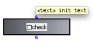
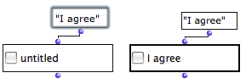
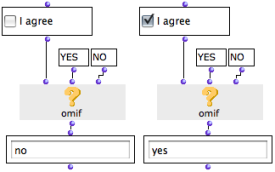

Navigation générale : 

  - [Guide](OM-Documentation.md)
  - [Plan](OM-Documentation_1.md)
  - [Glossaire](OM-Documentation_2.md)

OpenMusic
DocumentationHiérarchie
de section : [OM 6.6 User
Manual](OM-User-Manual.md) \>
[Visual Programming
II](AdvancedVisualProgramming.md) \>
[Interface
Boxes](InterfaceBoxes.md) \>
Check Box

Navigation : [page
précédente](TextBoxes.md "page précédente(Text Boxes)")
| [page
suivante](ListBoxes.md "page suivante(List Boxes)")

# Controlling Operations : the Check Box

The **check-box** object resembles a
[predicate](Predicates.md). If the box is checked, it
returns "true". If not, it returns "nil". Hence, it can be used as a
"switch on / off condition" for the execution of programs. It must be
associated with **conditional boxes** that will call the programs.

## Features

Inputs and Outputs

<table>
<colgroup>
<col style="width: 50%" />
<col style="width: 50%" />
</colgroup>
<tbody>
<tr class="odd">
<td>

</td>
<td>

The check-box object has one input and one output :

<ul>
<li>
"text" : a statement
</li>
<li>
the output returns "t" or "nil" depending on <strong>if the box is checked</strong> or not.
</li>
</ul>

</td>
</tr>
</tbody>
</table>

Editing the Statement

<table>
<colgroup>
<col style="width: 50%" />
<col style="width: 50%" />
</colgroup>
<tbody>
<tr class="odd">
<td>

To change the box's statement :

<ol>
<li>
click or <code class="keyboard_tl">SHIFT</code> click on the first input to edit it and validate,
</li>
<li>
select the box again,
</li>
<li>
evaluate the box.
</li>
</ol>

</td>
<td>

</td>
</tr>
</tbody>
</table>

## Use

<table>
<colgroup>
<col style="width: 50%" />
<col style="width: 50%" />
</colgroup>
<tbody>
<tr class="odd">
<td>

Wherever the box is clicked, it is successively checked or unchecked. Depending on its state, the box output returns "t" or "nil".

</td>
<td>

In the first case, the OMIF box returns the second argument, because the checkbox returns "nil". In the second case, it returns the first argument, because the checkbox returns "t".

</td>
</tr>
</tbody>
</table>

Using Conditions in a Program

  - [Conditional Operators](ConditionalOps.md)

For a More than Two Options

  - [Selection : List Boxes](ListBoxes.md)

## A Musical Application : an Extended Example

Building a Triad with an Item-List-Box, a Button-Box, and a Check
Box

  - [Using the Interface Boxes :
    Example](InterfaceExample.md)

Références : 

Plan :

  - [OpenMusic Documentation](OM-Documentation.md)
  - [OM 6.6 User Manual](OM-User-Manual.md)
      - [Introduction](00-Sommaire.md)
      - [System Configuration and
        Installation](Installation.md)
      - [Going Through an OM Session](Goingthrough.md)
      - [The OM Environment](Environment.md)
      - [Visual Programming I](BasicVisualProgramming.md)
      - [Visual Programming
        II](AdvancedVisualProgramming.md)
          - [Abstraction](Abstraction.md)
          - [Evaluation Modes](EvalModes.md)
          - [Higher-Order Functions](HighOrder.md)
          - [Control Structures](Control.md)
          - [Iterations: OMLoop](OMLoop.md)
          - [Instances](Instances.md)
          - [Interface Boxes](InterfaceBoxes.md)
              - [General Features](GeneralFeatures.md)
              - [Text Boxes](TextBoxes.md)
              - Check
                Box
              - [List Boxes](ListBoxes.md)
              - [Button](Button.md)
              - [Slider Box](Slider.md)
              - [Pop-Up Menu Box](MenuBoxes.md)
              - [Examples of Use](InterfaceExample.md)
          - [Files](Files.md)
      - [Basic Tools](BasicObjects.md)
      - [Score Objects](ScoreObjects.md)
      - [Maquettes](Maquettes.md)
      - [Sheet](Sheet.md)
      - [MIDI](MIDI.md)
      - [Audio](Audio.md)
      - [SDIF](SDIF.md)
      - [Lisp Programming](Lisp.md)
      - [Errors and Problems](errors.md)
  - [OpenMusic QuickStart](QuickStart-Chapters.md)

Navigation : [page
précédente](TextBoxes.md "page précédente(Text Boxes)")
| [page
suivante](ListBoxes.md "page suivante(List Boxes)")

[A propos...](OM-Documentation_3.md)(c) Ircam - Centre
Pompidou

