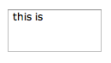
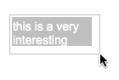
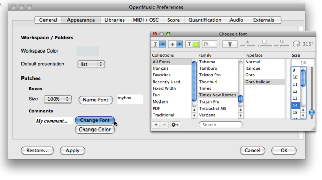
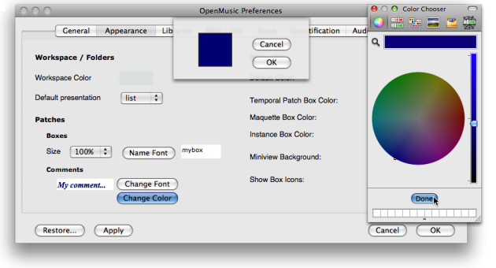

Navigation générale : 

  - [Guide](OM-Documentation.md)
  - [Plan](OM-Documentation_1.md)
  - [Glossaire](OM-Documentation_2.md)

OpenMusic
DocumentationHiérarchie
de section : [OM 6.6 User
Manual](OM-User-Manual.md) \>
[Visual Programming
I](BasicVisualProgramming.md) \>
Comments

Navigation : [page
précédente](DocAndInfo.md "page précédente(Documentation and Info)")
| [page
suivante](Pictures.md "page suivante(Pictures)")

# Comments

[Sommaire ](#)

1.  [Creating a comment](#hbN12)
2.  [Editing a comment](#hbNa4)
3.  [Modifications](#hbNfe)
4.  [Comments Font Style](#hbN171)

A comment is a text box that doesn't affect the patch in which it is
set. It allows to add textual indications that can make a program more
legible.

## Creating a comment

With the contextual menu

<table>
<colgroup>
<col style="width: 50%" />
<col style="width: 50%" />
</colgroup>
<tbody>
<tr class="odd">
<td>

</td>
<td>

To add a comment in a patch :

<ol>
<li>
<code class="keyboard_tl">Ctrl</code> / right click in the patch editor
</li>
<li>
choose <code class="menuPath_tl">Comment</code> .
</li>
</ol>

</td>
</tr>
</tbody>
</table>

Directly in the patch editor

<table>
<colgroup>
<col style="width: 50%" />
<col style="width: 50%" />
</colgroup>
<tbody>
<tr class="odd">
<td>

To add a comment box directly in a patch editor :

<ol>
<li>
<code class="keyboard_tl">Cmd</code> click in the editor and type "comment"
</li>
<li>
validate to create the comment box.
</li>
</ol>

</td>
<td>

</td>
</tr>
</tbody>
</table>

## Editing a comment

<table>
<colgroup>
<col style="width: 50%" />
<col style="width: 50%" />
</colgroup>
<tbody>
<tr class="odd">
<td>

</td>
<td>

<ol>
<li>
Double click in the comment box to type the text.
</li>
<li>
Click somewhere in the patch editor to validate and save your text.
</li>
</ol>

</td>
</tr>
</tbody>
</table>

Note

Unlike data boxes, comment boxes accept breaks and line returns.

## Modifications

Manipulating Comment Boxes

<table>
<colgroup>
<col style="width: 50%" />
<col style="width: 50%" />
</colgroup>
<tbody>
<tr class="odd">
<td>

</td>
<td>

Like any other box, a comment box can be moved, resized, copied, deleted.

To apply a modification, choose a menu item in the <code class="menuPath_tl">Edit</code> menu, or use the usual commands and shortcuts.

</td>
</tr>
</tbody>
</table>

Manipulating Boxes :

  - [Elementary Manipulations](ElementaryManips.md)

Fitting

To fit a comment box to the text, select it and press `i` .

## Comments Font Style

Local Modifications

<table>
<colgroup>
<col style="width: 50%" />
<col style="width: 50%" />
</colgroup>
<tbody>
<tr class="odd">
<td>

To modify the font type and colour of a comment within a patch :

<ol>
<li>
<code class="keyboard_tl">Ctrl</code> / right click on the box,
</li>
<li>
choose <code class="menuPath_tl">Text color</code> or <code class="menuPath_tl">Text Font</code>.
</li>
</ol>

</td>
<td>

</td>
</tr>
</tbody>
</table>

Style Shortcuts

use the menu `Edit / Font / Bold` and `Edit / Fonts / Italics` or the
corresponding keyboard shortcuts `CMD` + `SHIFT` + `B` / `I` in order to
change all selected comments to bold or italics.

Default Style

The comments font style can be globally specified via the OM
preferences. Select the `OM 6.X.X. / Preferences menu`. Click on the
`Appearance` tab and go to the **Comments** section

To modify the comments font style :

1.  click on `Change Font` and define a font style in the font dialogue
    window

2.    - choose `Apply` and/or `OK`
    
      - choose `Restore` to get back to the OM default values.

[Zoom](../res/commentfont_scr_1.png "Zoom (nouvelle fenêtre)")

To modify the comments colour

1.  click on `Change Colour`

2.  click on the coloured patch, and choose a colour in the colour
    chooser.

3.    - choose `Apply` and/or `OK`
    
      - choose `Restore` to get back to the OM default values.

[Zoom](../res/commentstyle_scr_1.png "Zoom (nouvelle fenêtre)")

Applying Changes

<table>
<colgroup>
<col style="width: 50%" />
<col style="width: 50%" />
</colgroup>
<tbody>
<tr class="odd">
<td>

</td>
<td>

New preferences will apply to new comments only.

</td>
</tr>
</tbody>
</table>

Références : 

Plan :

  - [OpenMusic Documentation](OM-Documentation.md)
  - [OM 6.6 User Manual](OM-User-Manual.md)
      - [Introduction](00-Sommaire.md)
      - [System Configuration and
        Installation](Installation.md)
      - [Going Through an OM Session](Goingthrough.md)
      - [The OM Environment](Environment.md)
      - [Visual Programming I](BasicVisualProgramming.md)
          - [Patch Introduction](ProgrammingIntro.md)
          - [Adding Boxes Into a Patch](AddingBoxes.md)
          - [Elementary Manipulations](ElementaryManips.md)
          - [Boxes](Boxes.md)
          - [Box Inputs](BoxInputs.md)
          - [Connections](Connections.md)
          - [Evaluation](Evaluation.md)
          - [Documentation and Info](DocAndInfo.md)
          - Comments
          - [Pictures](Pictures.md)
          - [Saving / Reloading a Patch](SavingPatch.md)
          - [Dead Boxes](DeadBox.md)
      - [Visual Programming
        II](AdvancedVisualProgramming.md)
      - [Basic Tools](BasicObjects.md)
      - [Score Objects](ScoreObjects.md)
      - [Maquettes](Maquettes.md)
      - [Sheet](Sheet.md)
      - [MIDI](MIDI.md)
      - [Audio](Audio.md)
      - [SDIF](SDIF.md)
      - [Lisp Programming](Lisp.md)
      - [Errors and Problems](errors.md)
  - [OpenMusic QuickStart](QuickStart-Chapters.md)

Navigation : [page
précédente](DocAndInfo.md "page précédente(Documentation and Info)")
| [page
suivante](Pictures.md "page suivante(Pictures)")

[A propos...](OM-Documentation_3.md)(c) Ircam - Centre
Pompidou

