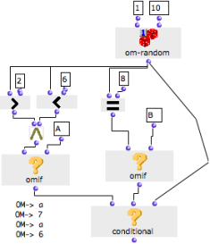

Navigation générale : 

  - [Guide](OM-Documentation.md)
  - [Plan](OM-Documentation_1.md)
  - [Glossaire](OM-Documentation_2.md)

OpenMusic
DocumentationHiérarchie
de section : [OM 6.6 User
Manual](OM-User-Manual.md) \>
[Visual Programming
II](AdvancedVisualProgramming.md) \>
[Control
Structures](Control.md) \>
[Conditional
Operators](ConditionalOps.md) \>
Conditional

Navigation : [page
précédente](OMIF.md "page précédente(OMif)")
| [page
suivante](Logical.md "page suivante(Logical Operators)")

# Conditional : Multiple Conditions

Conditional is very similar to omif : it tests if **a set **of
conditions**** is fulfilled, one by one. As soon as one condition is
fulfilled, conditional executes the corresponding operation.

Its behaviour can be summed up as :

"IF condition A is fulfilled, THEN return x, ELSE check if condition B
is fulfilled.

IF condition B is fulfilled, THEN return y, ELSE check if condition C is
fulfilled.

IF condition C is fulfilled..."

The conditional box can be accessed via the `Functions / Control /
CONDITIONAL` menu.

Inputs and Outputs

<table>
<colgroup>
<col style="width: 50%" />
<col style="width: 50%" />
</colgroup>
<tbody>
<tr class="odd">
<td>

The conditional box takes a number of test arguments. It has one default input and output and a free number of additional inputs.

<ul>
<li>"test" : a test argument</li>
<li>"add-test" : an additional test argument.</li>
<li>The user can add as additional test arguments as necessary. </li>
</ul>

Its output returns the value of the last evaluated input.

All inputs are test inputs : predicates, or other types of boxes.

</td>
<td>

</td>
</tr>
</tbody>
</table>

Behaviour

Conditional behaves like an [ or operator.](Logical.md)

1.  The box evaluates its inputs successively until an input returns a
    non nil value.

2.  This value is returned by conditional.

Conditional and Omif

Conditional can be used as a meta-omif box, with a virtually unlimited
number of "if" / "then" and "else" inputs, and a terminal "else" input.

Each input can take an omif box representing a condition and an action.
Because conditional stops the inputs evaluation as soon as it gets a non
nil value, these actions are linked with each other in a causal chain.

Examples

<table>
<colgroup>
<col style="width: 50%" />
<col style="width: 50%" />
</colgroup>
<tbody>
<tr class="odd">
<td>

</td>
<td>

In this example, we will test successively if 4 = 5, and define a last argument for conditional.

<ol>
<li>
Om+ returns 4.
</li>
<li>
Every time, om= tests if 4 = 5, and returns "nil" to the omif boxes. One by one, they return "nil", because the condition to return "1984" is not fulfilled.
</li>
<li>
Finally, the last input of conditional is evaluated and returns "george".
</li>
<li>
Conditional returns "george".
</li>
</ol>

</td>
</tr>
</tbody>
</table>

<table>
<colgroup>
<col style="width: 50%" />
<col style="width: 50%" />
</colgroup>
<tbody>
<tr class="odd">
<td>

In this example, we want to filter values from 1 to 10 and pass 1, 7, 9 or 10.

<ol>
<li>
Om-random returns a number between 1 and 10. The box is on "<a href="EvOnceMode.md">evaluate-once mode</a>" so that the <strong>same value</strong> is returned to all the other boxes at the evaluation.
</li>
<li>
The value is tested by two predicates.

<ul>
<li>If it is comprised between 2 and 6, the first predicate returns true and omif returns "A".</li>
<li>If it is equal to 8, the second predicate returns true and omif returns "B". </li>
</ul></li>
<li>
Finally, if none of these conditions is fulfilled, the last input of conditional is evaluated and returns the random number yielded by om-random.
</li>
</ol>

</td>
<td>

</td>
</tr>
</tbody>
</table>

Références : 

Plan :

  - [OpenMusic Documentation](OM-Documentation.md)
  - [OM 6.6 User Manual](OM-User-Manual.md)
      - [Introduction](00-Sommaire.md)
      - [System Configuration and
        Installation](Installation.md)
      - [Going Through an OM Session](Goingthrough.md)
      - [The OM Environment](Environment.md)
      - [Visual Programming I](BasicVisualProgramming.md)
      - [Visual Programming
        II](AdvancedVisualProgramming.md)
          - [Abstraction](Abstraction.md)
          - [Evaluation Modes](EvalModes.md)
          - [Higher-Order Functions](HighOrder.md)
          - [Control Structures](Control.md)
              - [Predicates](Predicates.md)
              - [Conditional Operators](ConditionalOps.md)
                  - [OMif](OMIF.md)
                  - Conditional
              - [Logical Operators](Logical.md)
              - [Sequential Operators](Sequencial.md)
          - [Iterations: OMLoop](OMLoop.md)
          - [Instances](Instances.md)
          - [Interface Boxes](InterfaceBoxes.md)
          - [Files](Files.md)
      - [Basic Tools](BasicObjects.md)
      - [Score Objects](ScoreObjects.md)
      - [Maquettes](Maquettes.md)
      - [Sheet](Sheet.md)
      - [MIDI](MIDI.md)
      - [Audio](Audio.md)
      - [SDIF](SDIF.md)
      - [Lisp Programming](Lisp.md)
      - [Errors and Problems](errors.md)
  - [OpenMusic QuickStart](QuickStart-Chapters.md)

Navigation : [page
précédente](OMIF.md "page précédente(OMif)")
| [page
suivante](Logical.md "page suivante(Logical Operators)")

[A propos...](OM-Documentation_3.md)(c) Ircam - Centre
Pompidou

