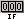
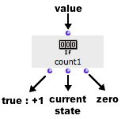
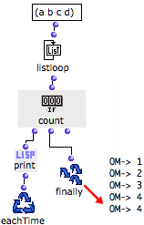
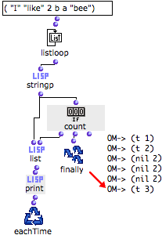

Navigation générale : 

  - [Guide](OM-Documentation.md)
  - [Plan](OM-Documentation_1.md)
  - [Glossaire](OM-Documentation_2.md)

OpenMusic
DocumentationHiérarchie
de section : [OM 6.6 User
Manual](OM-User-Manual.md) \>
[Visual Programming
II](AdvancedVisualProgramming.md) \>
[Iterations: OMLoop](OMLoop.md)
\>
[Accumulators](LoopAccumulators.md)
\> Count

Navigation : [page
précédente](MinMax.md "page précédente(Min / Max)")
| [page suivante](Acum.md "page suivante(Acum)")

# Count : Counting Items

**Count** is a counter. Its internal value increases at each evaluation
evaluated, if the input value is non nil.

## Inputs and Outputs

<table>
<colgroup>
<col style="width: 50%" />
<col style="width: 50%" />
</colgroup>
<tbody>
<tr class="odd">
<td>

</td>
<td>

Count has one default input and three outputs :

<ul>
<li>"what" : a value.</li>
<li>first output : triggers the increment of the counter if the input is non nil, and returns its current value. </li>
<li>second output : returns the current state of the counter.</li>
<li> third output : resets the value of the counter to zero.</li>
</ul>

</td>
</tr>
</tbody>
</table>

## Examples

Counting the Items of a List

<table>
<colgroup>
<col style="width: 50%" />
<col style="width: 50%" />
</colgroup>
<tbody>
<tr class="odd">
<td>

<ol>
<li>
Listloop returns each element of the list successively to count. These elements are non nil values.
</li>
<li>
The first output of count adds 1 every time listloop returns an element.
</li>
<li>
Once the enumeration of listloop is over, the final state of count is returned by Finally.
</li>
</ol>

</td>
<td>

</td>
</tr>
</tbody>
</table>

Counting Specific Items of a List

We will now apply count more specifically, to know how many **strings**
a list contains among other types of items.

<table>
<colgroup>
<col style="width: 50%" />
<col style="width: 50%" />
</colgroup>
<tbody>
<tr class="odd">
<td>

</td>
<td>

<ol>
<li>
Listloop enumerates the elements of a list.
</li>
<li>
The stringp predicate returns true every time it evaluates a string.
</li>
<li>
At each step of the loop, the first output of count is evaluated :

<ul>
<li>if it gets a non nil value from stringp, it increments the value of the counter</li>
<li>if it gets "nil", the value doesn't change.</li>
</ul></li>
<li>
The results returned by stringp and counter are gathered in a list and printed.
</li>
<li>
The total number of strings, that is, the final state of counter is returned by Finally.
</li>
</ol>

</td>
</tr>
</tbody>
</table>

Références : 

Plan :

  - [OpenMusic Documentation](OM-Documentation.md)
  - [OM 6.6 User Manual](OM-User-Manual.md)
      - [Introduction](00-Sommaire.md)
      - [System Configuration and
        Installation](Installation.md)
      - [Going Through an OM Session](Goingthrough.md)
      - [The OM Environment](Environment.md)
      - [Visual Programming I](BasicVisualProgramming.md)
      - [Visual Programming
        II](AdvancedVisualProgramming.md)
          - [Abstraction](Abstraction.md)
          - [Evaluation Modes](EvalModes.md)
          - [Higher-Order Functions](HighOrder.md)
          - [Control Structures](Control.md)
          - [Iterations: OMLoop](OMLoop.md)
              - [Iteration](LoopIntro.md)
              - [General Features](LoopGeneral.md)
              - [Evaluators](LoopEvaluators.md)
              - [Iterators](LoopIterators.md)
              - [Accumulators](LoopAccumulators.md)
                  - [Collect](Collect.md)
                  - [Sum](Sum.md)
                  - [Min / Max](MinMax.md)
                  - Count
                  - [Acum](Acum.md)
              - [Example : A Random Series](LoopExample.md)
          - [Instances](Instances.md)
          - [Interface Boxes](InterfaceBoxes.md)
          - [Files](Files.md)
      - [Basic Tools](BasicObjects.md)
      - [Score Objects](ScoreObjects.md)
      - [Maquettes](Maquettes.md)
      - [Sheet](Sheet.md)
      - [MIDI](MIDI.md)
      - [Audio](Audio.md)
      - [SDIF](SDIF.md)
      - [Lisp Programming](Lisp.md)
      - [Errors and Problems](errors.md)
  - [OpenMusic QuickStart](QuickStart-Chapters.md)

Navigation : [page
précédente](MinMax.md "page précédente(Min / Max)")
| [page suivante](Acum.md "page suivante(Acum)")

[A propos...](OM-Documentation_3.md)(c) Ircam - Centre
Pompidou

