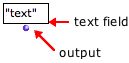
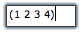

Navigation générale : 

  - [Guide](OM-Documentation.md)
  - [Plan](OM-Documentation_1.md)
  - [Glossaire](OM-Documentation_2.md)

OpenMusic
DocumentationHiérarchie
de section : [OM 6.6 User
Manual](OM-User-Manual.md) \>
[Visual Programming
I](BasicVisualProgramming.md) \>
[Boxes](Boxes.md) \>
Data Boxes

Navigation : [page
précédente](GraphicFeatures.md "page précédente(Boxes Features)")
| [page
suivante](FunctionBoxes.md "page suivante(Function Boxes)")

# Data Boxes

[Sommaire ](#)

1.  [Use](#tN1e)
2.  [Adding a Data Box](#tN115)
3.  [Editing the Content of a Box](#tN1a5)
4.  [Connection to Another Box](#tN233)

**Data boxes** are the simplest of all OM boxes. A data box represents a
constant value. This value belongs to one of the primitive Lisp types,
which are available in the OM Kernel / Lisp package.

## Use

<table>
<colgroup>
<col style="width: 50%" />
<col style="width: 50%" />
</colgroup>
<tbody>
<tr class="odd">
<td>

</td>
<td>

A data box is designed to pass data to other boxes in a patch. It is made of a text field that expresses a value or a text, and an output that allows to connect this content to other boxes.

</td>
</tr>
</tbody>
</table>

Primitive Lisp Types

There are several primitive Lisp types :

<table>
<tbody>
<tr class="odd">
<td><ul>
<li>
number :
</li>
</ul></td>
<td>
any type of numeric data
</td>
<td><ul>
<li>
list :
</li>
</ul></td>
<td>
a list of any type of item between parenthesis
</td>
</tr>
<tr class="even">
<td><ul>
<li>
integer :
</li>
</ul></td>
<td>
an integer number
</td>
<td><ul>
<li>
string :
</li>
</ul></td>
<td>
a text between double quotes – inverted commas –
</td>
</tr>
<tr class="odd">
<td><ul>
<li>
float :
</li>
</ul></td>
<td>
decimal number
</td>
<td><ul>
<li>
t :
</li>
</ul></td>
<td>
the Lisp expression for "true"
</td>
</tr>
<tr class="even">
<td><ul>
<li>
rational :
</li>
</ul></td>
<td>
a/b 
</td>
<td><ul>
<li>
nil :
</li>
</ul></td>
<td>
the Lisp expression of "false" or "nothing"
</td>
</tr>
</tbody>
</table>

## Adding a Data Box

Typing Directly In the Patch Editor

|                                                                                     |                                                                                                                            |
| ----------------------------------------------------------------------------------- | -------------------------------------------------------------------------------------------------------------------------- |
|  | `Cmd` click in the patch editor and type a content – for instance 4, (2 3 4), "hello", etc. – directly in the text prompt. |

Menus Or Library Window

  -  Go to `Classes / Kernel / Lisp` and choose a menu
    item.
  -  `Ctrl` / right click in the patch editor and choose a menu
    item in the contextual menu.
  - Pick the box in the relevant package from the
    [Library](Library.md) window and drop it in the editor.
    

Note

A data box accepts any primitive type, no matter what its type was
initially.

## Editing the Content of a Box

|                                                                                                   |                                            |
| ------------------------------------------------------------------------------------------------- | ------------------------------------------ |
|  | Double click on a box to edit its content. |

  -  Numbers should be entered as simple numbers.
  -  Strings should be entered between double quotes – inverted
    commas.
  -  Symbols should be entered as simple text.
  -  Lists should be entered between parenthesis, just as in Lisp.
    Ill-formed lists are not accepted.

**** To confirm the input value, press `Enter` or click in the patch
editor. **** ****No line return is allowed in data boxes.**** ****

Resizing

To fit the box size to its content, select it and type `i`.

## Connection to Another Box

<table>
<colgroup>
<col style="width: 50%" />
<col style="width: 50%" />
</colgroup>
<tbody>
<tr class="odd">
<td>

Click on the outlet to create a connection and drag it to the wanted inlet of another box.

</td>
<td>

Connecting a simple value box to the pitch inlet of a "note" box.

</td>
</tr>
</tbody>
</table>

Automatic Connection

<table>
<colgroup>
<col style="width: 50%" />
<col style="width: 50%" />
</colgroup>
<tbody>
<tr class="odd">
<td>

</td>
<td>

To add a connected data box to a factory or function box, <code class="keyboard_tl">SHIFT</code> click on an input. This data box will have the default value of the input, which will then be displayed permanently.

</td>
</tr>
</tbody>
</table>

Références : 

Plan :

  - [OpenMusic Documentation](OM-Documentation.md)
  - [OM 6.6 User Manual](OM-User-Manual.md)
      - [Introduction](00-Sommaire.md)
      - [System Configuration and
        Installation](Installation.md)
      - [Going Through an OM Session](Goingthrough.md)
      - [The OM Environment](Environment.md)
      - [Visual Programming I](BasicVisualProgramming.md)
          - [Patch Introduction](ProgrammingIntro.md)
          - [Adding Boxes Into a Patch](AddingBoxes.md)
          - [Elementary Manipulations](ElementaryManips.md)
          - [Boxes](Boxes.md)
              - [Boxes Features](GraphicFeatures.md)
              - Data
                Boxes
              - [Function Boxes](FunctionBoxes.md)
              - [Objects – Factory Boxes](FactoryBoxes.md)
              - [Abstraction Boxes](AbsBoxesIntro.md)
              - [Other Boxes](OtherBoxes.md)
          - [Box Inputs](BoxInputs.md)
          - [Connections](Connections.md)
          - [Evaluation](Evaluation.md)
          - [Documentation and Info](DocAndInfo.md)
          - [Comments](Comments.md)
          - [Pictures](Pictures.md)
          - [Saving / Reloading a Patch](SavingPatch.md)
          - [Dead Boxes](DeadBox.md)
      - [Visual Programming
        II](AdvancedVisualProgramming.md)
      - [Basic Tools](BasicObjects.md)
      - [Score Objects](ScoreObjects.md)
      - [Maquettes](Maquettes.md)
      - [Sheet](Sheet.md)
      - [MIDI](MIDI.md)
      - [Audio](Audio.md)
      - [SDIF](SDIF.md)
      - [Lisp Programming](Lisp.md)
      - [Errors and Problems](errors.md)
  - [OpenMusic QuickStart](QuickStart-Chapters.md)

Navigation : [page
précédente](GraphicFeatures.md "page précédente(Boxes Features)")
| [page
suivante](FunctionBoxes.md "page suivante(Function Boxes)")

[A propos...](OM-Documentation_3.md)(c) Ircam - Centre
Pompidou

