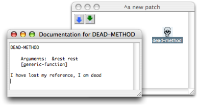
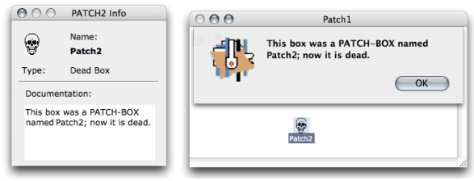
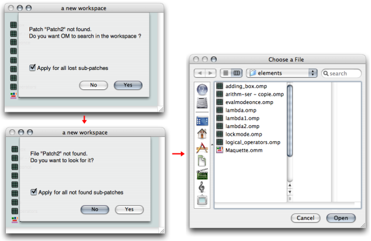

Navigation générale : 

  - [Guide](OM-Documentation.md)
  - [Plan](OM-Documentation_1.md)
  - [Glossaire](OM-Documentation_2.md)

OpenMusic
DocumentationHiérarchie
de section : [OM 6.6 User
Manual](OM-User-Manual.md) \>
[Visual Programming
I](BasicVisualProgramming.md) \>
Dead Boxes

Navigation : [page
précédente](SavingPatch.md "page précédente(Saving / Reloading a Patch)")
| [page
suivante](AdvancedVisualProgramming.md "page suivante(Visual Programming II)")

# Missing References : Dead Boxes

An item used in a patch may sometimes be missing. **Dead boxes**

refer to saved items that OM cannot find anymore :

  - if an item belongs to a library that was loaded at a previous
    session, and that this library isn't reloaded,
  - if an OM function doesn't exist in a new OM version, 
  - If a sub patch that was used in another patch is missing in a
    workspace.

Dead boxes have been designed to keep as much information as possible
about their original reference, so that they can possibly be loaded
again correctly.

## Dead Boxes

If the user tries to open a dead box or to get information or
documentation, the box doc will say "I have lost my reference, I am
dead"...

... or a message of the same kind.

Note

When a dead box "knows" which reference – class or function for instance
– it was attached to, it can possibly be restored. Its reference must be
loaded again or re-created before the patch is reloaded. To reload a
patch containing dead boxes, use the "Last Saved" command.

Saving Procedures

  - [Saving / Reloading a Patch](SavingPatch.md)

## Finding Lost Patches

If a patch reference is missing in the workspace, OM will point it out
and offer to find it. If the item can't be found, the user will be
offered to look for it by himself.

Looking for the reference of a dead
box.[Zoom](../res/deadpatches_scr_1.png "Zoom (nouvelle fenêtre)")

What Is a Patch Reference ?

  - [Standard Abstraction](BlueAbstraction.md)

See also : Workspace / Adding Components in a Workspace at a
Session : Import and Export Functions

  - [Workspace](Workspace.md)

Références : 

Plan :

  - [OpenMusic Documentation](OM-Documentation.md)
  - [OM 6.6 User Manual](OM-User-Manual.md)
      - [Introduction](00-Sommaire.md)
      - [System Configuration and
        Installation](Installation.md)
      - [Going Through an OM Session](Goingthrough.md)
      - [The OM Environment](Environment.md)
      - [Visual Programming I](BasicVisualProgramming.md)
          - [Patch Introduction](ProgrammingIntro.md)
          - [Adding Boxes Into a Patch](AddingBoxes.md)
          - [Elementary Manipulations](ElementaryManips.md)
          - [Boxes](Boxes.md)
          - [Box Inputs](BoxInputs.md)
          - [Connections](Connections.md)
          - [Evaluation](Evaluation.md)
          - [Documentation and Info](DocAndInfo.md)
          - [Comments](Comments.md)
          - [Pictures](Pictures.md)
          - [Saving / Reloading a Patch](SavingPatch.md)
          - Dead
            Boxes
      - [Visual Programming
        II](AdvancedVisualProgramming.md)
      - [Basic Tools](BasicObjects.md)
      - [Score Objects](ScoreObjects.md)
      - [Maquettes](Maquettes.md)
      - [Sheet](Sheet.md)
      - [MIDI](MIDI.md)
      - [Audio](Audio.md)
      - [SDIF](SDIF.md)
      - [Lisp Programming](Lisp.md)
      - [Errors and Problems](errors.md)
  - [OpenMusic QuickStart](QuickStart-Chapters.md)

Navigation : [page
précédente](SavingPatch.md "page précédente(Saving / Reloading a Patch)")
| [page
suivante](AdvancedVisualProgramming.md "page suivante(Visual Programming II)")

[A propos...](OM-Documentation_3.md)(c) Ircam - Centre
Pompidou

