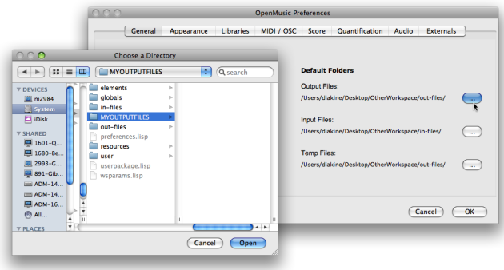

Navigation générale : 

  - [Guide](OM-Documentation.md)
  - [Plan](OM-Documentation_1.md)
  - [Glossaire](OM-Documentation_2.md)

OpenMusic
DocumentationHiérarchie
de section : [OM 6.6 User
Manual](OM-User-Manual.md) \>
[Visual Programming
II](AdvancedVisualProgramming.md) \>
[Files](Files.md) \>
Default
Directories

Navigation : [page
précédente](Pathnames.md "page précédente(Pathnames)")
| [page
suivante](File-Box.md "page suivante(File-Box)")

# Default Directories

Default directories can be used for the storage of external input,
output and temporary files – MIDI, SDIF or sound files , sound analysis
and synthesis files, etc. These storage folders can also be used in
programs with the text tools presented in this section.

## OM Settings

The default locations are the in-files and out-files directories of the
current workspace directory.

Preferences

These directories are selected in the [OM
Preferences](Preferences.md).

[Zoom](../res/selectout_scr_1.png "Zoom (nouvelle fenêtre)")

To define a location folder

1.  go to the `General` tab of the preferences pane

2.  click on the relevant button of the `Default Folders` section

3.  select a folder for the corresponding item.

Selection

Note that you can select any folder, including out of the workspace, and
possibly share these folders between different workspaces.

## Infile, Outfile and Tmpfile Boxes

The **infile** , **outfile** and **tmpfile** boxes allow to build
pathnames directly in the OM default folders.

Access

To access these boxes

  - select `Functions / Kernel / Files` and pick a menu item

  - `Cmd` click and type "infile", "outfile" or "tmpfile".

Inputs and Output

  - Each box has one default input where the name of the file can be
    specified.
    
    A keyword input allows to specify also a list of subdirectories, a
    specific file extension, etc.

  - The output returns the a pathname.

Using the Pathname with File-Box

The output of the box can be connected to a streamfile box in a
[File-Box](File-Box.md), where the pointed file can be
manipulated.

Références : 

Plan :

  - [OpenMusic Documentation](OM-Documentation.md)
  - [OM 6.6 User Manual](OM-User-Manual.md)
      - [Introduction](00-Sommaire.md)
      - [System Configuration and
        Installation](Installation.md)
      - [Going Through an OM Session](Goingthrough.md)
      - [The OM Environment](Environment.md)
      - [Visual Programming I](BasicVisualProgramming.md)
      - [Visual Programming
        II](AdvancedVisualProgramming.md)
          - [Abstraction](Abstraction.md)
          - [Evaluation Modes](EvalModes.md)
          - [Higher-Order Functions](HighOrder.md)
          - [Control Structures](Control.md)
          - [Iterations: OMLoop](OMLoop.md)
          - [Instances](Instances.md)
          - [Interface Boxes](InterfaceBoxes.md)
          - [Files](Files.md)
              - [Pathnames](Pathnames.md)
              - Default
                Directories
              - [File-Box](File-Box.md)
      - [Basic Tools](BasicObjects.md)
      - [Score Objects](ScoreObjects.md)
      - [Maquettes](Maquettes.md)
      - [Sheet](Sheet.md)
      - [MIDI](MIDI.md)
      - [Audio](Audio.md)
      - [SDIF](SDIF.md)
      - [Lisp Programming](Lisp.md)
      - [Errors and Problems](errors.md)
  - [OpenMusic QuickStart](QuickStart-Chapters.md)

Navigation : [page
précédente](Pathnames.md "page précédente(Pathnames)")
| [page
suivante](File-Box.md "page suivante(File-Box)")

[A propos...](OM-Documentation_3.md)(c) Ircam - Centre
Pompidou

