

Navigation générale : 

  - [Guide](OM-Documentation.md)
  - [Plan](OM-Documentation_1.md)
  - [Glossaire](OM-Documentation_2.md)

OpenMusic
DocumentationHiérarchie
de section : [OM 6.6 User
Manual](OM-User-Manual.md) \>
[Basic Tools](BasicObjects.md)
\> [Curves and
Functions](CurvesAndFunctions.md) \>
[Editors](BPFEditors.md) \>
Display

Navigation : [page
précédente](Edition.md "page précédente(Edition Basics)")
| [page
suivante](BPFLibEditors.md "page suivante(BPF-Lib / BPC-Lib Editors)")

# Display Options

[Sommaire ](#)

1.  [Curve and Points](#ndN6)
2.  [View](#ndNd4)
3.  [Background Picture](#ndN191)
4.  [Spline Display](#ndN237)

## Curve and Points

Show / Hide Points

To display or hide the points of a curve, click on or outside it.

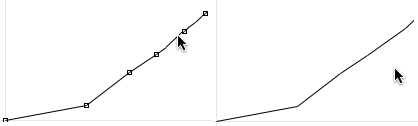

Show / Hide Line

<table>
<colgroup>
<col style="width: 50%" />
<col style="width: 50%" />
</colgroup>
<tbody>
<tr class="odd">
<td>

The <code class="textCheckBox_tl">line</code> option is selected by default.

To display points only, unselect this option.

</td>
<td>

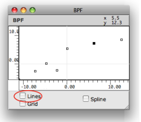

</td>
</tr>
</tbody>
</table>

Grid

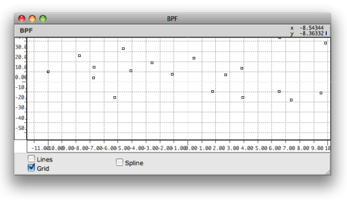

Displaying a grid in a BPF editor.

To display a grid in the editor, select the `grid` option.

The grid's step is adapted automatically to the window size and to the
axis scale.

Indexes

Press `p` to show or hide the indexes of the points. The indexes are not
ordered "chronologically", but follow the abscissa axis order.

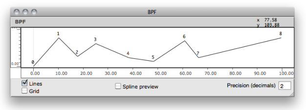

Closed BPC

BPC editors have an additional option : the `Closed BPC` option.

This option allows to connect the first and last point of the curve, in
order to get a polyhedron.

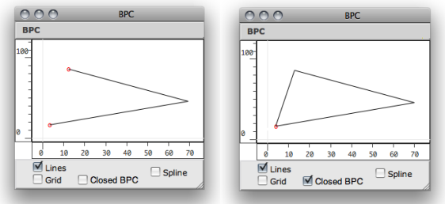

## View

Browsing the Editor

<table>
<colgroup>
<col style="width: 50%" />
<col style="width: 50%" />
</colgroup>
<tbody>
<tr class="odd">
<td>

<a href="../res/moveineditor.png" class="overLnk" title="Cliquez pour agrandir">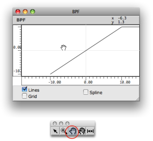</a>

</td>
<td>

To browse the editor's surface :

<ol>
<li>
select the hand tool ,
</li>
<li>
click and drag the mouse in the editor.
</li>
</ol>

</td>
</tr>
</tbody>
</table>

Rulers

To change the editor's scale, click and drag the abscissa or ordinates
axis.

The adjustment limits of the abscissa ruler depends on the value of the
"decimals" input.

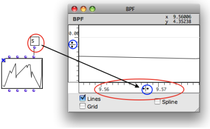

Zoom In / Out, Resize

[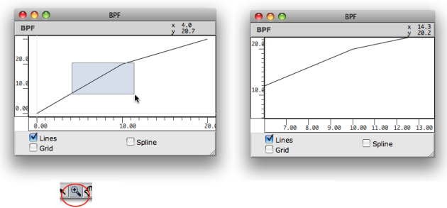](../res/zoom.png "Cliquez pour agrandir")

To zoom in a region of a curve :

1.  select the zoom tool
    
    ,

2.  click and drag a region.

To fit the editor's scale to the object size, click on the rezise tool

.

## Background Picture

A picture can be associated with the BPF or BPC editors and displayed as
background. To select a background picture :

1.  `Ctrl` / right click and and select `Background Picture` in the
    contextual menu

2.  Click on the picyre icon

3.  Select a picture via the dialogue window

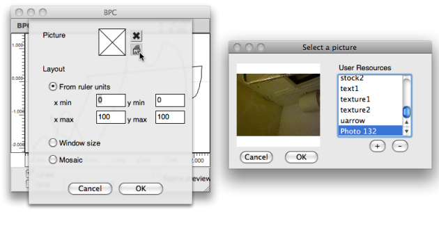

[Zoom](../res/choosepic_scr_1.png "Zoom (nouvelle fenêtre)")

Pictures Management

  - [Resources](resources.md)

<table>
<colgroup>
<col style="width: 50%" />
<col style="width: 50%" />
</colgroup>
<tbody>
<tr class="odd">
<td>

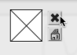

</td>
<td>

To delete the picture, click on the small cross icon.

<ul>
<li>
Several options are available to set the picture coordinates and size relatively to the editor scale.
</li>
<li>
When a background picture is attached to the editor, the resize command  fits the editor's scales to the picture size.
</li>
</ul>

</td>
</tr>
</tbody>
</table>

## Spline Display

Spline Curves

Spline are mathematical functions defined piecewise by polynomial
interpolation. They are used for generating smoothed interpolated shapes
, starting from a set of control points. Some functions in OM allow to
generate spline curves starting from the points of a BPF or BPC.

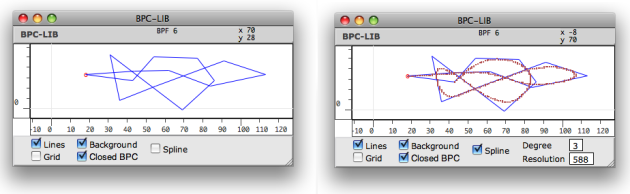

Displaying the spline of a
curve.[Zoom](../res/spline1_scr_1.png "Zoom (nouvelle fenêtre)")

To display the preview of a spline curve computed from the BPF/BPC,
check the `spline` display option.

Parameters

  - The spline's resolution represents the number of points in the
    spline preview. 
  - The spline's degree determines the number of adjacent control
    points used for computing the spline curve points. Higher values
    produce smoother curves.

To modify the spline resolution or degree :

1.  click on the **"Degree"** or " **Resolution"** frames

2.  scroll the mouse up or down to change the value.

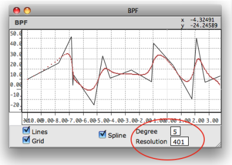

Spline Tools in OM

  - [BPF and BPC Tools](Tools.md)

Références : 

Plan :

  - [OpenMusic Documentation](OM-Documentation.md)
  - [OM 6.6 User Manual](OM-User-Manual.md)
      - [Introduction](00-Sommaire.md)
      - [System Configuration and
        Installation](Installation.md)
      - [Going Through an OM Session](Goingthrough.md)
      - [The OM Environment](Environment.md)
      - [Visual Programming I](BasicVisualProgramming.md)
      - [Visual Programming
        II](AdvancedVisualProgramming.md)
      - [Basic Tools](BasicObjects.md)
          - [Curves and Functions](CurvesAndFunctions.md)
              - [BPF / BPC](BPF-BPC.md)
              - [BPF/BPC-Libs](MultiBPF.md)
              - [Editors](BPFEditors.md)
                  - [Edition Basics](Edition.md)
                  - Display
                  - [BPF-Lib / BPC-Lib
                    Editors](BPFLibEditors.md)
              - [BPF / BPC Tools](Tools.md)
              - [3D Objects](3D.md)
          - [Array](ClassArray.md)
          - [TextFile](textfile.md)
          - [Picture](Picture.md)
      - [Score Objects](ScoreObjects.md)
      - [Maquettes](Maquettes.md)
      - [Sheet](Sheet.md)
      - [MIDI](MIDI.md)
      - [Audio](Audio.md)
      - [SDIF](SDIF.md)
      - [Lisp Programming](Lisp.md)
      - [Errors and Problems](errors.md)
  - [OpenMusic QuickStart](QuickStart-Chapters.md)

Navigation : [page
précédente](Edition.md "page précédente(Edition Basics)")
| [page
suivante](BPFLibEditors.md "page suivante(BPF-Lib / BPC-Lib Editors)")

[A propos...](OM-Documentation_3.md)(c) Ircam - Centre
Pompidou

