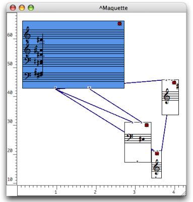
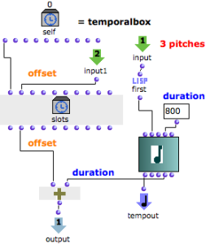
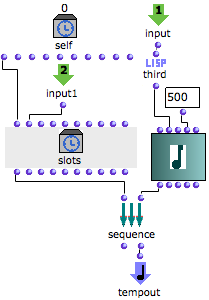

Navigation générale : 

  - [Guide](OM-Documentation.md)
  - [Plan](OM-Documentation_1.md)
  - [Glossaire](OM-Documentation_2.md)

OpenMusic
DocumentationHiérarchie
de section : [OM 6.6 User
Manual](OM-User-Manual.md) \>
[Maquettes](Maquettes.md) \>
[Maquette
Programming](Programming%20Maquette.md) \>
[TempBoxes
Programming](TempProgramming.md) \>
Temporal
Relations

Navigation : [page
précédente](Examplestempbox.md "page précédente(Programming with the Tempin)")
| [page
suivante](Maquettes%20in%20Patches.md "page suivante(Maquettes in Patches)")

# Example 2 : Defining Temporal Relations Between TemporalBoxes

## Applying the Values of a TemporalBox to Other TemporalBoxes

The values of the Self Input Box can be used for defining **temporal
relations** with other TemporalBoxes, via connections between functional
inputs and outputs.

Building a Sequence of TemporalBoxes

The chord of TemporalBox \#1 is a reservoir for isolated notes that will
occur successively in the maquette.

1.  We have programmed the TemporalBoxes so that the initial chord
    provides one random note to each of TemporalBoxes \#2; 3; and 4.

2.  The **offset** of each TemporalBox is determined by the **offset
    and** ****duration**** of the **preceding box** , so that boxes
    follow each other.

Inside TemporalBox \#1

The internal program of the first TemporalBox determines some
characteristics of the other TemporalBox.

Inside TemporalBox \#1 : using the "pattern-chord"'s data.

  - The initial chord lasts 3 seconds. It is connected to the
    Tempout of TemporalBox \#1, and represents its musical value.
    
  -  Permut-random performs a random permutation of the chord's
    pitches. The **three first pitches** of this permutation are
    returned by nth-first to the **first output** of TemporalBox
    \#1.
  -  On the other hand, the **offset** of the TemporalBox returned
    by the Self Input Box, is added with the chord's **duration** .
    
  - The result is returned to the **second output** of the
    TemporalBox.

## TemporalBoxes Interaction

The random pitches – output \#1 – are returned to all the other
TemporalBoxes. The ending time of the box – output \#2 – is returned to
the next TemporalBox.

Inside TemporalBox \#2

<table>
<colgroup>
<col style="width: 50%" />
<col style="width: 50%" />
</colgroup>
<tbody>
<tr class="odd">
<td>

<ol>
<li>
The three random pitches are returned by the first input of TemporalBox #2 to the first function.

First picks the first note and returns it to the note box. This note is also given a duration.
</li>
<li>
The note is connected to the Tempout and becomes the musical value of the TemporalBox.
</li>
<li>
The temporal position of TemporalBox #1, is returned to the "offset" input of slots, which defines the offset of TemporalBox #2.
</li>
<li>
The offset of TemporalBox #2 is added to the duration of the note, and the result is returned to the output of TemporalBox #2.
</li>
<li>
The value of the output ending of the box – is returned to the next TemporalBox, which contains the same program.
</li>
</ol>

</td>
<td>

</td>
</tr>
</tbody>
</table>

About Last TemporalBox

<table>
<colgroup>
<col style="width: 50%" />
<col style="width: 50%" />
</colgroup>
<tbody>
<tr class="odd">
<td>

</td>
<td>

Note that the last TemporalBox has nor output, neither om+ function, but a sequence function. The box has nothing to return to another box. The sequence function allows to evaluate slots before evaluating the TemporalBox, so that its offset is correct.

</td>
</tr>
</tbody>
</table>

Références : 

Plan :

  - [OpenMusic Documentation](OM-Documentation.md)
  - [OM 6.6 User Manual](OM-User-Manual.md)
      - [Introduction](00-Sommaire.md)
      - [System Configuration and
        Installation](Installation.md)
      - [Going Through an OM Session](Goingthrough.md)
      - [The OM Environment](Environment.md)
      - [Visual Programming I](BasicVisualProgramming.md)
      - [Visual Programming
        II](AdvancedVisualProgramming.md)
      - [Basic Tools](BasicObjects.md)
      - [Score Objects](ScoreObjects.md)
      - [Maquettes](Maquettes.md)
          - [Creating a Maquette](Maquette.md)
          - [TemporalBoxes](TemporalBoxes.md)
          - [The Maquette Editor](Editor.md)
          - [Maquette
            Programming](Programming%20Maquette.md)
              - [Functional Components](InputsOutputs.md)
              - [Evaluation](MaquetteEvaluation.md)
              - [The Synthesis Patch](Synthpatchprog.md)
              - [TempBoxes Programming](TempProgramming.md)
                  - [The Self Input Box –
                    Tempin](SelfInputBox.md)
                  - [Programming with the
                    Tempin](Examplestempbox.md)
                  - Temporal
                    Relations
          - [Maquettes in
            Patches](Maquettes%20in%20Patches.md)
      - [Sheet](Sheet.md)
      - [MIDI](MIDI.md)
      - [Audio](Audio.md)
      - [SDIF](SDIF.md)
      - [Lisp Programming](Lisp.md)
      - [Errors and Problems](errors.md)
  - [OpenMusic QuickStart](QuickStart-Chapters.md)

Navigation : [page
précédente](Examplestempbox.md "page précédente(Programming with the Tempin)")
| [page
suivante](Maquettes%20in%20Patches.md "page suivante(Maquettes in Patches)")

[A propos...](OM-Documentation_3.md)(c) Ircam - Centre
Pompidou

