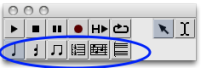
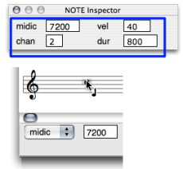
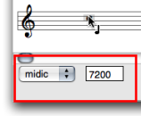
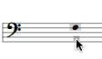
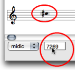
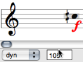
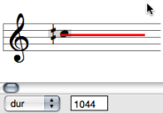
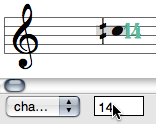
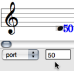

Navigation générale : 

  - [Guide](OM-Documentation.md)
  - [Plan](OM-Documentation_1.md)
  - [Glossaire](OM-Documentation_2.md)

OpenMusic
DocumentationHiérarchie
de section : [OM 6.6 User
Manual](OM-User-Manual.md) \>
[Score
Objects](ScoreObjects.md) \>
[Score
Editors](ScoreEditors.md) \>
Basic Editing

Navigation : [page
précédente](Editor-Display.md "page précédente(Score Display)")
| [page
suivante](Harmonic-Obj-Editor.md "page suivante(Harmonic Objects)")

# Basic Editing

Edition applies to all score objects. The **Palette** offers a set of
edition tools, adapted to each of these objects. The **Editor Control**
is the main edition interface of the editor window. The **Score
Inspector window** also allows a number of editing operations.

## Accessing Parameters

Selecting the Right Item : the Palette

<table>
<colgroup>
<col style="width: 50%" />
<col style="width: 50%" />
</colgroup>
<tbody>
<tr class="odd">
<td>

The palette displays a player in its upper part, and edition tools in its lower part.

To edit an item, select the relevant edition tool.

</td>
<td>

</td>
</tr>
</tbody>
</table>

Inspector Window

<table>
<colgroup>
<col style="width: 50%" />
<col style="width: 50%" />
</colgroup>
<tbody>
<tr class="odd">
<td>

A non exhaustive set of parameters can be accessed via the <strong>Inspector window</strong> .

The Inspector window appears once an item is selected, and displays related parametric values.

To modify a parameter :

<ul>
<li>Select a frame and scroll the mouse up or down to increase or decrease the values. </li>
<li>Add <code class="keyboard_tl">Cmd</code> to change the value by 10 steps, or <code class="keyboard_tl">SHIFT</code> to change the value by 100 steps.</li>
</ul>

</td>
<td>

Editing the pitch of a note.

</td>
</tr>
</tbody>
</table>

Editor Control Menu and Frame

<table>
<colgroup>
<col style="width: 50%" />
<col style="width: 50%" />
</colgroup>
<tbody>
<tr class="odd">
<td>

</td>
<td>

The <strong>editor control</strong> allows a thorough edition of each slot, as shown below. It shows one or two menus and an adjacent numeric frame.

</td>
</tr>
</tbody>
</table>

## Editor Control : Selecting and Editing Slots

Pitch

There are three ways to change the pitch of a note. In any case, the
`midic` menu item must be previously selected.

<table>
<colgroup>
<col style="width: 50%" />
<col style="width: 50%" />
</colgroup>
<tbody>
<tr class="odd">
<td>

<ul>
<li>
"Manually" :

Select an item and move it with the mouse.
</li>
</ul>

</td>
<td>

</td>
</tr>
</tbody>
</table>

To raise or lower the pitch from the staff, use the `↑` or `↓` keys .

  - Add `Cmd` to transpose the note from a perfect fifth.
  - Add `SHIFT` to transpose the note from an octave.

<table>
<colgroup>
<col style="width: 50%" />
<col style="width: 50%" />
</colgroup>
<tbody>
<tr class="odd">
<td>

</td>
<td>

To change a pitch from the Editor Control Frame, click on the value displayed in the numeric frame and scroll the mouse upwards or downwards.

<ul>
<li>Add <code class="keyboard_tl">Cmd</code> to change the value by 100 midicents steps.</li>
<li>Add <code class="keyboard_tl">SHIFT</code> to change the value by 1000 midicents steps.</li>
</ul>

Double click in the frame and type a value.

</td>
</tr>
</tbody>
</table>

Velocity – Dynamics

<table>
<colgroup>
<col style="width: 50%" />
<col style="width: 50%" />
</colgroup>
<tbody>
<tr class="odd">
<td>

</td>
<td>

<ol>
<li>
Choose <code class="menuPath_tl">Dyn</code> in the editor control. The dynamic is displayed under the note.
</li>
<li>
Click on the note and scroll the mouse to increase or decrease the velocity value.

<ul>
<li>Add <code class="keyboard_tl">SHIFT</code> to change the value by steps of 10.</li>
<li>Add <code class="keyboard_tl">Cmd</code> to switch from 0 to 127.</li>
</ul></li>
</ol>

</td>
</tr>
</tbody>
</table>

Duration

<table>
<colgroup>
<col style="width: 50%" />
<col style="width: 50%" />
</colgroup>
<tbody>
<tr class="odd">
<td>

Choose <code class="menuPath_tl">Dur</code> in the pop up menu. The duration is expressed by a plain line.

There are two ways to change the duration of a note :

<ul>
<li>
To Click in the numeric frame and scroll the mouse to increase or decrease the duration value
</li>
<li>
Use the <code class="keyboard_tl">←</code> and <code class="keyboard_tl">→</code> keys.

<ul>
<li>Add <code class="keyboard_tl">Cmd</code> to change the value by steps of 100 milliseconds.</li>
<li>Add <code class="keyboard_tl">SHIFT</code> to change the value by steps of 1000 milliseconds.</li>
</ul></li>
</ul>

</td>
<td>

</td>
</tr>
</tbody>
</table>

MidiChannel

<table>
<colgroup>
<col style="width: 50%" />
<col style="width: 50%" />
</colgroup>
<tbody>
<tr class="odd">
<td>

</td>
<td>

The OM midi interface has 16 midi channel.

<ol>
<li>
Choose <code class="menuPath_tl">Channel</code> in the pop up menu.
</li>
<li>
Click in the adjacent frame and scroll the mouse to increase or decrease the duration value.

Add <code class="keyboard_tl">Cmd</code> or <code class="keyboard_tl"> SHIFT</code> to switch from 1 to 16.
</li>
</ol>

</td>
</tr>
</tbody>
</table>

Port

<table>
<colgroup>
<col style="width: 50%" />
<col style="width: 50%" />
</colgroup>
<tbody>
<tr class="odd">
<td>

You can access 255 audio ports.

<ol>
<li>
Choose <code class="menuPath_tl">Port</code> in the pop up menu.
</li>
<li>
Click in the adjacent frame and scroll the mouse to increase or decrease the duration value.

<ul>
<li>Add <code class="keyboard_tl">Cmd</code> to change the value by steps of 100</li>
<li>Add <code class="keyboard_tl">SHIFT</code> to change the value by steps of 10.</li>
</ul></li>
</ol>

</td>
<td>

</td>
</tr>
</tbody>
</table>

Références : 

Plan :

  - [OpenMusic Documentation](OM-Documentation.md)
  - [OM 6.6 User Manual](OM-User-Manual.md)
      - [Introduction](00-Sommaire.md)
      - [System Configuration and
        Installation](Installation.md)
      - [Going Through an OM Session](Goingthrough.md)
      - [The OM Environment](Environment.md)
      - [Visual Programming I](BasicVisualProgramming.md)
      - [Visual Programming
        II](AdvancedVisualProgramming.md)
      - [Basic Tools](BasicObjects.md)
      - [Score Objects](ScoreObjects.md)
          - [Presentation](Score-Objects-Intro.md)
          - [Rhythm Trees](RT.md)
          - [Score Players](ScorePlayer.md)
          - [Score Editors](ScoreEditors.md)
              - [Overview](Editor-Overview.md)
              - [Preferences](Editors-Prefs.md)
              - [Score Display](Editor-Display.md)
              - Basic
                Editing
              - [Harmonic Objects](Harmonic-Obj-Editor.md)
              - [Rhythmic Objects](Editor-Rhythm.md)
              - [Polyphonic Objects](Poly-Multi-Editor.md)
              - [Page Mode](Editor-PageMode.md)
              - [Tonal Display](Editor-Tonality.md)
              - [Microintervals
                Notation](Editor-Microintervals.md)
              - [Play Controls](Editor-Play.md)
          - [Quantification](Quantification.md)
          - [Export / Import](ImportExport.md)
      - [Maquettes](Maquettes.md)
      - [Sheet](Sheet.md)
      - [MIDI](MIDI.md)
      - [Audio](Audio.md)
      - [SDIF](SDIF.md)
      - [Lisp Programming](Lisp.md)
      - [Errors and Problems](errors.md)
  - [OpenMusic QuickStart](QuickStart-Chapters.md)

Navigation : [page
précédente](Editor-Display.md "page précédente(Score Display)")
| [page
suivante](Harmonic-Obj-Editor.md "page suivante(Harmonic Objects)")

[A propos...](OM-Documentation_3.md)(c) Ircam - Centre
Pompidou

