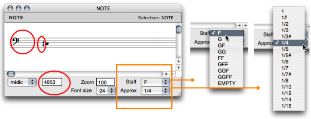
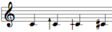
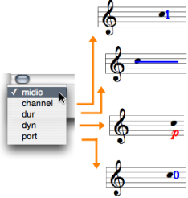
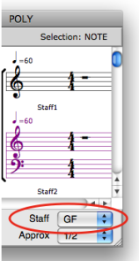
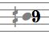

Navigation générale : 

  - [Guide](OM-Documentation.md)
  - [Plan](OM-Documentation_1.md)
  - [Glossaire](OM-Documentation_2.md)

OpenMusic
DocumentationHiérarchie
de section : [OM 6.6 User
Manual](OM-User-Manual.md) \>
[Score
Objects](ScoreObjects.md) \>
[Score
Editors](ScoreEditors.md) \>
Score Display

Navigation : [page
précédente](Editors-Prefs.md "page précédente(Preferences)")
| [page
suivante](Editor-Basics.md "page suivante(Basic Editing)")

# Score Display

## Displaying Information

Pop Up Menus

The note editor menus and
controls.[Zoom](../res/changegrade_scr_1.png "Zoom (nouvelle fenêtre)")

Pop up menus are mainly used for modifying the score displaying and
player options :

  - `Font size` – adjust the font size to your convenience.
    
    Use the Zoom to adjust the horizontal spacing of notes.

  - `Staff`  – number of staves and G or F clefs.

<table>
<colgroup>
<col style="width: 50%" />
<col style="width: 50%" />
</colgroup>
<tbody>
<tr class="odd">
<td>

<ul>
<li>
<code class="menuPath_tl">Approx</code>  – division of the octave, from the tone to the 1/16th tone.
</li>
</ul>

Each scale has an adapted accidentals notation system.

</td>
<td>

The 1/6 tone notation system.

</td>
</tr>
</tbody>
</table>

Microintervals Notation

  - [Microintervals Notation](Editor-Microintervals.md)

Editor Control Menu

<table>
<colgroup>
<col style="width: 50%" />
<col style="width: 50%" />
</colgroup>
<tbody>
<tr class="odd">
<td>

The Editor Control <code class="menuPath_tl">pop up menu</code> allows to select and visualize each of the parametric values attached to an object.

<ul>
<li>
To display the corresponding value of an object, pick one option.

The midic parameter is selected by default, and the note is displayed permanently. This value can now be modified.
</li>
</ul>

</td>
<td>

</td>
</tr>
</tbody>
</table>

## Staves Configuration

Non Polyphonic Objects

The staves configuration of notes , chords , chord-seqs and voices can
be modified via a simple selection in the `Staff` pop up menu.

Polyphonic Objects

<table>
<colgroup>
<col style="width: 50%" />
<col style="width: 50%" />
</colgroup>
<tbody>
<tr class="odd">
<td>

</td>
<td>

The staves configuration of polys and multi-seqs can be modified to the whole object's scale, or to selected items scale.

<ul>
<li>
To apply a configuration to a specific item

<ol>
<li>
click on the clef of a staff
</li>
<li>
select a configuration in the<code class="menuPath_tl"> Staff</code> pop up menu.
</li>
</ol></li>
</ul>
<ul>
<li>
To apply a configuration to each element

<ol>
<li>
don't select any staff
</li>
<li>
choose a configuration in the menu.
</li>
</ol></li>
</ul>

</td>
</tr>
</tbody>
</table>

Editors Displaying Parameters

  - [Preferences](Editors-Prefs.md)

Multipe Staves Configurations in Polyphonic Objects

<table>
<colgroup>
<col style="width: 50%" />
<col style="width: 50%" />
</colgroup>
<tbody>
<tr class="odd">
<td>

</td>
<td>

All score objects, but note objects, offer multiple staves configurations – <code class="menuPath_tl">GG</code>, <code class="menuPath_tl">FF</code>, <code class="menuPath_tl">GGFF</code> etc. –.

These configurations do no allow single staff manipulation : staves form groups which cannot be splitted for edition purposes .

</td>
</tr>
</tbody>
</table>

## Colour

Midi Channel

|                                                                    |                                                                                               |
| ------------------------------------------------------------------ | --------------------------------------------------------------------------------------------- |
| To change the note colour according to its midi channel, Press `c` |  |

Note Colour

<table>
<colgroup>
<col style="width: 50%" />
<col style="width: 50%" />
</colgroup>
<tbody>
<tr class="odd">
<td>

To change the colour of a note :

<ol>
<li>
press <code class="keyboard_tl">SHIFT</code> + <code class="keyboard_tl">c</code>
</li>
<li>
select a colour in the Colour Chooser.
</li>
</ol>

</td>
<td>

</td>
</tr>
</tbody>
</table>

Références : 

Plan :

  - [OpenMusic Documentation](OM-Documentation.md)
  - [OM 6.6 User Manual](OM-User-Manual.md)
      - [Introduction](00-Sommaire.md)
      - [System Configuration and
        Installation](Installation.md)
      - [Going Through an OM Session](Goingthrough.md)
      - [The OM Environment](Environment.md)
      - [Visual Programming I](BasicVisualProgramming.md)
      - [Visual Programming
        II](AdvancedVisualProgramming.md)
      - [Basic Tools](BasicObjects.md)
      - [Score Objects](ScoreObjects.md)
          - [Presentation](Score-Objects-Intro.md)
          - [Rhythm Trees](RT.md)
          - [Score Players](ScorePlayer.md)
          - [Score Editors](ScoreEditors.md)
              - [Overview](Editor-Overview.md)
              - [Preferences](Editors-Prefs.md)
              - Score
                Display
              - [Basic Editing](Editor-Basics.md)
              - [Harmonic Objects](Harmonic-Obj-Editor.md)
              - [Rhythmic Objects](Editor-Rhythm.md)
              - [Polyphonic Objects](Poly-Multi-Editor.md)
              - [Page Mode](Editor-PageMode.md)
              - [Tonal Display](Editor-Tonality.md)
              - [Microintervals
                Notation](Editor-Microintervals.md)
              - [Play Controls](Editor-Play.md)
          - [Quantification](Quantification.md)
          - [Export / Import](ImportExport.md)
      - [Maquettes](Maquettes.md)
      - [Sheet](Sheet.md)
      - [MIDI](MIDI.md)
      - [Audio](Audio.md)
      - [SDIF](SDIF.md)
      - [Lisp Programming](Lisp.md)
      - [Errors and Problems](errors.md)
  - [OpenMusic QuickStart](QuickStart-Chapters.md)

Navigation : [page
précédente](Editors-Prefs.md "page précédente(Preferences)")
| [page
suivante](Editor-Basics.md "page suivante(Basic Editing)")

[A propos...](OM-Documentation_3.md)(c) Ircam - Centre
Pompidou

