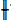
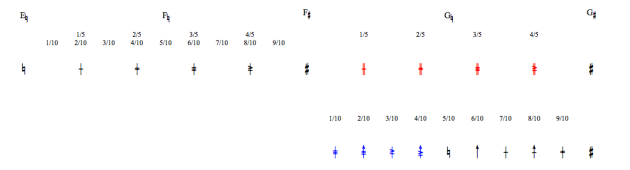

Navigation générale : 

  - [Guide](OM-Documentation.md)
  - [Plan](OM-Documentation_1.md)
  - [Glossaire](OM-Documentation_2.md)

OpenMusic
DocumentationHiérarchie
de section : [OM 6.6 User
Manual](OM-User-Manual.md) \>
[Score
Objects](ScoreObjects.md) \>
[Score
Editors](ScoreEditors.md) \>
Microintervals
Notation

Navigation : [page
précédente](Editor-Tonality.md "page précédente(Tonal Display)")
| [page
suivante](Editor-Play.md "page suivante(Play Controls)")

# Microintervals Notation

## Conventions

Scales

OM offers all scales approximations from 1/2 to 1/8 tone, as well as
1/10, 1/12, 1/14 and 1/16 tone approximations.

Accidental Types

All accidentals are ascending, that is, based on **naturals** and
**sharps** .

Microintervals and Tonality

Microtonal scales are not available in a tonal context.

To cancel the choice of a tonality, press `Shift` + `t`. The original
"atonal" configuration is be restored.

## Accidentals Charts

Note

Scales that don't comprise semitones – 1/3, 1/5, 1/7 and their derived
scales can be tricky, for they sometimes have different types of
accidentals.

Notation Principles

**Naturals** are replaced by plain vertical lines – for
instance :
.

Incrementations of **sharps** are indicated by two vertical lines – for
instance
:.

  - **1/4 tone** scale :
    
    the number of vertical lines indicates incrementations of 1, 2 or 3
    quarter tones – for instance
    .

  - **1/8  and 1/16 tone** scales :
    
    three different arrowheads indicate incrementations of a 1/16th
    ,
    1/8th
    and
    3/16th
    tones
    of naturals and sharps.

  - **1/3 tone** scale :
    
    incrementations of 1 or 2 thirds of tone are shown by the number of
    additional horizontal lines – for instance
    
    .

  - **1/6 and 1/12 tone** scales :
    
    they combine
    
    
    arrowheads
    with horizontal lines.

  - **1/5, 1/7 tone** scale and their multiples :
    
    they use additional combination of horizontal lines. 

1/2 Tone and Elementary Multiples

Accidentals of the half tone scale and its
multiples.[Zoom](../res/1_scr_1.png "Zoom (nouvelle fenêtre)")

1/3 Tone and Elementary Multiples

Accidentals of the third tone scale and its
multiples.[Zoom](../res/3RD_scr_1.png "Zoom (nouvelle fenêtre)")

1/5 and 1/10 Tone

Accidentals of the fifth and tenth tone
scales.[Zoom](../res/5th_scr_1.png "Zoom (nouvelle fenêtre)")

1/7 and 1/14 Tone

Accidentals of the seventh and fourteenth tone
scales.[Zoom](../res/7th_scr_1.png "Zoom (nouvelle fenêtre)")

Références : 

Plan :

  - [OpenMusic Documentation](OM-Documentation.md)
  - [OM 6.6 User Manual](OM-User-Manual.md)
      - [Introduction](00-Sommaire.md)
      - [System Configuration and
        Installation](Installation.md)
      - [Going Through an OM Session](Goingthrough.md)
      - [The OM Environment](Environment.md)
      - [Visual Programming I](BasicVisualProgramming.md)
      - [Visual Programming
        II](AdvancedVisualProgramming.md)
      - [Basic Tools](BasicObjects.md)
      - [Score Objects](ScoreObjects.md)
          - [Presentation](Score-Objects-Intro.md)
          - [Rhythm Trees](RT.md)
          - [Score Players](ScorePlayer.md)
          - [Score Editors](ScoreEditors.md)
              - [Overview](Editor-Overview.md)
              - [Preferences](Editors-Prefs.md)
              - [Score Display](Editor-Display.md)
              - [Basic Editing](Editor-Basics.md)
              - [Harmonic Objects](Harmonic-Obj-Editor.md)
              - [Rhythmic Objects](Editor-Rhythm.md)
              - [Polyphonic Objects](Poly-Multi-Editor.md)
              - [Page Mode](Editor-PageMode.md)
              - [Tonal Display](Editor-Tonality.md)
              - Microintervals
                Notation
              - [Play Controls](Editor-Play.md)
          - [Quantification](Quantification.md)
          - [Export / Import](ImportExport.md)
      - [Maquettes](Maquettes.md)
      - [Sheet](Sheet.md)
      - [MIDI](MIDI.md)
      - [Audio](Audio.md)
      - [SDIF](SDIF.md)
      - [Lisp Programming](Lisp.md)
      - [Errors and Problems](errors.md)
  - [OpenMusic QuickStart](QuickStart-Chapters.md)

Navigation : [page
précédente](Editor-Tonality.md "page précédente(Tonal Display)")
| [page
suivante](Editor-Play.md "page suivante(Play Controls)")

[A propos...](OM-Documentation_3.md)(c) Ircam - Centre
Pompidou

