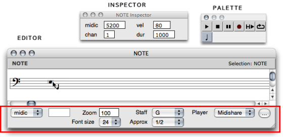

Navigation générale : 

  - [Guide](OM-Documentation.md)
  - [Plan](OM-Documentation_1.md)
  - [Glossaire](OM-Documentation_2.md)

OpenMusic
DocumentationHiérarchie
de section : [OM 6.6 User
Manual](OM-User-Manual.md) \>
[Score
Objects](ScoreObjects.md) \>
[Score
Editors](ScoreEditors.md) \>
Overview

Navigation : [page
précédente](ScoreEditors.md "page précédente(Score Editors)")
| [page
suivante](Editors-Prefs.md "page suivante(Preferences)")

# Overview

Score editors allow to **visualize, listen to, modify, or create**
instances. Each score object – note , chord , chord-seq , voice , poly –
has a specific score editor. Editors open with a double click on a
factory box.

The displaying and parametric values of a note object can be controled
directly via its editor.

Score objects are organized in a simple hierarchy with growing levels of
complexity, like in a matriochka. From the note to the poly , the panel
of score editors shows a growing number of editing tools. All editors
follow the paradigm of the note editor.

## Windows Overview

The editor window opens along with a **general palette** , and a **score
inspector** .

It shows a number of pop up menus, which allow to modify the displaying
of the score, and an Editor Control on the lower left corner, dedicated
to editing operations.

Score Inspector

<table>
<colgroup>
<col style="width: 50%" />
<col style="width: 50%" />
</colgroup>
<tbody>
<tr class="odd">
<td>

The <strong>score inspector</strong> gives access to all the related data of a selected object, which can then possibly be modified.

The score inspector appears automatically at the selection of an item.

To display the score inspector, select the <code class="menuPath_tl">Window / Score Inspector</code> menu.

</td>
<td>

</td>
</tr>
</tbody>
</table>

Modifying Parametric Values via the Editor Control

  - [Score Display](Editor-Display.md)

General Palette

<table>
<colgroup>
<col style="width: 50%" />
<col style="width: 50%" />
</colgroup>
<tbody>
<tr class="odd">
<td>

</td>
<td>

The general palette is declined over the set of score editors. It provides :

<ul>
<li> <strong>edition tools</strong>  : note , chord , group , measure , voice and poly tools,</li>
<li>a <strong>player</strong> </li>
<li>and two selection <strong>cursors</strong> .</li>
</ul>

</td>
</tr>
</tbody>
</table>

The selected edition tool is displayed as small tag when hovering the
mouse over the score  :

## Objects and Edition Levels

Edition Tools Overview

Each of these levels can be accessed via dedicated edition tools.

|                                                                                         | Tool                      | Applies to                      | Editors                      |
| --------------------------------------------------------------------------------------- | ------------------------- | ------------------------------- | ---------------------------- |
|      | **** ****Note**** ****    | notes – within chords –         | all editors                  |
|  | **** ****Chord**** ****   | chords                          | all editors but note editors |
|    | **** ****Group**** ****   | rhythmic groups within measures | voice and poly editors       |
|    | **** ****Measure**** **** | entire measures within a voice  | voice and poly editors       |
|          | **** ****Voice**** ****   | one or more voices at once      | voice and poly editors       |
|      | **** ****Poly**** ****    | a whole stack of voices at once | poly editors                 |

Example

The poly object integrates all edition levels : note , chord , group ,
measure , voice .

[Zoom](../res/polystructure1_scr_1.png "Zoom (nouvelle fenêtre)")

Références : 

Plan :

  - [OpenMusic Documentation](OM-Documentation.md)
  - [OM 6.6 User Manual](OM-User-Manual.md)
      - [Introduction](00-Sommaire.md)
      - [System Configuration and
        Installation](Installation.md)
      - [Going Through an OM Session](Goingthrough.md)
      - [The OM Environment](Environment.md)
      - [Visual Programming I](BasicVisualProgramming.md)
      - [Visual Programming
        II](AdvancedVisualProgramming.md)
      - [Basic Tools](BasicObjects.md)
      - [Score Objects](ScoreObjects.md)
          - [Presentation](Score-Objects-Intro.md)
          - [Rhythm Trees](RT.md)
          - [Score Players](ScorePlayer.md)
          - [Score Editors](ScoreEditors.md)
              - Overview
              - [Preferences](Editors-Prefs.md)
              - [Score Display](Editor-Display.md)
              - [Basic Editing](Editor-Basics.md)
              - [Harmonic Objects](Harmonic-Obj-Editor.md)
              - [Rhythmic Objects](Editor-Rhythm.md)
              - [Polyphonic Objects](Poly-Multi-Editor.md)
              - [Page Mode](Editor-PageMode.md)
              - [Tonal Display](Editor-Tonality.md)
              - [Microintervals
                Notation](Editor-Microintervals.md)
              - [Play Controls](Editor-Play.md)
          - [Quantification](Quantification.md)
          - [Export / Import](ImportExport.md)
      - [Maquettes](Maquettes.md)
      - [Sheet](Sheet.md)
      - [MIDI](MIDI.md)
      - [Audio](Audio.md)
      - [SDIF](SDIF.md)
      - [Lisp Programming](Lisp.md)
      - [Errors and Problems](errors.md)
  - [OpenMusic QuickStart](QuickStart-Chapters.md)

Navigation : [page
précédente](ScoreEditors.md "page précédente(Score Editors)")
| [page
suivante](Editors-Prefs.md "page suivante(Preferences)")

[A propos...](OM-Documentation_3.md)(c) Ircam - Centre
Pompidou

