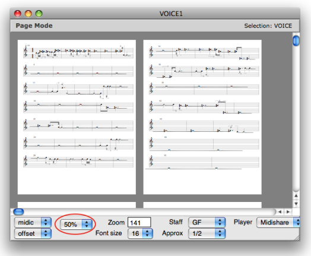

Navigation générale : 

  - [Guide](OM-Documentation.md)
  - [Plan](OM-Documentation_1.md)
  - [Glossaire](OM-Documentation_2.md)

OpenMusic
DocumentationHiérarchie
de section : [OM 6.6 User
Manual](OM-User-Manual.md) \>
[Score
Objects](ScoreObjects.md) \>
[Score
Editors](ScoreEditors.md) \>
Page Mode

Navigation : [page
précédente](Poly-Multi-Editor.md "page précédente(Polyphonic Objects)")
| [page
suivante](Editor-Tonality.md "page suivante(Tonal Display)")

# Page Mode

The content of objects can be displayed and edited – to a certain extent
– on **page mode** . This is especially convenient as far as long
sequences are concerned. The page mode is also very convenient to get a
preview of an object and modify its page layout before printing.

## Displaying Pages

Accessing Page Mode

<table>
<colgroup>
<col style="width: 50%" />
<col style="width: 50%" />
</colgroup>
<tbody>
<tr class="odd">
<td>

</td>
<td>

To display a content on page mode

<ul>
<li>select <code class="menuPath_tl">Presentation / Page</code> in the main menu</li>
<li> <code class="keyboard_tl">Ctrl</code> / right click in the editor to access the contextual menu.</li>
</ul>

</td>
</tr>
</tbody>
</table>

Page Size

The number of displayed pages can be modified via the `page size` menu.

Margins

<table>
<colgroup>
<col style="width: 50%" />
<col style="width: 50%" />
</colgroup>
<tbody>
<tr class="odd">
<td>

</td>
<td>

To modify the page margins :

<ol>
<li>
<code class="keyboard_tl">Ctrl</code> / right click in the editor
</li>
<li>
select the <code class="menuPath_tl">Page layout</code> menu item in the contextual menu.

<ul>
<li>Select <code class="textButton_tl">Default</code> to restore the default page margins.</li>
<li>Select <code class="textButton_tl">Cancel</code> to cancel values.</li>
<li>Press <code class="textButton_tl">OK</code> to validate.</li>
</ul></li>
</ol>

Margins values are also effective on <code class="menuPath_tl">Normal</code> presentation mode.

</td>
</tr>
</tbody>
</table>

## Parameters Displaying and Edition

Legibility : Slots and Score

Parametric values can also be displayed via the usual upper and lower
Editor Control menus.

Font size and zoom can be adjusted via the usual menus.

Parametric Values Edition

Slots cannot be edited.

Notes and chord can be moved or deleted, but new pitches cannot be
entered in the score.

## Print

To print the score :

  - select `File / Print` in the main menu 
  - press `Cmd` + `p` .

Références : 

Plan :

  - [OpenMusic Documentation](OM-Documentation.md)
  - [OM 6.6 User Manual](OM-User-Manual.md)
      - [Introduction](00-Sommaire.md)
      - [System Configuration and
        Installation](Installation.md)
      - [Going Through an OM Session](Goingthrough.md)
      - [The OM Environment](Environment.md)
      - [Visual Programming I](BasicVisualProgramming.md)
      - [Visual Programming
        II](AdvancedVisualProgramming.md)
      - [Basic Tools](BasicObjects.md)
      - [Score Objects](ScoreObjects.md)
          - [Presentation](Score-Objects-Intro.md)
          - [Rhythm Trees](RT.md)
          - [Score Players](ScorePlayer.md)
          - [Score Editors](ScoreEditors.md)
              - [Overview](Editor-Overview.md)
              - [Preferences](Editors-Prefs.md)
              - [Score Display](Editor-Display.md)
              - [Basic Editing](Editor-Basics.md)
              - [Harmonic Objects](Harmonic-Obj-Editor.md)
              - [Rhythmic Objects](Editor-Rhythm.md)
              - [Polyphonic Objects](Poly-Multi-Editor.md)
              - Page
                Mode
              - [Tonal Display](Editor-Tonality.md)
              - [Microintervals
                Notation](Editor-Microintervals.md)
              - [Play Controls](Editor-Play.md)
          - [Quantification](Quantification.md)
          - [Export / Import](ImportExport.md)
      - [Maquettes](Maquettes.md)
      - [Sheet](Sheet.md)
      - [MIDI](MIDI.md)
      - [Audio](Audio.md)
      - [SDIF](SDIF.md)
      - [Lisp Programming](Lisp.md)
      - [Errors and Problems](errors.md)
  - [OpenMusic QuickStart](QuickStart-Chapters.md)

Navigation : [page
précédente](Poly-Multi-Editor.md "page précédente(Polyphonic Objects)")
| [page
suivante](Editor-Tonality.md "page suivante(Tonal Display)")

[A propos...](OM-Documentation_3.md)(c) Ircam - Centre
Pompidou

