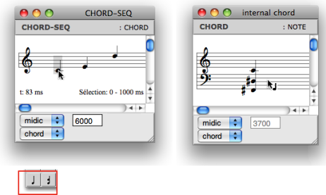
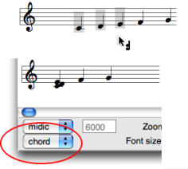

Navigation générale : 

  - [Guide](OM-Documentation.md)
  - [Plan](OM-Documentation_1.md)
  - [Glossaire](OM-Documentation_2.md)

OpenMusic
DocumentationHiérarchie
de section : [OM 6.6 User
Manual](OM-User-Manual.md) \>
[Score
Objects](ScoreObjects.md) \>
[Score
Editors](ScoreEditors.md) \>
[Harmonic
Objects](Harmonic-Obj-Editor.md) \>
Pitches

Navigation : [page
précédente](Harmonic-Obj-Editor.md "page précédente(Harmonic Objects)")
| [page
suivante](Editor-Other-Slots.md "page suivante(Other Slots)")

# Editing Pitches

The tools of the editors palette define several hierarchic edition
levels.

  - 
    **Note tool** - to edit selected notes.

  - 
    **Chord tool** - to edit whole chords.

  - 
    **Voice tool** - more specifically dedicated to the voice object,
    can apply to a whole chord-seq .

A whole object can be selected with a click and drag in any case .

## Adding Notes and Chords

Adding Notes in Note and Chord Objects

  - In note objects :
    
    1.  select the note tool
    
    2.  `Cmd` click in the score.
    
    The default or current value of the object is modified.

<!-- end list -->

  - In chord objects :
    
    1.  select the chord tool **or** the note tool
    
    2.  `Cmd` click in the staff to add a note.

Adding Notes to a Chord in a Chord-Seq

Chords can be edited in the chord-seq editor, or in an `internal chord`
window.

  - To edit a chord from a chord-seq window :
    
    1.  Select the chord tool and `Cmd` click on the chord : a grey note
        appears at the root of the green-framed chord.
    
    2.  Change its pitch with the `↑` or `↓` keys.
    
    3.  Click in the editor window to validate.

  - To edit a chord in a `internal chord` window :
    
    1.  Select the note **or** the chord tool.
        
        **Double click on the chord** : the `internal chord` window pops
        up.
    
    2.  `Cmd` click on the staff to insert notes in the chord.

Adding Chords in a Chord-seq

<table>
<colgroup>
<col style="width: 50%" />
<col style="width: 50%" />
</colgroup>
<tbody>
<tr class="odd">
<td>

</td>
<td>

<ol>
<li>
Select the note, chord <strong>or</strong> poly tool.
</li>
<li>
<code class="keyboard_tl">Cmd</code> click in the staff.
</li>
</ol>

</td>
</tr>
</tbody>
</table>

Deleting Items

<table>
<colgroup>
<col style="width: 50%" />
<col style="width: 50%" />
</colgroup>
<tbody>
<tr class="odd">
<td>

<ol>
<li>
Select the note, chord or poly tool, depending on the type of items you want to delete.
</li>
<li>
Select one or more items and press <code class="keyboard_tl">Backspace</code>.
</li>
</ol>

</td>
<td>

</td>
</tr>
</tbody>
</table>

Extracting Chords

<table>
<colgroup>
<col style="width: 50%" />
<col style="width: 50%" />
</colgroup>
<tbody>
<tr class="odd">
<td>

</td>
<td>

Chord factory boxes can be dragged out of any type of score editor – but the note editor.

To create a factory box :

<ol>
<li>
select the chord tool in the <a href="Editor-Basics.md">editor palette</a> 
</li>
<li>
click on an item and dragg it to the patch editor.
</li>
</ol>

It is materialized as a factory box.

</td>
</tr>
</tbody>
</table>

Score Editors

  - [Overview](Editor-Overview.md)

## Group / Union Chords

<table>
<colgroup>
<col style="width: 50%" />
<col style="width: 50%" />
</colgroup>
<tbody>
<tr class="odd">
<td>

The <strong>group</strong> and <strong>union chords</strong> commands allow to gather several chords into one chord.

<ol>
<li>
Select the items you want to group or union.
</li>
<li>
Press <code class="keyboard_tl">*</code> to group chords.

Press <code class="keyboard_tl">+</code> to union chords.
</li>
</ol>

On <code class="menuPath_tl">chord</code> mode, chords are displayed the same way with both commands.

</td>
<td>

</td>
</tr>
</tbody>
</table>

Group Chords

<table>
<colgroup>
<col style="width: 50%" />
<col style="width: 50%" />
</colgroup>
<tbody>
<tr class="odd">
<td>

The <strong>group chords</strong> command allows to preserve the individual offsets of the chords.

<ul>
<li>Pitches are played successively.</li>
<li>The <code class="menuPath_tl">offset</code> mode of the Editor Control shows the actual offsets of each chord.</li>
</ul>

</td>
<td>

</td>
</tr>
</tbody>
</table>

Union Chords

<table>
<colgroup>
<col style="width: 50%" />
<col style="width: 50%" />
</colgroup>
<tbody>
<tr class="odd">
<td>

The <strong>union chords</strong> command gathers several chords graphically and temporally in a same chord.

<ul>
<li>Pitches are played simultaneously.</li>
<li>The <code class="menuPath_tl">offset</code> mode of the Editor Control shows that all chords have the same offset.</li>
</ul>

</td>
<td>

</td>
</tr>
</tbody>
</table>

## Displaying Modes

Features

The order and offsets of the pitches in the list can be expressed via
the "order" and "offset" modes of the Editor Control.

The Editor Control lower menu allows to modify the displaying of chords.
Notes can be ordered according to their :

  - pitch : `arp up` and `arp down` modes
  - order in the pitches list : `order` mode
  - offset : `offset` mode.

A small vertical line marks the starting point of the chord.

Références : 

Plan :

  - [OpenMusic Documentation](OM-Documentation.md)
  - [OM 6.6 User Manual](OM-User-Manual.md)
      - [Introduction](00-Sommaire.md)
      - [System Configuration and
        Installation](Installation.md)
      - [Going Through an OM Session](Goingthrough.md)
      - [The OM Environment](Environment.md)
      - [Visual Programming I](BasicVisualProgramming.md)
      - [Visual Programming
        II](AdvancedVisualProgramming.md)
      - [Basic Tools](BasicObjects.md)
      - [Score Objects](ScoreObjects.md)
          - [Presentation](Score-Objects-Intro.md)
          - [Rhythm Trees](RT.md)
          - [Score Players](ScorePlayer.md)
          - [Score Editors](ScoreEditors.md)
              - [Overview](Editor-Overview.md)
              - [Preferences](Editors-Prefs.md)
              - [Score Display](Editor-Display.md)
              - [Basic Editing](Editor-Basics.md)
              - [Harmonic Objects](Harmonic-Obj-Editor.md)
                  - Pitches
                  - [Other Slots](Editor-Other-Slots.md)
              - [Rhythmic Objects](Editor-Rhythm.md)
              - [Polyphonic Objects](Poly-Multi-Editor.md)
              - [Page Mode](Editor-PageMode.md)
              - [Tonal Display](Editor-Tonality.md)
              - [Microintervals
                Notation](Editor-Microintervals.md)
              - [Play Controls](Editor-Play.md)
          - [Quantification](Quantification.md)
          - [Export / Import](ImportExport.md)
      - [Maquettes](Maquettes.md)
      - [Sheet](Sheet.md)
      - [MIDI](MIDI.md)
      - [Audio](Audio.md)
      - [SDIF](SDIF.md)
      - [Lisp Programming](Lisp.md)
      - [Errors and Problems](errors.md)
  - [OpenMusic QuickStart](QuickStart-Chapters.md)

Navigation : [page
précédente](Harmonic-Obj-Editor.md "page précédente(Harmonic Objects)")
| [page
suivante](Editor-Other-Slots.md "page suivante(Other Slots)")

[A propos...](OM-Documentation_3.md)(c) Ircam - Centre
Pompidou

