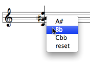

Navigation générale : 

  - [Guide](OM-Documentation.md)
  - [Plan](OM-Documentation_1.md)
  - [Glossaire](OM-Documentation_2.md)

OpenMusic
DocumentationHiérarchie
de section : [OM 6.6 User
Manual](OM-User-Manual.md) \>
[Score
Objects](ScoreObjects.md) \>
[Score
Editors](ScoreEditors.md) \>
Tonal Display

Navigation : [page
précédente](Editor-PageMode.md "page précédente(Page Mode)")
| [page
suivante](Editor-Microintervals.md "page suivante(Microintervals Notation)")

# Tonal Display

[Sommaire ](#)

1.  [Tonality](#oeN2a)
2.  [Editor Scale](#oeNff)
3.  [Cadences, Degrees and Figuring](#oeN1a6)
4.  [Modulation](#oeN206)

Tonal display options concern all musical objects with possible tonal
harmonic or melodic progressions : chord-seqs, multi-seqs, voices and
polys .

## Tonality

Editor Preferences

<table>
<colgroup>
<col style="width: 50%" />
<col style="width: 50%" />
</colgroup>
<tbody>
<tr class="odd">
<td>

The <code class="label_tl">Editor preferences</code> tab provides a number of options and tools, which relate to tonality expression and analysis.

</td>
<td>

</td>
</tr>
</tbody>
</table>

Tonality Dialogue Window

To choose a tonality

1.  select the editor and press `t`.

2.  A tonality dialogue window pops up.

3.  Select the `Minor` or `Major` mode in the pop up menu, and a key
    signature via the `<` and `>` buttons.

4.  The tonality is indicated on the upper left corner of the editor, as
    well as a conventional key signature.

To restore the original "atonal" configuration, press `SHIFT` + `t` .

Enharmony

<table>
<colgroup>
<col style="width: 50%" />
<col style="width: 50%" />
</colgroup>
<tbody>
<tr class="odd">
<td>

OM automatically assigns the expected accidentals, depending on the chosen tonality. Accidentals can though be modified enharmonically.

To modify an accidental :

<ol>
<li>
select the note tool,
</li>
<li>
<code class="keyboard_tl">Ctrl</code> click on a note and select an item.
</li>
</ol>

</td>
<td>

</td>
</tr>
</tbody>
</table>

## Editor Scale

The default accidental notation system in score editors uses sharps.
This system can be modified, to a certain extent.

<table>
<colgroup>
<col style="width: 50%" />
<col style="width: 50%" />
</colgroup>
<tbody>
<tr class="odd">
<td>

</td>
<td>

The <code class="label_tl">Editor Scale</code> dialogue window offers a limited number of enharmonic accidentals, based on the standard twelve semitones notation.

This especially makes sense when using a tonal or modal semitones scale pattern.

To specify a scale

<ol>
<li>
select an editor and press <code class="keyboard_tl">s</code>.
</li>
<li>
The <code class="label_tl">Editor Scale</code> dialogue window opens.
</li>
<li>
Choose <code class="textButton_tl">Edit</code>.
</li>
</ol>

</td>
</tr>
</tbody>
</table>

To assign an enharmonic accidental to a note, `Ctrl` / right click on it
and select a menu item.

<table>
<colgroup>
<col style="width: 50%" />
<col style="width: 50%" />
</colgroup>
<tbody>
<tr class="odd">
<td>

Modifications of the default scale are displayed by the dialogue window.

Click on <code class="textButton_tl">Default</code> to reset the default scale.

</td>
<td>

</td>
</tr>
</tbody>
</table>

## Cadences, Degrees and Figuring

<table>
<colgroup>
<col style="width: 50%" />
<col style="width: 50%" />
</colgroup>
<tbody>
<tr class="odd">
<td>

</td>
<td>

An elementary tonal analysis tool is implemented in musical editors. It is based on the options provided in the <code class="label_tl">Editor preferences</code> :

<ul>
<li> <code class="textButton_tl">Degrees</code> </li>
<li> <code class="textButton_tl">Cadences</code> </li>
<li> <code class="textButton_tl">Figuring</code> </li>
</ul>

The analysis takes place as chords are being edited, provided OM can recognize a listed chord and chord progression.

</td>
</tr>
</tbody>
</table>

## Modulation

Specifying Modulations

<table>
<colgroup>
<col style="width: 50%" />
<col style="width: 50%" />
</colgroup>
<tbody>
<tr class="odd">
<td>

Modulations can be specified textually in the score editor.

<ol>
<li>
Select a section in a score and press <code class="keyboard_tl">t</code>.
</li>
<li>
Choose a tonality.
</li>
</ol>

</td>
<td>

</td>
</tr>
</tbody>
</table>

Boundaries

<table>
<colgroup>
<col style="width: 50%" />
<col style="width: 50%" />
</colgroup>
<tbody>
<tr class="odd">
<td>

</td>
<td>

OM displays the modulation but it doesn't automatically adapt the key signature or accidentals to the new tonality.

</td>
</tr>
</tbody>
</table>

Références : 

Plan :

  - [OpenMusic Documentation](OM-Documentation.md)
  - [OM 6.6 User Manual](OM-User-Manual.md)
      - [Introduction](00-Sommaire.md)
      - [System Configuration and
        Installation](Installation.md)
      - [Going Through an OM Session](Goingthrough.md)
      - [The OM Environment](Environment.md)
      - [Visual Programming I](BasicVisualProgramming.md)
      - [Visual Programming
        II](AdvancedVisualProgramming.md)
      - [Basic Tools](BasicObjects.md)
      - [Score Objects](ScoreObjects.md)
          - [Presentation](Score-Objects-Intro.md)
          - [Rhythm Trees](RT.md)
          - [Score Players](ScorePlayer.md)
          - [Score Editors](ScoreEditors.md)
              - [Overview](Editor-Overview.md)
              - [Preferences](Editors-Prefs.md)
              - [Score Display](Editor-Display.md)
              - [Basic Editing](Editor-Basics.md)
              - [Harmonic Objects](Harmonic-Obj-Editor.md)
              - [Rhythmic Objects](Editor-Rhythm.md)
              - [Polyphonic Objects](Poly-Multi-Editor.md)
              - [Page Mode](Editor-PageMode.md)
              - Tonal
                Display
              - [Microintervals
                Notation](Editor-Microintervals.md)
              - [Play Controls](Editor-Play.md)
          - [Quantification](Quantification.md)
          - [Export / Import](ImportExport.md)
      - [Maquettes](Maquettes.md)
      - [Sheet](Sheet.md)
      - [MIDI](MIDI.md)
      - [Audio](Audio.md)
      - [SDIF](SDIF.md)
      - [Lisp Programming](Lisp.md)
      - [Errors and Problems](errors.md)
  - [OpenMusic QuickStart](QuickStart-Chapters.md)

Navigation : [page
précédente](Editor-PageMode.md "page précédente(Page Mode)")
| [page
suivante](Editor-Microintervals.md "page suivante(Microintervals Notation)")

[A propos...](OM-Documentation_3.md)(c) Ircam - Centre
Pompidou

