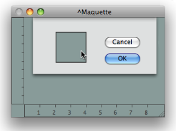
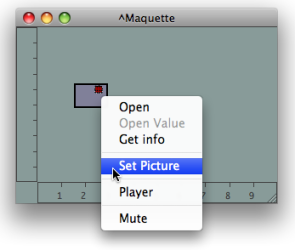
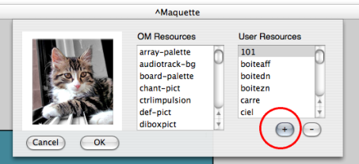

Navigation générale : 

  - [Guide](OM-Documentation.md)
  - [Plan](OM-Documentation_1.md)
  - [Glossaire](OM-Documentation_2.md)

OpenMusic
DocumentationHiérarchie
de section : [OM 6.6 User
Manual](OM-User-Manual.md) \>
[Maquettes](Maquettes.md) \>
[The Maquette
Editor](Editor.md) \>
Editor
Appearance

Navigation : [page
précédente](Editor.md "page précédente(The Maquette Editor)")
| [page
suivante](Grid%20and%20Rulers.md "page suivante(Rulers and Grid)")

# Maquette Editor Appearance

## Default Appearance of Maquettes

<table>
<colgroup>
<col style="width: 50%" />
<col style="width: 50%" />
</colgroup>
<tbody>
<tr class="odd">
<td>

To modify the default appearance of maquettes :

<ol>
<li>
go to the <code class="menuPath_tl">Prefences</code> menu
</li>
<li>
select the <code class="label_tl">Maquette</code>  tab in the <code class="label_tl">Preferences</code> pane.
</li>
</ol>

These modification only apply to items created afterward.

</td>
<td>

</td>
</tr>
</tbody>
</table>

<table>
<colgroup>
<col style="width: 50%" />
<col style="width: 50%" />
</colgroup>
<tbody>
<tr class="odd">
<td>

</td>
<td>

<ol>
<li>
Click on the <strong>"Default Colour"</strong> frame of the maquette.
</li>
<li>
Pick a colour in the Colour Chooser, and select <code class="textButton_tl">OK</code>.
</li>
<li>
Select <code class="textButton_tl">Apply</code> or <code class="textButton_tl">Cancel</code>, 
</li>
<li>
choose <code class="textButton_tl">OK</code> to validate your choice.
</li>
</ol>

Select <code class="textButton_tl">Restore</code> to reset the default preferences of the maquette.

</td>
</tr>
</tbody>
</table>

## Contextual Modifications

Colour

To modify the colour of a specific maquette editor, press `SHIFT` + `c`
and follow the previous procedure.

Maquettes and TemporalBoxes Pictures

<table>
<colgroup>
<col style="width: 50%" />
<col style="width: 50%" />
</colgroup>
<tbody>
<tr class="odd">
<td>

To assign a maquette editor or a TemporalBox a background picture :

<ol>
<li>
<code class="keyboard_tl">Ctrl</code> / right click in the editor
</li>
<li>
choose <code class="menuPath_tl">Load Picture</code>, or <code class="menuPath_tl">Set Picture</code> depending whether you have selected the maquette itself or a Temporalbox,
</li>
<li>
choose a picture in the Picture Chooser.
</li>
</ol>

</td>
<td>

</td>
</tr>
</tbody>
</table>

You can possibly import a resource to the **User Resources**.

Choosing Pictures : Detailed Procedure

  - [Resources](resources.md)

Modifying the Temporalboxes Appearance

  - [Temporalboxes Appearance](Appearance.md)

## Connections

Showing / Hiding Connections

Connections can be hidden or shown, depending whether the semantic
structure of the program has to be revealed or not.

To show or hide connections, `Ctrl` / right click on a box and choose
`Show / Hide Connections`.

Colour

<table>
<colgroup>
<col style="width: 50%" />
<col style="width: 50%" />
</colgroup>
<tbody>
<tr class="odd">
<td>

</td>
<td>

To modify the colour of the connections between Temporalboxes :

<ol>
<li>
select a connection
</li>
<li>
press <code class="keyboard_tl">c</code>.
</li>
</ol>

</td>
</tr>
</tbody>
</table>

Références : 

Plan :

  - [OpenMusic Documentation](OM-Documentation.md)
  - [OM 6.6 User Manual](OM-User-Manual.md)
      - [Introduction](00-Sommaire.md)
      - [System Configuration and
        Installation](Installation.md)
      - [Going Through an OM Session](Goingthrough.md)
      - [The OM Environment](Environment.md)
      - [Visual Programming I](BasicVisualProgramming.md)
      - [Visual Programming
        II](AdvancedVisualProgramming.md)
      - [Basic Tools](BasicObjects.md)
      - [Score Objects](ScoreObjects.md)
      - [Maquettes](Maquettes.md)
          - [Creating a Maquette](Maquette.md)
          - [TemporalBoxes](TemporalBoxes.md)
          - [The Maquette Editor](Editor.md)
              - Editor
                Appearance
              - [Rulers and Grid](Grid%20and%20Rulers.md)
              - [The Palette](player.md)
              - [Markers / Anchors](Markers.md)
          - [Maquette
            Programming](Programming%20Maquette.md)
          - [Maquettes in
            Patches](Maquettes%20in%20Patches.md)
      - [Sheet](Sheet.md)
      - [MIDI](MIDI.md)
      - [Audio](Audio.md)
      - [SDIF](SDIF.md)
      - [Lisp Programming](Lisp.md)
      - [Errors and Problems](errors.md)
  - [OpenMusic QuickStart](QuickStart-Chapters.md)

Navigation : [page
précédente](Editor.md "page précédente(The Maquette Editor)")
| [page
suivante](Grid%20and%20Rulers.md "page suivante(Rulers and Grid)")

[A propos...](OM-Documentation_3.md)(c) Ircam - Centre
Pompidou

