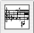

Navigation générale : 

  - [Guide](OM-Documentation.md)
  - [Plan](OM-Documentation_1.md)
  - [Glossaire](OM-Documentation_2.md)

OpenMusic
DocumentationHiérarchie
de section : [OM 6.6 User
Manual](OM-User-Manual.md) \>
[Score
Objects](ScoreObjects.md) \>
[Score
Editors](ScoreEditors.md) \>
Preferences

Navigation : [page
précédente](Editor-Overview.md "page précédente(Overview)")
| [page
suivante](Editor-Display.md "page suivante(Score Display)")

# Preferences

The basic settings of the score editors can be modified via the`  Score
Editors ` tab of the `Preferences` pane. To access the `Score Editors`
preferences, select the `OM.6.X.X / Preferences` menu, and click on the

score icon. These default parameters can be modified subsequently if
needed, via the score editors themselves.

## Displaying Options

The score editors preferences give access to a set of musical displaying
parameters.

Default Scale Approximation

Three default scales are offered by OM :

  - semitones
  - quarter tones
  - eighth tones. 

Other scales, from the tone to the sixteenth tone are available via the
editors menus.

Choosing a Scale :

  - [Score Display](Editor-Display.md)

Music Font Size

The music font size affects the size of the whole score, like a vertical
zoom.

Staff Configuration and Colour

<table>
<colgroup>
<col style="width: 50%" />
<col style="width: 50%" />
</colgroup>
<tbody>
<tr class="odd">
<td>

A great number of staff configurations, based on F and G clefs combinations, is offered in the preferences.

A specific staff colour can be be selected via the Colour Chooser.

</td>
<td>

</td>
</tr>
</tbody>
</table>

Dynamics

<table>
<colgroup>
<col style="width: 50%" />
<col style="width: 50%" />
</colgroup>
<tbody>
<tr class="odd">
<td>

</td>
<td>

The standard midi dynamics scale can also be adapted to the user's specific needs, via the <strong>"Dynamics"</strong> frame.

</td>
</tr>
</tbody>
</table>

Tonal Display

<table>
<colgroup>
<col style="width: 50%" />
<col style="width: 50%" />
</colgroup>
<tbody>
<tr class="odd">
<td>

The <strong>"Tonal Display"</strong> frame offers a number of options, which are dedicated to tonal music notation.

</td>
<td>

</td>
</tr>
</tbody>
</table>

About Tonality :

  - [Tonal Display](Editor-Tonality.md)

Références : 

Plan :

  - [OpenMusic Documentation](OM-Documentation.md)
  - [OM 6.6 User Manual](OM-User-Manual.md)
      - [Introduction](00-Sommaire.md)
      - [System Configuration and
        Installation](Installation.md)
      - [Going Through an OM Session](Goingthrough.md)
      - [The OM Environment](Environment.md)
      - [Visual Programming I](BasicVisualProgramming.md)
      - [Visual Programming
        II](AdvancedVisualProgramming.md)
      - [Basic Tools](BasicObjects.md)
      - [Score Objects](ScoreObjects.md)
          - [Presentation](Score-Objects-Intro.md)
          - [Rhythm Trees](RT.md)
          - [Score Players](ScorePlayer.md)
          - [Score Editors](ScoreEditors.md)
              - [Overview](Editor-Overview.md)
              - Preferences
              - [Score Display](Editor-Display.md)
              - [Basic Editing](Editor-Basics.md)
              - [Harmonic Objects](Harmonic-Obj-Editor.md)
              - [Rhythmic Objects](Editor-Rhythm.md)
              - [Polyphonic Objects](Poly-Multi-Editor.md)
              - [Page Mode](Editor-PageMode.md)
              - [Tonal Display](Editor-Tonality.md)
              - [Microintervals
                Notation](Editor-Microintervals.md)
              - [Play Controls](Editor-Play.md)
          - [Quantification](Quantification.md)
          - [Export / Import](ImportExport.md)
      - [Maquettes](Maquettes.md)
      - [Sheet](Sheet.md)
      - [MIDI](MIDI.md)
      - [Audio](Audio.md)
      - [SDIF](SDIF.md)
      - [Lisp Programming](Lisp.md)
      - [Errors and Problems](errors.md)
  - [OpenMusic QuickStart](QuickStart-Chapters.md)

Navigation : [page
précédente](Editor-Overview.md "page précédente(Overview)")
| [page
suivante](Editor-Display.md "page suivante(Score Display)")

[A propos...](OM-Documentation_3.md)(c) Ircam - Centre
Pompidou

