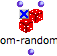
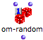
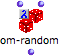
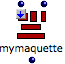

Navigation générale : 

  - [Guide](OM-Documentation.md)
  - [Plan](OM-Documentation_1.md)
  - [Glossaire](OM-Documentation_2.md)

OpenMusic
DocumentationHiérarchie
de section : [OM 6.6 User
Manual](OM-User-Manual.md) \>
[Visual Programming
II](AdvancedVisualProgramming.md) \>
Evaluation
Modes

Navigation : [page
précédente](RecursiveTree.md "page précédente(Recursive Trees)")
| [page
suivante](LockMode.md "page suivante(Lock Mode)")

# Evaluation Modes

"Evaluation" refers to two different concepts :

  - The **user-evaluation**, which is triggered **by the user via the
    interface** :
    
    `Cmd` click on an outlet, or with a selection + `v` .

  - The **internal evaluation**, which refers to an evaluation or to a
    series of evaluations **resulting** from a user-evaluation.

This section deals with the **control of internal evaluations**.

Boxes can be set on four different evaluation modes, in addition to the
default mode, to control the transmission of resulting data in a
program, or to perform specific tasks. These modes are :

<table>
<tbody>
<tr class="odd">
<td><ul>
<li> <strong></strong> <a href="LockMode.md"> <strong></strong> <strong><strong>lock</strong></strong> <strong>mode</strong></a> <strong></strong> :  </li>
</ul></td>
<td><ul>
<li> <strong></strong> <a href="EvOnceMode.md"> <strong></strong> <strong><strong>evaluate-once</strong></strong> <strong>mode</strong></a> <strong></strong> :  </li>
</ul></td>
</tr>
<tr class="even">
<td><ul>
<li> <strong></strong> <a href="LambdaMode.md"> <strong></strong> <strong><strong>lambda</strong></strong> <strong>mode</strong></a> <strong></strong> :  </li>
</ul></td>
<td><ul>
<li> <strong></strong> <a href="RefMode.md"> <strong></strong> <strong><strong>reference</strong></strong> <strong>mode</strong></a> <strong></strong> :  </li>
</ul></td>
</tr>
</tbody>
</table>

To select an evaluation mode :

1.  press `b` to set the box on "lock" mode

2.  click successively on the upper left label of the box to select
    other modes.

To reset the box to its initial state, press `b` again.

Duplication doesn't affect the state of a box that was set on a specific
evaluation mode : the copy will have the same parameters and will be on
the same mode as the master.

Références : 

Plan :

  - [OpenMusic Documentation](OM-Documentation.md)
  - [OM 6.6 User Manual](OM-User-Manual.md)
      - [Introduction](00-Sommaire.md)
      - [System Configuration and
        Installation](Installation.md)
      - [Going Through an OM Session](Goingthrough.md)
      - [The OM Environment](Environment.md)
      - [Visual Programming I](BasicVisualProgramming.md)
      - [Visual Programming
        II](AdvancedVisualProgramming.md)
          - [Abstraction](Abstraction.md)
          - Evaluation
            Modes
              - [Lock Mode](LockMode.md)
              - [Evaluate-Once Mode](EvOnceMode.md)
              - [Lambda Mode](LambdaMode.md)
              - [Reference Mode](RefMode.md)
          - [Higher-Order Functions](HighOrder.md)
          - [Control Structures](Control.md)
          - [Iterations: OMLoop](OMLoop.md)
          - [Instances](Instances.md)
          - [Interface Boxes](InterfaceBoxes.md)
          - [Files](Files.md)
      - [Basic Tools](BasicObjects.md)
      - [Score Objects](ScoreObjects.md)
      - [Maquettes](Maquettes.md)
      - [Sheet](Sheet.md)
      - [MIDI](MIDI.md)
      - [Audio](Audio.md)
      - [SDIF](SDIF.md)
      - [Lisp Programming](Lisp.md)
      - [Errors and Problems](errors.md)
  - [OpenMusic QuickStart](QuickStart-Chapters.md)

Navigation : [page
précédente](RecursiveTree.md "page précédente(Recursive Trees)")
| [page
suivante](LockMode.md "page suivante(Lock Mode)")

[A propos...](OM-Documentation_3.md)(c) Ircam - Centre
Pompidou

