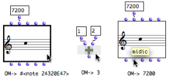
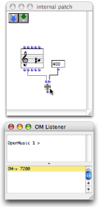
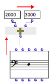
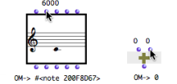
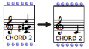
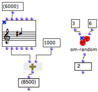
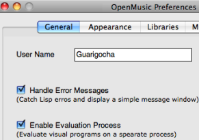

Navigation générale : 

  - [Guide](OM-Documentation.md)
  - [Plan](OM-Documentation_1.md)
  - [Glossaire](OM-Documentation_2.md)

OpenMusic
DocumentationHiérarchie
de section : [OM 6.6 User
Manual](OM-User-Manual.md) \>
[Visual Programming
I](BasicVisualProgramming.md) \>
Evaluation

Navigation : [page
précédente](Connections.md "page précédente(Connections)")
| [page
suivante](DocAndInfo.md "page suivante(Documentation and Info)")

# Evaluation

Evaluating a box means calling its inner function and parameters. If
this box is connected to others, all the upstream boxes will be
evaluated one by one. Thus, evaluating one box can trigger a more or
less lengthy evaluation chain. This chain refers to the calculus of a
function tree, or, in other words, of the visual program.

## Evaluating Boxes and Outlets

Shortcuts

<table>
<colgroup>
<col style="width: 50%" />
<col style="width: 50%" />
</colgroup>
<tbody>
<tr class="odd">
<td>

</td>
<td>

<ul>
<li>
To evaluate a box, select it and press <code class="keyboard_tl">v</code>.

The result of the leftmost output is displayed in the Listener.
</li>
<li>
To evaluate a specific output of a box, <code class="keyboard_tl">Cmd</code> click on the outlet.

The corresponding value is displayed in the Listener.
</li>
</ul>

In any case, the whole box, that is all of its outputs, are computed during the evaluation.

</td>
</tr>
</tbody>
</table>

Reminder : Listener Window

<table>
<colgroup>
<col style="width: 50%" />
<col style="width: 50%" />
</colgroup>
<tbody>
<tr class="odd">
<td>

The Listener window displays the different messages and the results of evaluations.

</td>
<td>

</td>
</tr>
</tbody>
</table>

Computation Flow : Left-Right, Bottom-Up

<table>
<colgroup>
<col style="width: 50%" />
<col style="width: 50%" />
</colgroup>
<tbody>
<tr class="odd">
<td>

In a program, a box evaluates all boxes connected to its inputs, and evaluates its inputs <strong>from left to right</strong> .

Therefore, the evaluation of a patch always goes <strong>bottom-top and left right</strong> , graphically speaking.

</td>
<td>

</td>
</tr>
</tbody>
</table>

<table>
<colgroup>
<col style="width: 50%" />
<col style="width: 50%" />
</colgroup>
<tbody>
<tr class="odd">
<td>

</td>
<td>

Box inlets generally have a default value. This is why a box can often be evaluated even if part or the totality of its inlets are not connected to other boxes. Default values can be visualized by hovering the mouse over an inlet.

</td>
</tr>
</tbody>
</table>

Box Inputs

  - [Box Inputs](BoxInputs.md)

Reinitializing box contents

<table>
<colgroup>
<col style="width: 50%" />
<col style="width: 50%" />
</colgroup>
<tbody>
<tr class="odd">
<td>

To reset the content of a box to its default value, press <code class="keyboard_tl">SHIFT</code> + <code class="keyboard_tl">i</code>.

</td>
<td>

The same chord, before and after it was reinitialized.

</td>
</tr>
</tbody>
</table>

Listener Window

  - [Windows of the OM Environment](MainWindows.md)

## Locking / Unlocking a Box

<table>
<colgroup>
<col style="width: 50%" />
<col style="width: 50%" />
</colgroup>
<tbody>
<tr class="odd">
<td>

Locked boxes : the values of the locked boxes are fixed and do not depend on the box inputs anymore.

</td>
<td>

To lock a box, select it and press <code class="keyboard_tl">b</code> . A small  icon appears on the upper left corner of the box icon.

<ul>
<li>The last computed value will kept as a definitive value for this box. </li>
<li>The input values of this box, as well as the possible elements connected to these inputs will be ignored at a subsequent evaluation.</li>
</ul>

To unlock the box, press <code class="keyboard_tl">b</code> again.

</td>
</tr>
</tbody>
</table>

Evaluation Modes

Several other evaluation modes can be used for controlling the
transmission of resulting data in a program, or to perform specific
tasks.

Evaluation Modes :

  - [Evaluation Modes](EvalModes.md)

## Evaluation Control

Evaluation process

<table>
<colgroup>
<col style="width: 50%" />
<col style="width: 50%" />
</colgroup>
<tbody>
<tr class="odd">
<td>

The <code class="textCheckBox_tl">enable evaluation process</code> option in the OM preferences allows to trigger evaluations on a specific process separated from the user interface. The user can therefore keep on using the interface during evaluations. During an evaluation, the other evaluations are queued and performed successively after the current one terminates.

This option also enables <strong>to stop ongoing computations</strong> can via the "Abort" command (see below).

</td>
<td>

</td>
</tr>
</tbody>
</table>

Aborting Evaluations

When the `enable evaluation process` option is selected, it is possible
to abort evaluations :

1.  Select the Listener window

2.  Abort using the `Lisp / Abort` menu or the shortcut `Cmd` + `a`.

Error handling

The `handle error messages` option in the OM preferenxes allows, to some
extent, to limit the consequences of possible programming errors and
prevent OM from crashing. If an error occurs, a message is displayed in
a pop up window.

Errors in OM

  - [Errors and Problems](errors.md)

Références : 

Plan :

  - [OpenMusic Documentation](OM-Documentation.md)
  - [OM 6.6 User Manual](OM-User-Manual.md)
      - [Introduction](00-Sommaire.md)
      - [System Configuration and
        Installation](Installation.md)
      - [Going Through an OM Session](Goingthrough.md)
      - [The OM Environment](Environment.md)
      - [Visual Programming I](BasicVisualProgramming.md)
          - [Patch Introduction](ProgrammingIntro.md)
          - [Adding Boxes Into a Patch](AddingBoxes.md)
          - [Elementary Manipulations](ElementaryManips.md)
          - [Boxes](Boxes.md)
          - [Box Inputs](BoxInputs.md)
          - [Connections](Connections.md)
          - Evaluation
          - [Documentation and Info](DocAndInfo.md)
          - [Comments](Comments.md)
          - [Pictures](Pictures.md)
          - [Saving / Reloading a Patch](SavingPatch.md)
          - [Dead Boxes](DeadBox.md)
      - [Visual Programming
        II](AdvancedVisualProgramming.md)
      - [Basic Tools](BasicObjects.md)
      - [Score Objects](ScoreObjects.md)
      - [Maquettes](Maquettes.md)
      - [Sheet](Sheet.md)
      - [MIDI](MIDI.md)
      - [Audio](Audio.md)
      - [SDIF](SDIF.md)
      - [Lisp Programming](Lisp.md)
      - [Errors and Problems](errors.md)
  - [OpenMusic QuickStart](QuickStart-Chapters.md)

Navigation : [page
précédente](Connections.md "page précédente(Connections)")
| [page
suivante](DocAndInfo.md "page suivante(Documentation and Info)")

[A propos...](OM-Documentation_3.md)(c) Ircam - Centre
Pompidou

