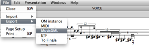
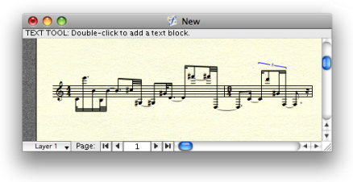

Navigation générale : 

  - [Guide](OM-Documentation.md)
  - [Plan](OM-Documentation_1.md)
  - [Glossaire](OM-Documentation_2.md)

OpenMusic
DocumentationHiérarchie
de section : [OM 6.6 User
Manual](OM-User-Manual.md) \>
[Score
Objects](ScoreObjects.md) \>
[Export /
Import](ImportExport.md) \>
Export

Navigation : [page
précédente](ImportExport.md "page précédente(Export / Import)")
| [page suivante](Import.md "page suivante(Import)")

# Export

Exporting OM score objects as external files can be done from the boxes'
contextual menu, from the score editors (menu `File / Export`) or using
the dedicated boxes in a patch from the `Functions / Score /
Import/Export` menu.

In this page we show an example of score export using the MusicXML
format.

Import/Export Formats and Generalities

  - [Export / Import](ImportExport.md)

Exporting a Voice in MusicXML

<table>
<colgroup>
<col style="width: 50%" />
<col style="width: 50%" />
</colgroup>
<tbody>
<tr class="odd">
<td>

<strong>Option 1 </strong>: The editor <code class="menuPath_tl">Export</code> menu

</td>
<td>

</td>
</tr>
</tbody>
</table>

<table>
<colgroup>
<col style="width: 50%" />
<col style="width: 50%" />
</colgroup>
<tbody>
<tr class="odd">
<td>

<strong>Option 2 </strong>: The editor <strong>export-musicxml</strong> box.

The export procedure is triggered at evaluating the box connected to a compatible type of object (here, voice or poly).

</td>
<td>

</td>
</tr>
</tbody>
</table>

Using the Export Box Options

The export boxes generally present a set of options for storage in a
given format.

<table>
<colgroup>
<col style="width: 50%" />
<col style="width: 50%" />
</colgroup>
<tbody>
<tr class="odd">
<td>

In particular, the "output file" option allows to connect the file name directly and avoids the file chooser dialog each time a file has to be saved.

</td>
<td>

</td>
</tr>
</tbody>
</table>

Importing the File in Finale

<table>
<colgroup>
<col style="width: 50%" />
<col style="width: 50%" />
</colgroup>
<tbody>
<tr class="odd">
<td>

</td>
<td>

To import an XML file in Finale, you can choose <code class="menuPath_tl">MusicXML</code> in the <code class="menuPath_tl">Import File</code> menu of the opening dialogue window, or use the <code class="menuPath_tl">File / MusicXML / Import</code> menu in any Finale window.

</td>
</tr>
</tbody>
</table>

Références : 

Plan :

  - [OpenMusic Documentation](OM-Documentation.md)
  - [OM 6.6 User Manual](OM-User-Manual.md)
      - [Introduction](00-Sommaire.md)
      - [System Configuration and
        Installation](Installation.md)
      - [Going Through an OM Session](Goingthrough.md)
      - [The OM Environment](Environment.md)
      - [Visual Programming I](BasicVisualProgramming.md)
      - [Visual Programming
        II](AdvancedVisualProgramming.md)
      - [Basic Tools](BasicObjects.md)
      - [Score Objects](ScoreObjects.md)
          - [Presentation](Score-Objects-Intro.md)
          - [Rhythm Trees](RT.md)
          - [Score Players](ScorePlayer.md)
          - [Score Editors](ScoreEditors.md)
          - [Quantification](Quantification.md)
          - [Export / Import](ImportExport.md)
              - Export
              - [Import](Import.md)
      - [Maquettes](Maquettes.md)
      - [Sheet](Sheet.md)
      - [MIDI](MIDI.md)
      - [Audio](Audio.md)
      - [SDIF](SDIF.md)
      - [Lisp Programming](Lisp.md)
      - [Errors and Problems](errors.md)
  - [OpenMusic QuickStart](QuickStart-Chapters.md)

Navigation : [page
précédente](ImportExport.md "page précédente(Export / Import)")
| [page suivante](Import.md "page suivante(Import)")

[A propos...](OM-Documentation_3.md)(c) Ircam - Centre
Pompidou

