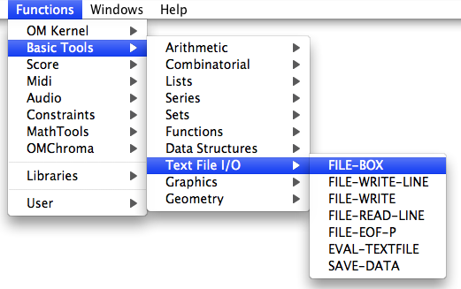

Navigation générale : 

  - [Guide](OM-Documentation.md)
  - [Plan](OM-Documentation_1.md)
  - [Glossaire](OM-Documentation_2.md)

OpenMusic
DocumentationHiérarchie
de section : [OM 6.6 User
Manual](OM-User-Manual.md) \>
[Visual Programming
II](AdvancedVisualProgramming.md) \>
[Files](Files.md) \>
File-Box

Navigation : [page
précédente](DefDirectories.md "page précédente(Default Directories)")
| [page
suivante](FileBoxIntro.md "page suivante(Introduction)")

# File-Box : Iterative File Input/Output Processes

The **File-Box** is an extension of **** [ ****OMLoop****
](OMLoop.md) **** used for programming iterative processes while
controlling file reading and/or writing operations. These operations can
be executed with several functions from the Files package .

To access the File-Box , `Cmd` click and type a name or select a menu
item in the `Basic Tools / Text File I/O / File-Box` menu.

Références : 

Plan :

  - [OpenMusic Documentation](OM-Documentation.md)
  - [OM 6.6 User Manual](OM-User-Manual.md)
      - [Introduction](00-Sommaire.md)
      - [System Configuration and
        Installation](Installation.md)
      - [Going Through an OM Session](Goingthrough.md)
      - [The OM Environment](Environment.md)
      - [Visual Programming I](BasicVisualProgramming.md)
      - [Visual Programming
        II](AdvancedVisualProgramming.md)
          - [Abstraction](Abstraction.md)
          - [Evaluation Modes](EvalModes.md)
          - [Higher-Order Functions](HighOrder.md)
          - [Control Structures](Control.md)
          - [Iterations: OMLoop](OMLoop.md)
          - [Instances](Instances.md)
          - [Interface Boxes](InterfaceBoxes.md)
          - [Files](Files.md)
              - [Pathnames](Pathnames.md)
              - [Default Directories](DefDirectories.md)
              - File-Box
                  - [Introduction](FileBoxIntro.md)
                  - [Reading / Writing](ReadingWriting.md)
                  - [Designing
                    Iterations](FileBoxIterations.md)
      - [Basic Tools](BasicObjects.md)
      - [Score Objects](ScoreObjects.md)
      - [Maquettes](Maquettes.md)
      - [Sheet](Sheet.md)
      - [MIDI](MIDI.md)
      - [Audio](Audio.md)
      - [SDIF](SDIF.md)
      - [Lisp Programming](Lisp.md)
      - [Errors and Problems](errors.md)
  - [OpenMusic QuickStart](QuickStart-Chapters.md)

Navigation : [page
précédente](DefDirectories.md "page précédente(Default Directories)")
| [page
suivante](FileBoxIntro.md "page suivante(Introduction)")

[A propos...](OM-Documentation_3.md)(c) Ircam - Centre
Pompidou

