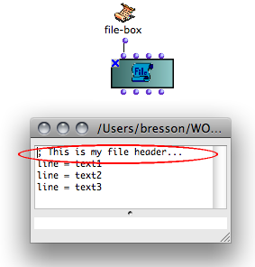
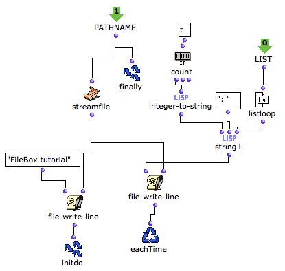

Navigation générale : 

  - [Guide](OM-Documentation.md)
  - [Plan](OM-Documentation_1.md)
  - [Glossaire](OM-Documentation_2.md)

OpenMusic
DocumentationHiérarchie
de section : [OM 6.6 User
Manual](OM-User-Manual.md) \>
[Visual Programming
II](AdvancedVisualProgramming.md) \>
[Files](Files.md) \>
[File-Box](File-Box.md) \>
Designing
Iterations

Navigation : [page
précédente](ReadingWriting.md "page précédente(Reading / Writing)")
| [page
suivante](BasicObjects.md "page suivante(Basic Tools)")

# Designing an Iterative Process with the File-Box

[Sommaire ](#)

1.  [Getting Results : Finally](#jdN18)
2.  [InitDo : Performing Initial Operations](#jdNb9)
3.  [Eachtime : Repeating an Operation](#jdN123)
4.  [File-Box inputs](#jdN1c0)

All the [common OMloop tools](OMLoop.md) – iterators,
accumulators – can be used in the File-Box to design iterative file
read/write processes.

## Getting Results : Finally

[Just like in an OMLoop](LoopEvaluators.md), the Finally
box allows to return something as a result of the iteration.

Example : Returning a Pathname

<table>
<colgroup>
<col style="width: 50%" />
<col style="width: 50%" />
</colgroup>
<tbody>
<tr class="odd">
<td>

</td>
<td>

Pathnames can be returned at the end of a process, which is quite convenient when writing a file.

<ul>
<li>On the left, <strong>Eachtime</strong> calls file-write-line three times to write three lines of string. </li>
<li>On the right, <strong>Finally</strong> returns the written file pathname.</li>
</ul>

</td>
</tr>
</tbody>
</table>

<table>
<colgroup>
<col style="width: 50%" />
<col style="width: 50%" />
</colgroup>
<tbody>
<tr class="odd">
<td>

The file can be accessed and used in a program.

Here, the file pathname allows to load and visualize the written file in a <a href="textfile.md">TextFile</a> object.

</td>
<td>

Visualizing the resulting text in a textfile box – above – and in the textfile editor – below.

</td>
</tr>
</tbody>
</table>

## InitDo : Performing Initial Operations

The **InitDo** box is called internally, just after the filestream has
been initialized, and before the iteration starts.

It allows to perform initial operations, such as writing a "file
header", as in this example.

Example : Writing a Header

Here, an Initdo module has been added to the program, so that a text
header is added before the strings.

<table>
<colgroup>
<col style="width: 50%" />
<col style="width: 50%" />
</colgroup>
<tbody>
<tr class="odd">
<td>

</td>
<td>

The data printed by InitDo is visible in the text file.

</td>
</tr>
</tbody>
</table>

## Eachtime : Repeating an Operation

**Eachtime** allows to execute an operation at each step of the loop.
can be used for writing data in the file at each step of the loop.

Example : Writing Several Lines of Strings

<table>
<colgroup>
<col style="width: 50%" />
<col style="width: 50%" />
</colgroup>
<tbody>
<tr class="odd">
<td>

<ul>
<li>At each step, file-write-line writes a line containing "hello" in the file. The path to the file is given by streamfile and outfile. </li>
<li>The operation is iterated ten times, as defined by forloop. </li>
<li>On the other hand, Finally returns the pathname.</li>
</ul>

</td>
<td>

</td>
</tr>
</tbody>
</table>

<table>
<colgroup>
<col style="width: 50%" />
<col style="width: 50%" />
</colgroup>
<tbody>
<tr class="odd">
<td>

The text file can be visualized in a <a href="textfile.md"> textfile </a> box.

</td>
<td>

</td>
</tr>
</tbody>
</table>

## File-Box inputs

The content of the file and other parameters – the file pathname for
instance – can be set in higher-level programs and abstracted as inputs
of the File-Box.

Inputs are added or removed like in [OMLoop
boxes](LoopGeneral.md) : press `alt` + `→` or `←`.

<table>
<colgroup>
<col style="width: 50%" />
<col style="width: 50%" />
</colgroup>
<tbody>
<tr class="odd">
<td>

Here, File-Box writes a text file that contains ten lines with "hello". The internal program of FileBox allows to add a header to the text, and a number to each line.

</td>
<td>

</td>
</tr>
</tbody>
</table>

  - On the left, the " **pathname" input** box returns a pathname to
    Finally and streamfile.
    
    1.  The pathname is returned to file-write-line functions.
    
    2.  The first file-write-line returns a header to Initdo, which
        executes the operation before the iteration starts.

<!-- end list -->

  - The second file-write-line writes the content of the text file with
    the boxes located on the right.
    
    1.  The " **list" input** returns a list with ten "hellos".
    
    2.  Listloop enumerates each item of the list. At each step, count
        gets "true" and returns the number of the step.
    
    3.  String+ concatenates this number, ":" and "hello".
    
    4.  Eachtime writes a line containing the resulting string in the
        text at each step of the loop.

The **pathname** returned by Finally can possibly be displayed in a
[text-view](TextBoxes.md) .

The **content of the text** displayed in the textfile box shows :

  - the header printed by Initdo
  -  the lines printed by Eachtime.

Références : 

Plan :

  - [OpenMusic Documentation](OM-Documentation.md)
  - [OM 6.6 User Manual](OM-User-Manual.md)
      - [Introduction](00-Sommaire.md)
      - [System Configuration and
        Installation](Installation.md)
      - [Going Through an OM Session](Goingthrough.md)
      - [The OM Environment](Environment.md)
      - [Visual Programming I](BasicVisualProgramming.md)
      - [Visual Programming
        II](AdvancedVisualProgramming.md)
          - [Abstraction](Abstraction.md)
          - [Evaluation Modes](EvalModes.md)
          - [Higher-Order Functions](HighOrder.md)
          - [Control Structures](Control.md)
          - [Iterations: OMLoop](OMLoop.md)
          - [Instances](Instances.md)
          - [Interface Boxes](InterfaceBoxes.md)
          - [Files](Files.md)
              - [Pathnames](Pathnames.md)
              - [Default Directories](DefDirectories.md)
              - [File-Box](File-Box.md)
                  - [Introduction](FileBoxIntro.md)
                  - [Reading / Writing](ReadingWriting.md)
                  - Designing
                    Iterations
      - [Basic Tools](BasicObjects.md)
      - [Score Objects](ScoreObjects.md)
      - [Maquettes](Maquettes.md)
      - [Sheet](Sheet.md)
      - [MIDI](MIDI.md)
      - [Audio](Audio.md)
      - [SDIF](SDIF.md)
      - [Lisp Programming](Lisp.md)
      - [Errors and Problems](errors.md)
  - [OpenMusic QuickStart](QuickStart-Chapters.md)

Navigation : [page
précédente](ReadingWriting.md "page précédente(Reading / Writing)")
| [page
suivante](BasicObjects.md "page suivante(Basic Tools)")

[A propos...](OM-Documentation_3.md)(c) Ircam - Centre
Pompidou

