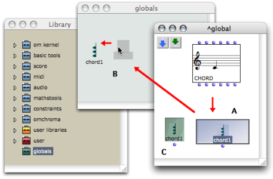
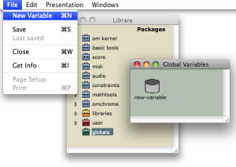

Navigation générale : 

  - [Guide](OM-Documentation.md)
  - [Plan](OM-Documentation_1.md)
  - [Glossaire](OM-Documentation_2.md)

OpenMusic
DocumentationHiérarchie
de section : [OM 6.6 User
Manual](OM-User-Manual.md) \>
[Visual Programming
II](AdvancedVisualProgramming.md) \>
[Instances](Instances.md) \>
Global
Variables

Navigation : [page
précédente](InstanceBoxes.md "page précédente(Instance Boxes)")
| [page
suivante](SlotsBox.md "page suivante(Slots)")

# Global Variables

[Sommaire ](#)

1.  [General Properties](#ucN1b)
2.  [Using a Global Variable](#ucN120)
3.  [Creating a Global Variable From an Instance](#ucN1a5)
4.  [Modifying a Global Variable](#ucN286)

**Global variables** are "globalized" instances.

## General Properties

Advantages

A global variable is an
instance[\[1\]](#kFootBsktc1804)
associated with the workspace where it was created. It can be used in
**several programs of the same workspace**. It is designed so that **any
modification of the instance** **is incorporated into** **all its
representations** .

Instances and Global Variables

When defining a chord, a metric sequence, manipulating an audio file,
the user creates a specific
instance[\[1\]](#kFootBsktc1804)
from a
class[\[2\]](#kFootBsktc1871).

|                                                                                     |                                                                                                                                                                                                                                                                            |
| ----------------------------------------------------------------------------------- | -------------------------------------------------------------------------------------------------------------------------------------------------------------------------------------------------------------------------------------------------------------------------- |
|  | This instance can be materialized in the current patch editor by instance boxes . Instance boxes are grey.                                                                                                                                                                 |
|      | It can also be exported as a **global variable** to a workspace where it will be stored in the [ Globals package](Packages.md) of the Library . Global variable boxes are green. |

## Using a Global Variable

Reference of a Global Variable

A global variable can be used in **several different places** , but all
boxes created from it correspond to the same instance.

  - When evaluated, the box always returns the same instance.

  - **A same global variable can be present **in several different
    places**** : it refers to several boxes.

Modifications : Effects

Any modification of a global variable will affect all of its
representations, as well as the master item.

  - Modifying a global variable affects each of its references.

  - Modifying **one of its references** equally affects the **variable
    itself and all its references** . 

Connections to Other Boxes

A global variable box can be connected to other boxes, just as an
instance box.

## Creating a Global Variable From an Instance

Adding a Global Variable in the Library

<table>
<colgroup>
<col style="width: 50%" />
<col style="width: 50%" />
</colgroup>
<tbody>
<tr class="odd">
<td>

Open the Globals package in the Library window :

<ul>
<li> double click on its lower part to open it as a side frame,</li>
<li> double click on its upper part, or <code class="keyboard_tl">Ctrl</code> / right click and choose <code class="menuPath_tl">Open</code> in the contextual menu to open it as a window. </li>
</ul>

</td>
<td>

</td>
</tr>
</tbody>
</table>

Select an instance and drop it in the Globals package window. The
instance box in the patch is converted into a global variable box
automatically.

Adding a Store Object in the Globals Package

<table>
<colgroup>
<col style="width: 50%" />
<col style="width: 50%" />
</colgroup>
<tbody>
<tr class="odd">
<td>

</td>
<td>

The <strong>store</strong> object is a <strong>general-purpose object</strong> , which is designed to store any type of data. A global variable created in the Globals package is an instance of the Store class, where any type of object can be stored.

To add a global variable in the Globals package, open the Globals package and select <code class="menuPath_tl">File / New Variable</code>.

</td>
</tr>
</tbody>
</table>

More About the Store Object

  - [The Store Object](Store.md)

## Modifying a Global Variable

Name

The variable can be renamed in the Globals window. All related elements
in the patch will be affected by this change immediately. They will have
the same name and reference.

Parametric Values : Using the Slots Box

Like an instance box, the global variable box appears without inputs.
Parametric values of global variables can be accessed and modified via a
specific type of box : the **slots** box.

How to Modify Instance Boxes

  - [Reading and Modifying Instances : Slots](SlotsBox.md)

Modifying a Global Variable from its Editor

A global variable can also be modified using its editor, like any
instance or factory box.

Modifying an Instance

  - [Editors](3-Editors.md)

Références : 

1.  
    
    

    
    

    
    Instance
    
    

    
    

    
    

    
    

    
    An actual object created at runtime, out of a given class. In OM,
    more specifically, an object created when evaluating a factory box.
    An instance can be saved as a global variable.
    
    ⤷ `SHIFT` click on an outlet – especially the first outlet
    representing the self, the whole object – of a factory box to
    materialize an instance.
    
    

    
    

    
    

    
    

2.  
    
    

    
    

    
    Class
    
    

    
    

    
    

    
    

    
    A category of objects sharing common properties – characteristics
    and behaviour. A class specifies the internal structure and
    behaviour of an object. In OM, it is represented in a patch by a
    factory box that can produce an instance of a class.
    
    See also : Object, Instance
    
    

    
    

    
    

    
    

Plan :

  - [OpenMusic Documentation](OM-Documentation.md)
  - [OM 6.6 User Manual](OM-User-Manual.md)
      - [Introduction](00-Sommaire.md)
      - [System Configuration and
        Installation](Installation.md)
      - [Going Through an OM Session](Goingthrough.md)
      - [The OM Environment](Environment.md)
      - [Visual Programming I](BasicVisualProgramming.md)
      - [Visual Programming
        II](AdvancedVisualProgramming.md)
          - [Abstraction](Abstraction.md)
          - [Evaluation Modes](EvalModes.md)
          - [Higher-Order Functions](HighOrder.md)
          - [Control Structures](Control.md)
          - [Iterations: OMLoop](OMLoop.md)
          - [Instances](Instances.md)
              - [Instance Boxes](InstanceBoxes.md)
              - Global
                Variables
              - [Slots](SlotsBox.md)
              - [The Store Object](Store.md)
          - [Interface Boxes](InterfaceBoxes.md)
          - [Files](Files.md)
      - [Basic Tools](BasicObjects.md)
      - [Score Objects](ScoreObjects.md)
      - [Maquettes](Maquettes.md)
      - [Sheet](Sheet.md)
      - [MIDI](MIDI.md)
      - [Audio](Audio.md)
      - [SDIF](SDIF.md)
      - [Lisp Programming](Lisp.md)
      - [Errors and Problems](errors.md)
  - [OpenMusic QuickStart](QuickStart-Chapters.md)

Navigation : [page
précédente](InstanceBoxes.md "page précédente(Instance Boxes)")
| [page
suivante](SlotsBox.md "page suivante(Slots)")

[A propos...](OM-Documentation_3.md)(c) Ircam - Centre
Pompidou

