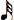

Navigation générale : 

  - [Guide](OM-Documentation.md)
  - [Plan](OM-Documentation_1.md)
  - [Glossaire](OM-Documentation_2.md)

OpenMusic
DocumentationHiérarchie
de section : [OM 6.6 User
Manual](OM-User-Manual.md) \>
[Maquettes](Maquettes.md) \>
[The Maquette
Editor](Editor.md) \>
Rulers and
Grid

Navigation : [page
précédente](EditorAppearance.md "page précédente(Editor Appearance)")
| [page
suivante](player.md "page suivante(The Palette)")

# Rulers and Grid

## Rulers

Function

<table>
<colgroup>
<col style="width: 50%" />
<col style="width: 50%" />
</colgroup>
<tbody>
<tr class="odd">
<td>

</td>
<td>

The maquette editor has two rulers :

<ul>
<li>the horizontal ruler, or abscissas axis, measures time in milliseconds</li>
<li>the vertical ruler, or ordinates axis, measures space with an arbitrary unit.</li>
</ul>

</td>
</tr>
</tbody>
</table>

Zoom

The scale of each ruler can be increased or decreased manually to zoom
in or out, vertically and/or horizontally in the maquette.

To modify the scale of a ruler :

1.  click on a ruler to view the double-arrow cursor

2.  keep pressing while scroling the mouse.
    
    To zoom in scroll the mouse upwards or rightwards. To zoom out,
    scroll it downwards or leftwards.

## Grid

Displaying and Resolution

To display the grid of the maquette editor, press `g` .The grid's
resolution is calculated automatically, according to the zoom scale.

Quantization and Snap to Grid Option

<table>
<colgroup>
<col style="width: 50%" />
<col style="width: 50%" />
</colgroup>
<tbody>
<tr class="odd">
<td>

</td>
<td>

The quantization allows to snap boxes to the grid when they are moved manually. The quantization of the <strong>ordinates axis</strong> can be defined with positive integers.

<ul>
<li>
To specify a quantization :

<ol>
<li>
double click on the vertical ruler.
</li>
<li>
enter a number of steps in the <strong>"Y Step"</strong> frame.
</li>
</ol></li>
</ul>
<ul>
<li>
To activate the quantization, select the <code class="textCheckBox_tl">Magnetic</code> option. Boxes will snap to the closest vertical step.
</li>
</ul>

</td>
</tr>
</tbody>
</table>

## The Metric Ruler : Rhythmic Parameters of the Maquette

<table>
<colgroup>
<col style="width: 50%" />
<col style="width: 50%" />
</colgroup>
<tbody>
<tr class="odd">
<td>

The <strong>metric ruler</strong> displays measures and beats. It can be shown at the top of the maquette editor.

To display the metric ruler :

<ol>
<li>
<code class="keyboard_tl">Ctrl</code> / right click in the maquette
</li>
<li>
choose <code class="menuPath_tl">Show / Hide Metric Ruler</code>.
</li>
</ol>

</td>
<td>

</td>
</tr>
</tbody>
</table>

The metric ruler has three parameters :

  - tempo
  -  meter
  - a metric quantization applying to objects.

To define the musical parameters of the maquette, double click on the
metric ruler.

<table>
<colgroup>
<col style="width: 50%" />
<col style="width: 50%" />
</colgroup>
<tbody>
<tr class="odd">
<td>

<ul>
<li>
To define a tempo :

<ol>
<li>
click successively on the quarter note  icon to choose a unit.
</li>
<li>
enter a tempo in the <strong>"Tempo"</strong> frame.
</li>
</ol></li>
</ul>
<ul>
<li>
To define a metric pattern, enter a list of one or more measures in the <strong>Metric</strong> frame according to the usual conventions.
</li>
</ul>
<ul>
<li>
To specify pattern repetitions, use the <code class="textRadioButton_tl"> Loop Measure / Last Measure</code> option :

<ul>
<li>The <code class="textRadioButton_tl">Loop Measure</code> option allows to repeat the meter pattern defined above. </li>
<li>The <code class="textRadioButton_tl">Repeat Last Measure</code> option allows to apply the last metric value of the pattern to the following measures</li>
</ul></li>
</ul>

Note that complex or irregular meter changes, which cannot be expressed by a single pattern, require a thorough expression, measure by measure...

</td>
<td>

</td>
</tr>
</tbody>
</table>

Snap to Metrics

The **"Maximum Subdivision"** frame takes a metric quantization unit.

  - The reference unit of this
    subdivision[\[1\]](#kFootBsktc3484)
    **** **is always **equal to the whole note****
    ****
    , no matter which time signature has been chosen.
    
    For instance, "64" represents a 64th note subdivision, that is :
    .

  - Values must be integers.

  - Any subdivision of the whole note, – other values than powers of 2 –
    are accepted by OM.
    
    For instance, "12" represents a triplet's fourth note subdivision,
    that is :
    .

Here, we defined the following pattern : ((6 8) (3 8) (3 4) (6 4)) and
chose the "Repeat Last Measure" option.

Grid and Metric Ruler

The grid fits the measure unit of the metric ruler.

Memento : Subdivisions

=
1; 
= 2;
=
4;
=
8;
=
16;
=
32;
=
64...

Références : 

1.  
    
    

    
    

    
    Subdivisions of the Whole Note
    
    

    
    

    
    

    
    

    
    Memento :
    
    =
    1,
    
    = 2,
    =
    4,
    =
    8,
    =
    16,
    =
    32,
    =
    64
    
    

    
    

    
    

    
    

Plan :

  - [OpenMusic Documentation](OM-Documentation.md)
  - [OM 6.6 User Manual](OM-User-Manual.md)
      - [Introduction](00-Sommaire.md)
      - [System Configuration and
        Installation](Installation.md)
      - [Going Through an OM Session](Goingthrough.md)
      - [The OM Environment](Environment.md)
      - [Visual Programming I](BasicVisualProgramming.md)
      - [Visual Programming
        II](AdvancedVisualProgramming.md)
      - [Basic Tools](BasicObjects.md)
      - [Score Objects](ScoreObjects.md)
      - [Maquettes](Maquettes.md)
          - [Creating a Maquette](Maquette.md)
          - [TemporalBoxes](TemporalBoxes.md)
          - [The Maquette Editor](Editor.md)
              - [Editor Appearance](EditorAppearance.md)
              - Rulers and
                Grid
              - [The Palette](player.md)
              - [Markers / Anchors](Markers.md)
          - [Maquette
            Programming](Programming%20Maquette.md)
          - [Maquettes in
            Patches](Maquettes%20in%20Patches.md)
      - [Sheet](Sheet.md)
      - [MIDI](MIDI.md)
      - [Audio](Audio.md)
      - [SDIF](SDIF.md)
      - [Lisp Programming](Lisp.md)
      - [Errors and Problems](errors.md)
  - [OpenMusic QuickStart](QuickStart-Chapters.md)

Navigation : [page
précédente](EditorAppearance.md "page précédente(Editor Appearance)")
| [page
suivante](player.md "page suivante(The Palette)")

[A propos...](OM-Documentation_3.md)(c) Ircam - Centre
Pompidou

