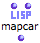
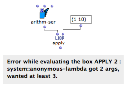

Navigation générale : 

  - [Guide](OM-Documentation.md)
  - [Plan](OM-Documentation_1.md)
  - [Glossaire](OM-Documentation_2.md)

OpenMusic
DocumentationHiérarchie
de section : [OM 6.6 User
Manual](OM-User-Manual.md) \>
[Visual Programming
II](AdvancedVisualProgramming.md) \>
Higher-Order
Functions

Navigation : [page
précédente](RefMode.md "page précédente(Reference Mode)")
| [page
suivante](Funcall.md "page suivante(Using Functions as Data)")

# Higher-Order Programs and Functions

In functional languages such as Lisp, programs and data are generally
considered as "**first-class''
objects**[\[1\]](#kFootBsktc2312).
A Lisp function can thus be considered as data and used or constructed
in the calculus.

Functions that accept other functions as arguments, or that produce
functions as output values are called **higher-order functions**.

In OM, higher-order programming is mainly possible with boxes in
"lambda" evaluation mode.

Lambda Mode

  - [Lambda Mode](LambdaMode.md)

|                                                                                        |                                                                                                                                                                                                                                                     |
| -------------------------------------------------------------------------------------- | --------------------------------------------------------------------------------------------------------------------------------------------------------------------------------------------------------------------------------------------------- |
| Some functions are more specifically designed to be called with functional arguments : |    ... |

## Using a Lambda Function in OM

Example

<table>
<colgroup>
<col style="width: 50%" />
<col style="width: 50%" />
</colgroup>
<tbody>
<tr class="odd">
<td>

In Lisp, apply is one of the simplest example of higher-order function. Apply takes two arguments :

<ol>
<li>
a function
</li>
<li>
a list of parameters
</li>
</ol>

The function on "lambda" mode is applied to each item of the list.

In this example, the + is on "lambda" mode : it can return the <strong>+ function</strong> .

</td>
<td>

</td>
</tr>
</tbody>
</table>

Using the function name

<table>
<colgroup>
<col style="width: 50%" />
<col style="width: 50%" />
</colgroup>
<tbody>
<tr class="odd">
<td>

When a simple function is involved, its <strong>name</strong> can be used instead of the function box on "lambda" mode.

</td>
<td>

</td>
</tr>
</tbody>
</table>

In Practice

In practice, functional arguments are used in two main configurations :

1.  as an argument applied to one or more other arguments by the
    higher-order function ****

2.  as a test function to determine the behaviour of a higher-order
    function.

The following sections detail several typical cases regarding the use of
higher-order functions and "lambda" mode.

Higher-Order Functions in OM

  - [Lambda Mode Examples: Funcall - Using Functions as
    Data](Funcall.md)
  - [Lambda Mode Examples: Mapcar - Iterations](Mapcar.md)
  - [Lambda Mode Examples: Lambda Patches](LambdaPatch.md)
  - [Lambda Mode Examples: Test Functions](LambdaTest.md)

## Inputs of a Lambda Function and Currying

In a higher-order function call, a function may be applied to a number
of items. These items are then matched to the different arguments of the
function. Hence, one must make sure that this function

  - has the **right number of arguments**
    
    an / or

  - is applied to the right number of items.

Example \#1

<table>
<colgroup>
<col style="width: 50%" />
<col style="width: 50%" />
</colgroup>
<tbody>
<tr class="odd">
<td>

Arithm-ser requires <strong>3 arguments</strong> : "from", "to" and "step".

It is applied to a list of <strong>two values only</strong>. OM returns an error message.

</td>
<td>

</td>
</tr>
</tbody>
</table>

Currying : Controling the Arguments of a Lambda Function

In some situations, we may want to ignore some of the arguments required
by a "lambda" function. In this case we only want to define the bounds
of the series : "from", and "to", and ignore "step".

To do so, we need to **set** one of the variables of the lambda form.
This procedure is known as
currying[\[2\]](#kFootBsktc2323).

<table>
<colgroup>
<col style="width: 50%" />
<col style="width: 50%" />
</colgroup>
<tbody>
<tr class="odd">
<td>

In OM, the arguments of a function box on "lambda" mode are represented by free inputs, and only free inputs. Free inputs are not connected to anything.

The values connected to the other inputs are comprised in the lambda function .

</td>
<td>

</td>
</tr>
</tbody>
</table>

Références : 

1.  
    
    

    
    

    
    First Class Object
    
    

    
    

    
    

    
    

    
    A first-class object is an entity which can be passed as a parameter
    to a function, returned from a function, or assigned into the
    variable of a program.
    
    

    
    

    
    

    
    

2.  
    
    

    
    

    
    Currying
    
    

    
    

    
    

    
    

    
    Reducing the number of arguments of a lambda function by assigning
    values to some of them.
    
    

    
    

    
    

    
    

Plan :

  - [OpenMusic Documentation](OM-Documentation.md)
  - [OM 6.6 User Manual](OM-User-Manual.md)
      - [Introduction](00-Sommaire.md)
      - [System Configuration and
        Installation](Installation.md)
      - [Going Through an OM Session](Goingthrough.md)
      - [The OM Environment](Environment.md)
      - [Visual Programming I](BasicVisualProgramming.md)
      - [Visual Programming
        II](AdvancedVisualProgramming.md)
          - [Abstraction](Abstraction.md)
          - [Evaluation Modes](EvalModes.md)
          - Higher-Order
            Functions
              - [Using Functions as Data](Funcall.md)
              - [Mapcar - Iterations](Mapcar.md)
              - [Lambda Patches](LambdaPatch.md)
              - [Test Functions](LambdaTest.md)
          - [Control Structures](Control.md)
          - [Iterations: OMLoop](OMLoop.md)
          - [Instances](Instances.md)
          - [Interface Boxes](InterfaceBoxes.md)
          - [Files](Files.md)
      - [Basic Tools](BasicObjects.md)
      - [Score Objects](ScoreObjects.md)
      - [Maquettes](Maquettes.md)
      - [Sheet](Sheet.md)
      - [MIDI](MIDI.md)
      - [Audio](Audio.md)
      - [SDIF](SDIF.md)
      - [Lisp Programming](Lisp.md)
      - [Errors and Problems](errors.md)
  - [OpenMusic QuickStart](QuickStart-Chapters.md)

Navigation : [page
précédente](RefMode.md "page précédente(Reference Mode)")
| [page
suivante](Funcall.md "page suivante(Using Functions as Data)")

[A propos...](OM-Documentation_3.md)(c) Ircam - Centre
Pompidou

