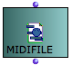
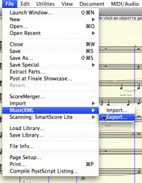

Navigation générale : 

  - [Guide](OM-Documentation.md)
  - [Plan](OM-Documentation_1.md)
  - [Glossaire](OM-Documentation_2.md)

OpenMusic
DocumentationHiérarchie
de section : [OM 6.6 User
Manual](OM-User-Manual.md) \>
[Score
Objects](ScoreObjects.md) \>
[Export /
Import](ImportExport.md) \>
Import

Navigation : [page
précédente](Export.md "page précédente(Export)")
| [page
suivante](Maquettes.md "page suivante(Maquettes)")

# Import

Importing OM musical objects from external files can be done from the
boxes' contextual menu, orfrom the score editors (menu `File / Import`).

Import/Export Formats and Generalities

  - [Export / Import](ImportExport.md)

**Other possibilities exist using the OM patch boxes and objects, which
are detailed in the next sections.**

## MIDI Import

<table>
<colgroup>
<col style="width: 50%" />
<col style="width: 50%" />
</colgroup>
<tbody>
<tr class="odd">
<td>

The easiest way to import MIDI data in OM is to instanciate a <strong>MIDIFile</strong> box. Several options are possible :

<ul>
<li>
Evaluate the box and choose a file on the disk.
</li>
<li>
Connect a pathname to the box input.
</li>
<li>
Drag the file from your computer folder to an OM patch editor.
</li>
</ul>

</td>
<td>

</td>
</tr>
</tbody>
</table>

Lock the Box

Remember to lock the box after the file is loaded, in order to avoid
initializing it again at every subsequent box evaluation.

Evaluating/Locking Boxes

  - [Evaluation](Evaluation.md)

<table>
<colgroup>
<col style="width: 50%" />
<col style="width: 50%" />
</colgroup>
<tbody>
<tr class="odd">
<td>

The MIDIfile box can then be connected to a chord-seq or multi-seq in order to convert the data to OM musical object formats.

</td>
<td>

</td>
</tr>
</tbody>
</table>

MIDI to Voice/Poly

Importing a MIDI file to a voice or poly object is not straightforward
since MIDI has no rhythmic information. An approximate quantification
will be performed using the metric information available.

About Quantification

  - [Quantification](Quantification.md)

## MusicXML Import

MusicXML files can be imported and loaded into **voice** or **poly**
objects from the `Import` menus or using the **import-musicxml** box.

<table>
<colgroup>
<col style="width: 50%" />
<col style="width: 50%" />
</colgroup>
<tbody>
<tr class="odd">
<td>

At evaluation, the <strong>import-musicxml</strong> box opens a file chooser dialog allowing to select a file to import.

</td>
<td>

</td>
</tr>
</tbody>
</table>

<table>
<colgroup>
<col style="width: 50%" />
<col style="width: 50%" />
</colgroup>
<tbody>
<tr class="odd">
<td>

An optional input allows to specify the file pathname directly in the patch editor.

</td>
<td>

</td>
</tr>
</tbody>
</table>

More About Pathnames in OM

  - [Creating and Using Pathnames](Pathnames.md)

Import-MusicXML Output Value

The import-musicxml output is always a **POLY** object. If a **VOICE**
is connected, only the first voice of the imported score will be loaded.

Creating a MusicXML file from Finale

<table>
<colgroup>
<col style="width: 50%" />
<col style="width: 50%" />
</colgroup>
<tbody>
<tr class="odd">
<td>

MusicXML files can be created by Finale via the<code class="menuPath_tl"> File / MusicXML / Export</code> menu.

</td>
<td>

<a href="../res/exp_scr_1.png" class="caption_zm js_hidden" title="Zoom (nouvelle fenêtre)">zoom</a>

</td>
</tr>
</tbody>
</table>

Références : 

Plan :

  - [OpenMusic Documentation](OM-Documentation.md)
  - [OM 6.6 User Manual](OM-User-Manual.md)
      - [Introduction](00-Sommaire.md)
      - [System Configuration and
        Installation](Installation.md)
      - [Going Through an OM Session](Goingthrough.md)
      - [The OM Environment](Environment.md)
      - [Visual Programming I](BasicVisualProgramming.md)
      - [Visual Programming
        II](AdvancedVisualProgramming.md)
      - [Basic Tools](BasicObjects.md)
      - [Score Objects](ScoreObjects.md)
          - [Presentation](Score-Objects-Intro.md)
          - [Rhythm Trees](RT.md)
          - [Score Players](ScorePlayer.md)
          - [Score Editors](ScoreEditors.md)
          - [Quantification](Quantification.md)
          - [Export / Import](ImportExport.md)
              - [Export](Export.md)
              - Import
      - [Maquettes](Maquettes.md)
      - [Sheet](Sheet.md)
      - [MIDI](MIDI.md)
      - [Audio](Audio.md)
      - [SDIF](SDIF.md)
      - [Lisp Programming](Lisp.md)
      - [Errors and Problems](errors.md)
  - [OpenMusic QuickStart](QuickStart-Chapters.md)

Navigation : [page
précédente](Export.md "page précédente(Export)")
| [page
suivante](Maquettes.md "page suivante(Maquettes)")

[A propos...](OM-Documentation_3.md)(c) Ircam - Centre
Pompidou

