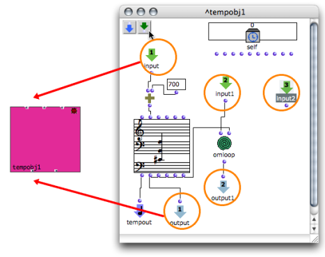

Navigation générale : 

  - [Guide](OM-Documentation.md)
  - [Plan](OM-Documentation_1.md)
  - [Glossaire](OM-Documentation_2.md)

OpenMusic
DocumentationHiérarchie
de section : [OM 6.6 User
Manual](OM-User-Manual.md) \>
[Maquettes](Maquettes.md) \>
[Maquette
Programming](Programming%20Maquette.md) \>
Functional
Components

Navigation : [page
précédente](Programming%20Maquette.md "page précédente(Maquette Programming)")
| [page
suivante](MaquetteEvaluation.md "page suivante(Evaluation)")

# Using TemporalBoxes as Functional Components : Inputs and Outputs

Data can be sent from and to TemporalBoxes via standard functional
inputs and outputs. These allow to assign input values to TemporalBoxes
and create connections between objects in the maquette. They are
represented on the outside of TemporalBoxes by  small

/
chips.

To display or hide connections :

  -  `Ctrl` / right click in the maquette
  - choose `Show / Hide Connections`. 

## Patches Inputs and Outputs

To add inputs and outputs to a TemporalBox, follow the usual procedure.

1.  Double click on the TemporalBox to open it.

2.  Click on the blue
    and
    green
    arrow
    icons to add inputs and outputs from the inside of patch.

3.  Inputs and outputs appear on the outside of the TemporalBox.

Note that, as in any patch, inputs and outputs are represented by the
same arrow icons, and are connected exactly the same way to the boxes of
the patch editor.

## Maquette Inputs and Outputs

Adding Inputs and Outputs

|                                                                                 |                                                                                   |                                                                                     |
| ------------------------------------------------------------------------------- | --------------------------------------------------------------------------------- | ----------------------------------------------------------------------------------- |
|  |  | Maquettes are also **programs** : they can be added a number of inputs and outputs. |

<table>
<colgroup>
<col style="width: 50%" />
<col style="width: 50%" />
</colgroup>
<tbody>
<tr class="odd">
<td>

</td>
<td>

In particular, this makes it possible to organize data transfers between temporal boxes into a hierarchy of maquettes.

To add an input or output in a maquette :

<ol>
<li>
<code class="keyboard_tl">Ctrl</code> click in the maquette editor
</li>
<li>
select <code class="menuPath_tl">Input</code> or <code class="menuPath_tl">Output</code> in the contextual menu.
</li>
</ol>

</td>
</tr>
</tbody>
</table>

Edition

<table>
<colgroup>
<col style="width: 50%" />
<col style="width: 50%" />
</colgroup>
<tbody>
<tr class="odd">
<td>

Maquette inputs and outputs can be edited like patch inputs, via their editor.

</td>
<td>

</td>
</tr>
</tbody>
</table>

Editing Input Boxes

  - [Input Boxes](AbsInputBoxes.md)

## Instances and Global Variables

Default Output

<table>
<colgroup>
<col style="width: 50%" />
<col style="width: 50%" />
</colgroup>
<tbody>
<tr class="odd">
<td>

When an <strong>instance</strong> , <strong>factory box</strong> or <strong>global variable</strong> is dropped into a maquette, a default output is automatically added in the corresponding Temporalbox.

</td>
<td>

</td>
</tr>
</tbody>
</table>

No Inputs

<table>
<colgroup>
<col style="width: 50%" />
<col style="width: 50%" />
</colgroup>
<tbody>
<tr class="odd">
<td>

</td>
<td>

Instances are programs that always produce the same object. Consequently,TemporalBoxes refering to instances don't have any inputs, but a single output that returns the value of the object they produce.

</td>
</tr>
</tbody>
</table>

Références : 

Plan :

  - [OpenMusic Documentation](OM-Documentation.md)
  - [OM 6.6 User Manual](OM-User-Manual.md)
      - [Introduction](00-Sommaire.md)
      - [System Configuration and
        Installation](Installation.md)
      - [Going Through an OM Session](Goingthrough.md)
      - [The OM Environment](Environment.md)
      - [Visual Programming I](BasicVisualProgramming.md)
      - [Visual Programming
        II](AdvancedVisualProgramming.md)
      - [Basic Tools](BasicObjects.md)
      - [Score Objects](ScoreObjects.md)
      - [Maquettes](Maquettes.md)
          - [Creating a Maquette](Maquette.md)
          - [TemporalBoxes](TemporalBoxes.md)
          - [The Maquette Editor](Editor.md)
          - [Maquette
            Programming](Programming%20Maquette.md)
              - Functional
                Components
              - [Evaluation](MaquetteEvaluation.md)
              - [The Synthesis Patch](Synthpatchprog.md)
              - [TempBoxes Programming](TempProgramming.md)
          - [Maquettes in
            Patches](Maquettes%20in%20Patches.md)
      - [Sheet](Sheet.md)
      - [MIDI](MIDI.md)
      - [Audio](Audio.md)
      - [SDIF](SDIF.md)
      - [Lisp Programming](Lisp.md)
      - [Errors and Problems](errors.md)
  - [OpenMusic QuickStart](QuickStart-Chapters.md)

Navigation : [page
précédente](Programming%20Maquette.md "page précédente(Maquette Programming)")
| [page
suivante](MaquetteEvaluation.md "page suivante(Evaluation)")

[A propos...](OM-Documentation_3.md)(c) Ircam - Centre
Pompidou

