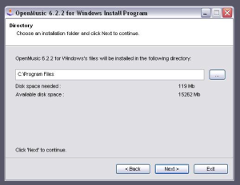

Navigation générale : 

  - [Guide](OM-Documentation.md)
  - [Plan](OM-Documentation_1.md)
  - [Glossaire](OM-Documentation_2.md)

OpenMusic
DocumentationHiérarchie
de section : [OM 6.6 User
Manual](OM-User-Manual.md) \>
[System Configuration and
Installation](Installation.md) \>
Windows

Navigation : [page
précédente](InstallationMac.md "page précédente(Mac OS X)")
| [page
suivante](Goingthrough.md "page suivante(Going Through an OM Session)")

# Windows

[Sommaire ](#)

1.  [System Configuration](#dN6)
2.  [Installation](#dN25)
3.  [Installed Items](#dNa0)
4.  [Uninstallation](#dN1e2)

## System Configuration

OM currently runs on Windows XP/Vista/7.

## Installation

Procedure

<table>
<colgroup>
<col style="width: 50%" />
<col style="width: 50%" />
</colgroup>
<tbody>
<tr class="odd">
<td>

Double click on the executable file icon to launch the installer.

</td>
<td>

</td>
</tr>
</tbody>
</table>

Installation Folder

<table>
<colgroup>
<col style="width: 50%" />
<col style="width: 50%" />
</colgroup>
<tbody>
<tr class="odd">
<td>

The OM default installation folder is <code class="filePath_tl">C:/Program Files/OM x.x.x/</code>. Another location can be chosen for the installation.

</td>
<td>

<a href="../res/install3_scr_1.png" class="caption_zm js_hidden" title="Zoom (nouvelle fenêtre)">zoom</a>

</td>
</tr>
</tbody>
</table>

## Installed Items

Application, Libraries and Fonts

<table>
<colgroup>
<col style="width: 50%" />
<col style="width: 50%" />
</colgroup>
<tbody>
<tr class="odd">
<td>

<a href="../res/install2_scr_1.png" class="caption_zm js_hidden" title="Zoom (nouvelle fenêtre)">zoom</a>

</td>
<td>

The following elements will be installed in the OM <code class="filePath_tl">C:/Program Files/OM x.x.x/</code> folder :

<ul>
<li>
OM Application : <code class="filePath_tl">OM 6.X.X.exe</code> application file.
</li>
</ul>
<ul>
<li>
External libraries<a href="#kFootBsktc1832">[1]</a> : <a href="http://midishare.sourceforge.net/" class="extUrl_ul" title="http://midishare.sourceforge.net/ (nouvelle fenêtre)"></a>

<ul>
<li> <a href="http://midishare.sourceforge.net/" class="extUrl_ul" title="http://midishare.sourceforge.net/ (nouvelle fenêtre)">Midishare</a> © GRAME</li>
<li> <a href="http://www.mega-nerd.com/libsndfile/" class="extUrl_ul" title="http://www.mega-nerd.com/libsndfile/ (nouvelle fenêtre)">libsndfile</a> © Erik de Castro Lopo</li>
<li> <a href="http://sdif.sourceforge.net/" class="extUrl_ul" title="http://sdif.sourceforge.net/ (nouvelle fenêtre)">SDIF</a> Library © IRCAM</li>
<li> <a href="http://libaudiostream.sourceforge.net/" class="extUrl_ul" title="http://libaudiostream.sourceforge.net/ (nouvelle fenêtre)">LibAudiostream</a> © GRAME</li>
</ul></li>
</ul>

</td>
</tr>
</tbody>
</table>

Musical fonts will be installed in `  C:/Windows/Fonts `.

  - omicron.ttf
  - omheads.ttf
  - omextras.ttf
  - omsign.ttf

Shortcuts

<table>
<colgroup>
<col style="width: 50%" />
<col style="width: 50%" />
</colgroup>
<tbody>
<tr class="odd">
<td>

</td>
<td>

Two shortcuts are created when installing OM :

<ul>
<li>
one on the desktop
</li>
<li>
one as an item of the  <code class="menuPath_tl">Start</code> menu.
</li>
</ul>

The <code class="menuPath_tl">Start</code> menu also includes a shortcut for the Msdrivers.exe application, which can be used for the MIDI ports configuration prior lauching OM.

</td>
</tr>
</tbody>
</table>

External Applications

External applications compatible with OM on Mac OS are not available on
Windows.

## Uninstallation

<table>
<colgroup>
<col style="width: 50%" />
<col style="width: 50%" />
</colgroup>
<tbody>
<tr class="odd">
<td>

Use the executable file that was created in the <code class="filePath_tl">C:/Program Files</code>.

</td>
<td>

</td>
</tr>
</tbody>
</table>

Références : 

1.  
    
    

    
    

    
    Library
    
    

    
    

    
    

    
    

    
    A library is a set of tools, or framework, used by an application –
    like OM – to execute specific tasks.
    
    

    
    

    
    

    
    

Plan :

  - [OpenMusic Documentation](OM-Documentation.md)
  - [OM 6.6 User Manual](OM-User-Manual.md)
      - [Introduction](00-Sommaire.md)
      - [System Configuration and
        Installation](Installation.md)
          - [Mac OS X](InstallationMac.md)
          - Windows
      - [Going Through an OM Session](Goingthrough.md)
      - [The OM Environment](Environment.md)
      - [Visual Programming I](BasicVisualProgramming.md)
      - [Visual Programming
        II](AdvancedVisualProgramming.md)
      - [Basic Tools](BasicObjects.md)
      - [Score Objects](ScoreObjects.md)
      - [Maquettes](Maquettes.md)
      - [Sheet](Sheet.md)
      - [MIDI](MIDI.md)
      - [Audio](Audio.md)
      - [SDIF](SDIF.md)
      - [Lisp Programming](Lisp.md)
      - [Errors and Problems](errors.md)
  - [OpenMusic QuickStart](QuickStart-Chapters.md)

Navigation : [page
précédente](InstallationMac.md "page précédente(Mac OS X)")
| [page
suivante](Goingthrough.md "page suivante(Going Through an OM Session)")

[A propos...](OM-Documentation_3.md)(c) Ircam - Centre
Pompidou

