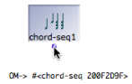

Navigation générale : 

  - [Guide](OM-Documentation.md)
  - [Plan](OM-Documentation_1.md)
  - [Glossaire](OM-Documentation_2.md)

OpenMusic
DocumentationHiérarchie
de section : [OM 6.6 User
Manual](OM-User-Manual.md) \>
[Visual Programming
II](AdvancedVisualProgramming.md) \>
[Instances](Instances.md) \>
Instance
Boxes

Navigation : [page
précédente](Instances.md "page précédente(Instances)")
| [page
suivante](GlobalVariables.md "page suivante(Global Variables)")

# Instance Boxes

An instance can be materialized out of any output of a factory box,
provided this output can return an instance or a list. Creating an
instance box is especially significant when done from the "self" outlet
of a factory box, which returns the **object itself** .

There are two types of instance boxes :

  -  **class instances**, which are created from objects,
  -  **list instances**, which are created from lists. 

## Procedure

<table>
<colgroup>
<col style="width: 50%" />
<col style="width: 50%" />
</colgroup>
<tbody>
<tr class="odd">
<td>

The first ouput of the chord-seq factory box is a chord-seq instance. The second output is a list of pitches.

</td>
<td>

To create an instance box, <code class="keyboard_tl">SHIFT</code> + <code class="keyboard_tl">Cmd</code> click on an output.

The corresponding object will appear in the patch editor.

</td>
</tr>
</tbody>
</table>

<table>
<colgroup>
<col style="width: 50%" />
<col style="width: 50%" />
</colgroup>
<tbody>
<tr class="odd">
<td>

The resulting box represents a specific object that cannot be reinitialized, but can be used and evaluated again in a patch.

This is why this box shows only one "self" outlet.

</td>
<td>

</td>
</tr>
</tbody>
</table>

Renaming Instance Boxes

<table>
<colgroup>
<col style="width: 50%" />
<col style="width: 50%" />
</colgroup>
<tbody>
<tr class="odd">
<td>

</td>
<td>

Instances in OM have a <strong>name</strong> , which can be edited on the instance box.

</td>
</tr>
</tbody>
</table>

Modifying the Instance

The parametric values of an instance box can't be accessed directly in
patches. However, they can be accessed and modified with the slots box.

About the Slots Box

  - [Reading and Modifying Instances : Slots](SlotsBox.md)

Instance Editors

The content of an instance box can be modified like that a factory box.

Double-click on the instance to open its editor.

An instance has the same editor as the factory box it is derived from,
and which offers the same edition possibilities.

About Factory Boxes Editors

  - [Editors](3-Editors.md)

Some OM Objects Editors

  - [BPFs and BPCs Editors](BPFEditors.md)
  - [Score Editors](ScoreEditors.md)

## List Instances

<table>
<colgroup>
<col style="width: 50%" />
<col style="width: 50%" />
</colgroup>
<tbody>
<tr class="odd">
<td>

<strong>List instances</strong> are instance boxes containing lists of values instead of a single instance. An instance derived from a list returns its content when evaluated.

</td>
<td>

A list can be used for creating an instance box.

</td>
</tr>
</tbody>
</table>

<table>
<colgroup>
<col style="width: 50%" />
<col style="width: 50%" />
</colgroup>
<tbody>
<tr class="odd">
<td>

</td>
<td>

Just like any list, it can be connected to other boxes to create new objects.

</td>
</tr>
</tbody>
</table>

Lists Editor

List instances have a basic editor allowing to get a preview and modify
their contents.

More about Instance and List Instance Editors

  - [Editors](3-Editors.md)

## Storing/Reusing Instances

Instances are a means to save an object within a patch, where it can
then be used as a source of data.

Instances can also be used in other patches :

  - they can be copied

  - they can saved as global
    variables[\[1\]](#kFootBsktc1805),
    which is sometimes more convenient and/or coherent.

About Global Variables

  - [Global Variables](GlobalVariables.md)

Instance Files

Instances can also be exported and imported as **.omi** files, to and
from any location of your hard drive. The import/export procedure must
be done via Factory Boxes.

An instance must be integrated as the content of a factory box, before
it is exported.

Importing / Exporting Instances to/from Factory Boxes

  - [Importing/Exporting Factory Box
    Values](4-ImportExport.md)

Dropping Instance Files in the Patch

You can drag and drop an **instance file** in a patch editor to create a
new instance box directly.

Références : 

1.  
    
    

    
    

    
    Global variable
    
    

    
    

    
    

    
    

    
    An instance of OM object that has been saved in order to be used in
    other programs. Global variables are visible from the `Library`
    window and stored as .omi files in the `Globals` folder of the
    workspace.
    
    

    
    

    
    

    
    

Plan :

  - [OpenMusic Documentation](OM-Documentation.md)
  - [OM 6.6 User Manual](OM-User-Manual.md)
      - [Introduction](00-Sommaire.md)
      - [System Configuration and
        Installation](Installation.md)
      - [Going Through an OM Session](Goingthrough.md)
      - [The OM Environment](Environment.md)
      - [Visual Programming I](BasicVisualProgramming.md)
      - [Visual Programming
        II](AdvancedVisualProgramming.md)
          - [Abstraction](Abstraction.md)
          - [Evaluation Modes](EvalModes.md)
          - [Higher-Order Functions](HighOrder.md)
          - [Control Structures](Control.md)
          - [Iterations: OMLoop](OMLoop.md)
          - [Instances](Instances.md)
              - Instance
                Boxes
              - [Global Variables](GlobalVariables.md)
              - [Slots](SlotsBox.md)
              - [The Store Object](Store.md)
          - [Interface Boxes](InterfaceBoxes.md)
          - [Files](Files.md)
      - [Basic Tools](BasicObjects.md)
      - [Score Objects](ScoreObjects.md)
      - [Maquettes](Maquettes.md)
      - [Sheet](Sheet.md)
      - [MIDI](MIDI.md)
      - [Audio](Audio.md)
      - [SDIF](SDIF.md)
      - [Lisp Programming](Lisp.md)
      - [Errors and Problems](errors.md)
  - [OpenMusic QuickStart](QuickStart-Chapters.md)

Navigation : [page
précédente](Instances.md "page précédente(Instances)")
| [page
suivante](GlobalVariables.md "page suivante(Global Variables)")

[A propos...](OM-Documentation_3.md)(c) Ircam - Centre
Pompidou

